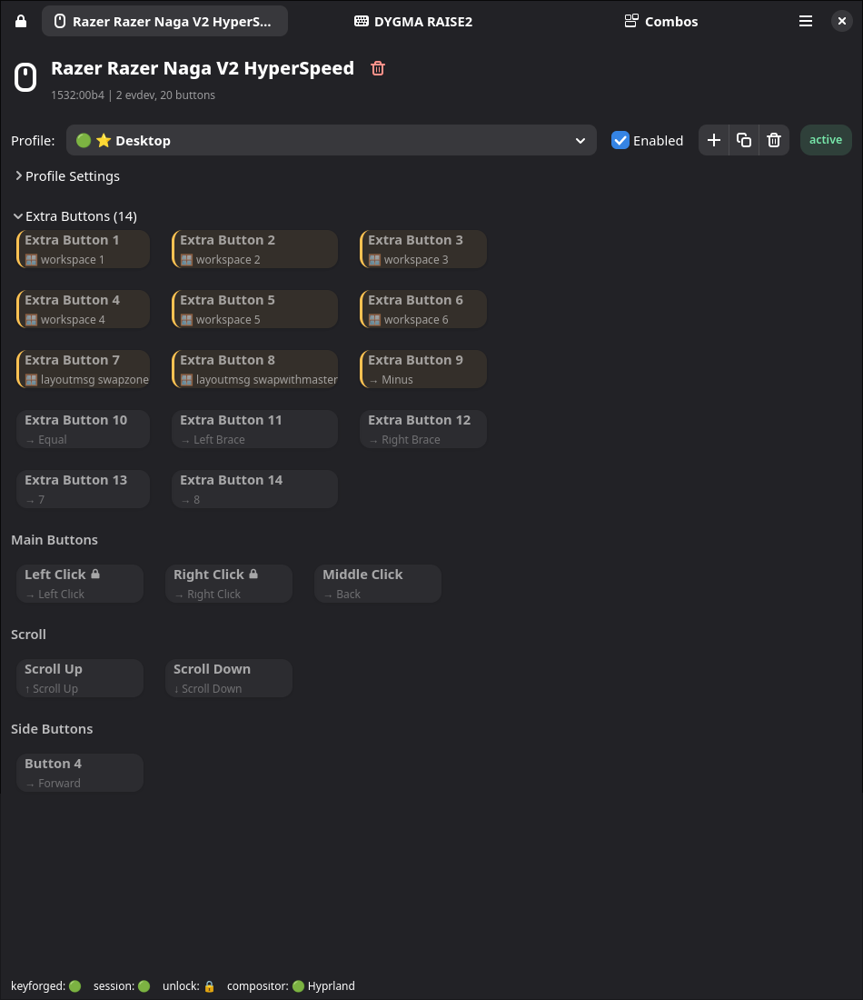

# Keyforge

[](https://github.com/nyrda/keyforge/actions/workflows/tests.yml)
[](https://github.com/nyrda/keyforge/actions/workflows/quality.yml)
[](https://github.com/nyrda/keyforge/actions/workflows/package.yml)

Keyforge is a Linux input remapper built around a privileged daemon, a
per-user session broker, and a GTK4 GUI.

It supports keyboard, mouse, and gamepad remapping with global layered
profiles, window-aware activation, macros, superkeys, and combos.

## Features

- Remap keyboard keys, mouse buttons, and gamepad inputs
- Build global profiles with per-device layers
- Auto-activate conditional profiles from the focused window
- Record, edit, and play macros
- Assign multiple actions to a single key with superkeys
- Define multi-step combos to trigger actions.

## Screenshot

Main profile view in the GTK4 application:



## Desktop Support

| Environment | Support | Notes |
| --- | --- | --- |
| Hyprland | Supported | Uses Hyprland IPC sockets for active window metadata |
| KDE Plasma | Supported | Uses an injected KWin script over session D-Bus |
| COSMIC | Supported | Uses `ext_foreign_toplevel_list_v1` and `zcosmic_toplevel_info_v1` |
| GNOME | Supported with setup | Uses the GNOME Shell bridge; see [docs/GNOME.md](docs/GNOME.md) |
| Generic Wayland | Supported | Uses `zwlr_foreign_toplevel_manager_v1` to read active window metadata |
| X11 desktops | Supported | Uses `_NET_ACTIVE_WINDOW`, `WM_CLASS`, and window title properties |


## Architecture

```text
┌─────────────────┐
│  GUI / CLI      │  `keyforge`
└────────┬────────┘
         │ session socket
┌────────▼────────┐
│ keyforge-session│  per-user broker
└────────┬────────┘
         │ daemon socket
┌────────▼────────┐
│   keyforged     │  privileged daemon
└─────────────────┘
```

- `keyforged` handles evdev/uinput access, macro storage, recording, and device
  control
- `keyforge-session` owns compositor integration, profile resolution, and the
  user-session boundary
- `keyforge` opens the GUI by default in a desktop session and exposes CLI
  subcommands when invoked with arguments

The daemon runs as a dedicated `keyforge` system user, not as root.

## Quick Start

Packaged installs are the recommended path for normal use.

## Install

Installation instructions for supported distributions and NixOS are in
[docs/INSTALL.md](docs/INSTALL.md).

## Configuration

Keyforge is primarily configured through the GTK4 GUI. Configuration data is
stored in `~/.config/keyforge/`:

```text
~/.config/keyforge/
├── hardware/
│   └── <hardware_id>.toml
└── profiles/
    └── <profile_name>.toml
```

- `hardware/` stores per-device metadata
- `profiles/` stores global profiles with one or more device layers

See [docs/PROFILES.md](docs/PROFILES.md) for the profile format and merge
rules.

## Components

| Command | Description |
| --- | --- |
| `keyforged` | Privileged system daemon |
| `keyforge-session` | Per-user session broker |
| `keyforge` | GUI by default, CLI with subcommands |
| `keyforge-record` | Privileged recording helper used by the GUI |

## Runtime

Keyforge targets mainstream Linux desktop systems and integrates with supported
Wayland compositors, desktop environments, and X11 sessions.

## Security

Keyforge uses a double-broker design:

- `keyforge-session` is the only client that talks to `keyforged`
- GUI and CLI clients talk to the session broker, not directly to kernel input
  devices
- Recording and capture features are guarded by an unlock flow and owner checks

See [docs/SECURITY.md](docs/SECURITY.md) for details.

## Documentation

- Installation guide: [docs/INSTALL.md](docs/INSTALL.md)
- Dependency reference: [docs/DEPENDENCIES.md](docs/DEPENDENCIES.md)
- Profile system: [docs/PROFILES.md](docs/PROFILES.md)
- Combo system: [docs/COMBOS.md](docs/COMBOS.md)
- Macro system: [docs/MACROS.md](docs/MACROS.md)
- Gamepad details: [docs/GAMEPAD.md](docs/GAMEPAD.md)
- GNOME setup: [docs/GNOME.md](docs/GNOME.md)
- Troubleshooting: [docs/TROUBLESHOOTING.md](docs/TROUBLESHOOTING.md)
- Security model: [docs/SECURITY.md](docs/SECURITY.md)

## License

MIT License. See [LICENSE](LICENSE).
