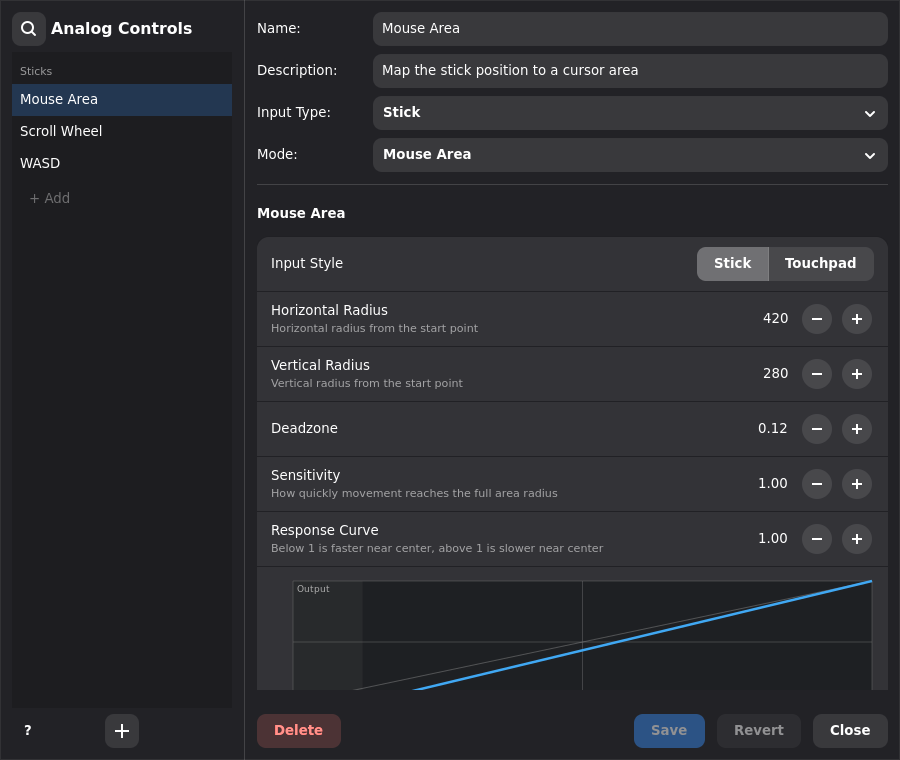

# Keymasq

[](https://github.com/nyrda/keymasq/actions/workflows/tests.yml)
[](https://github.com/nyrda/keymasq/actions/workflows/package.yml)

[keymasq.tools](https://keymasq.tools/) — project website and rendered documentation.

Keymasq is an input customization tool for Linux, built around a full input
remapper for keyboards, mice, and game controllers. One tool covers keys,
buttons, clicks, wheels, sticks, and triggers: remap a single key, turn a
stick into mouse movement, send a keyboard key to a virtual gamepad, and
switch bindings automatically based on the focused app — all from the same
layered profiles.


The GTK4 GUI handles everyday setup, configuration stays in plain TOML for
hand editing and tooling, and the CLI covers profile control, macro playback,
and scripted workflows.

## Features

- Remap keyboard, mouse, and game controller inputs
- Full profile layering for base layouts and temporary layers
- Momentary profile activation with while-held, one-shot, action-count, and timeout modes
- Automatic profile activation based on the focused app or window
- Macro recording, timeline editing, playback, and looping
- Rapidfire actions for autoclicker and auto-fire setups
- Repeat Last Action for replaying your most recent input from any key or button
- Superkeys for one-button multi-role or multi-output behavior
- Combos for single-device, cross-device, and multi-step chords or sequences
- Global hotkeys via combos that work in any app, on Wayland and X11
- Analog controls for controller sticks, triggers, wheels, and axes
- Virtual keyboard, mouse, and gamepad output



*Analog controls: define stick, trigger, and wheel behavior once — deadzone,
sensitivity, response curve — and reuse it across profiles.*

## Use Cases

**Replace vendor utilities**
- Remap mouse side buttons, controller buttons, and macro keys without
  proprietary software

**Tune controllers for games**
- Route sticks, triggers, wheels, and axes to mouse, keyboard, or gamepad output
- Keep game-specific controller layouts in profiles

**Turn spare buttons into workflows**
- Make Caps Lock act as Escape, a modifier, or a superkey
- Put Repeat Last Action on a spare button to re-run whatever you did last
- Trigger macros, commands, profile changes, or several outputs from one press

**Automate repeated input**
- Build autoclickers and auto-fire mappings with rapidfire
- Replay recorded or hand-built input sequences from keys, combos, or the CLI

**Switch by app**
- Auto-switch bindings when apps or games gain focus
- Keep separate profiles for work, desktop navigation, and games

**Navigate without leaving home row**
- Hold Caps Lock or a thumb button for WASD, Vim-style HJKL, Home/End, or scroll navigation
- Release the button to return instantly to your normal layout

**Build richer shortcuts**
- Use superkeys for one-button multi-role behavior
- Use combos for single-device or cross-device shortcut chords and sequences

## Desktop Support

Keymasq works on X11 and on major Wayland desktops, including GNOME, KDE
Plasma, Hyprland, Niri, COSMIC, and wlroots-based compositors such as Sway.
Mappings run at the input layer, below the compositor, and combos work as
global hotkeys in every app — including on Wayland, where applications often
can't register global shortcuts themselves.

Window-aware profiles, pointer capture, and compositor actions depend on what
your desktop session exposes to Keymasq. GNOME requires the Keymasq GNOME
Shell bridge extension.

See [docs/WAYLAND.md](docs/WAYLAND.md) for compositor details and
[docs/GNOME.md](docs/GNOME.md) for GNOME setup.

## Quick Start

Keymasq uses two systemd services: `keymasqd` handles the hardware (it needs elevated access to
input devices), and `keymasq-session` handles your profiles and window tracking
as your normal user. If either service is stopped, your devices work normally;
Keymasq only remaps input when both services are active. The GUI is just for
setup and the CLI for scripted workflows — neither needs to stay running for
your mappings to work.

### Arch Linux

```bash
yay -S keymasq
```

Then [start the services](#start-the-services).

### Debian

Also works on Ubuntu, Linux Mint, Pop!_OS, PikaOS, and other
Debian/Ubuntu-based distros.

```bash
curl -fsSL https://repo.keymasq.tools/gpg-key.asc \
  | sudo gpg --dearmor -o /etc/apt/keyrings/keymasq.gpg
echo "deb [signed-by=/etc/apt/keyrings/keymasq.gpg arch=all] https://repo.keymasq.tools/debian stable main" \
  | sudo tee /etc/apt/sources.list.d/keymasq.list
sudo apt update && sudo apt install keymasq
```

Then [start the services](#start-the-services).

### Fedora

COPR is the preferred Fedora channel:

```bash
sudo dnf install dnf-plugins-core
sudo dnf copr enable nyrda/keymasq
sudo dnf install keymasq
```

Then [start the services](#start-the-services).

### openSUSE / NixOS

See [docs/INSTALL.md](docs/INSTALL.md) for full instructions, including the
service setup.

### SteamOS / Steam Deck

SteamOS and other distros without a native package are supported through an
AppImage that installs itself. On systemd systems it starts the services for
you; on non-systemd systems it writes the missing service-manager instructions.

```bash
chmod +x Keymasq-*-x86_64.AppImage
./Keymasq-*-x86_64.AppImage --install
```

The installer asks for your password. A stock Steam Deck has no user password
yet — set one first with `passwd`.

See [docs/STEAMOS.md](docs/STEAMOS.md) for details.

### Start the services

The commands are the same on every distro. Start the daemon, start the
session service, then launch the GUI:

```bash
sudo systemctl enable --now keymasqd
systemctl --user enable --now keymasq-session
keymasq
```

## Configuration

Keymasq is primarily configured through the GTK4 GUI. User configuration is
stored as plain TOML in `~/.config/keymasq/`:

- `hardware/` stores per-device metadata
- `profiles/` stores global profiles with one or more device layers
- `superkeys/` stores reusable multi-action key definitions
- `analog_controls/` stores reusable stick and axis behavior
- `settings.toml` and `recording_settings.toml` store user preferences

Saved macros are daemon-managed under `/var/lib/keymasq/macros/`; use the GUI
or CLI to create and edit them. See [docs/HARDWARE.md](docs/HARDWARE.md) for
hardware configuration and [docs/PROFILES.md](docs/PROFILES.md) for the
profile format and merge rules.

## Security

Keymasq uses a double-broker design:

- `keymasq-session` is the only client that talks to `keymasqd`
- GUI and CLI clients talk to the session broker, not directly to kernel input
  devices
- Recording and capture features are guarded by an unlock flow and owner checks

See [docs/SECURITY.md](docs/SECURITY.md) for details.

## Documentation

- Getting started: [docs/GETTING_STARTED.md](docs/GETTING_STARTED.md)
- Installation guide: [docs/INSTALL.md](docs/INSTALL.md)
- Hardware configuration: [docs/HARDWARE.md](docs/HARDWARE.md)
- Game controller support: [docs/GAMEPAD.md](docs/GAMEPAD.md)
- Profile system: [docs/PROFILES.md](docs/PROFILES.md)
- Actions explained: [docs/ACTIONS.md](docs/ACTIONS.md)
- Superkeys system: [docs/SUPERKEYS.md](docs/SUPERKEYS.md)
- Combo system: [docs/COMBOS.md](docs/COMBOS.md)
- Macro system: [docs/MACROS.md](docs/MACROS.md)
- Macro timeline editor: [docs/MACRO_EDITOR.md](docs/MACRO_EDITOR.md)
- GNOME setup: [docs/GNOME.md](docs/GNOME.md)
- CLI reference: [docs/CLI.md](docs/CLI.md)
- Performance: [docs/PERFORMANCE.md](docs/PERFORMANCE.md)
- Troubleshooting: [docs/TROUBLESHOOTING.md](docs/TROUBLESHOOTING.md)
- Security model: [docs/SECURITY.md](docs/SECURITY.md)

## Contributing

Contributions are welcome. Start with [CONTRIBUTING.md](CONTRIBUTING.md) for
guidelines and [DEVELOPMENT.md](DEVELOPMENT.md) for the Nix-based development
environment.

## Support

Found a bug or have a question?
[Open a GitHub issue](https://github.com/nyrda/keymasq/issues).
[SUPPORT.md](SUPPORT.md) lists what to include in a report.

## License

MIT License. See [LICENSE](LICENSE).
