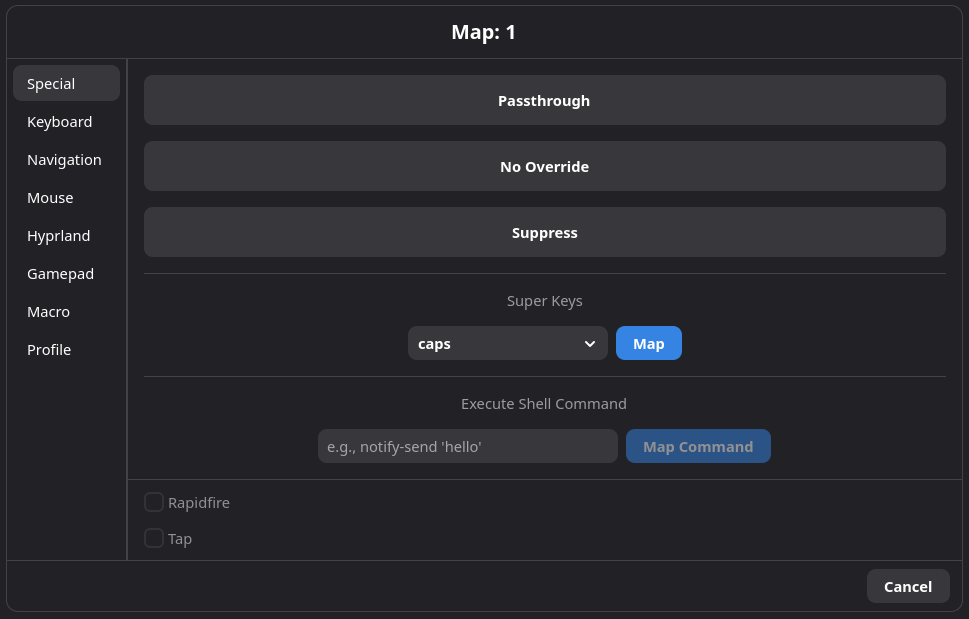
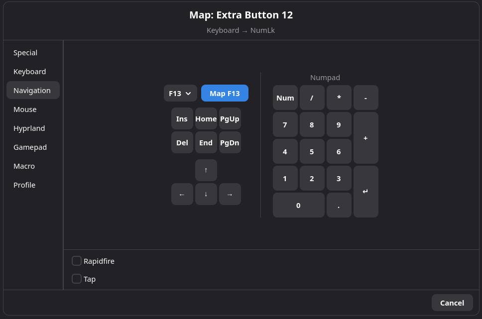
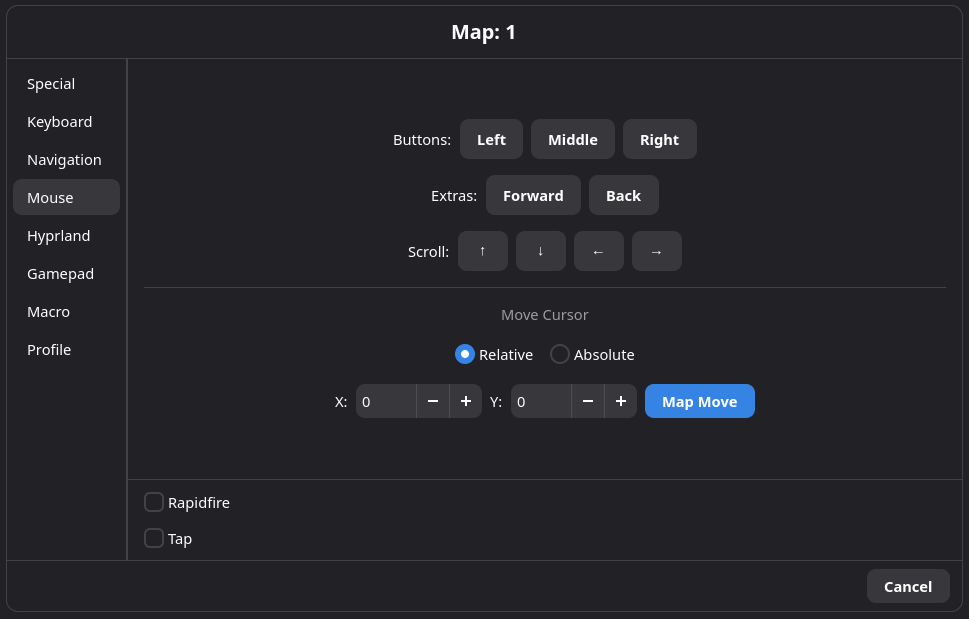
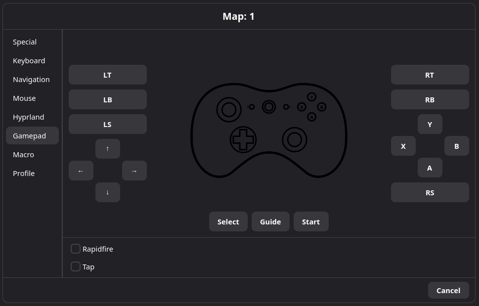
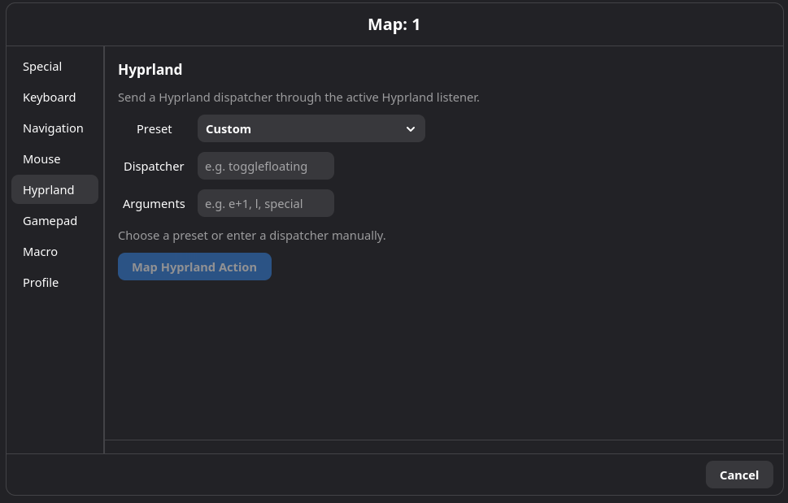
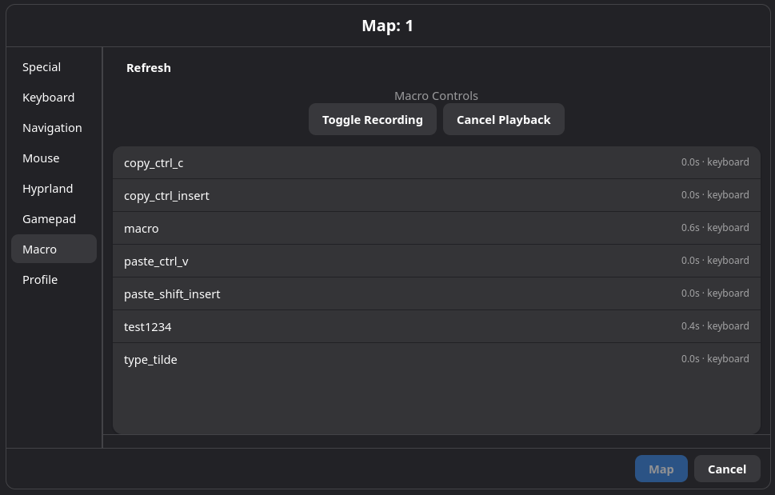
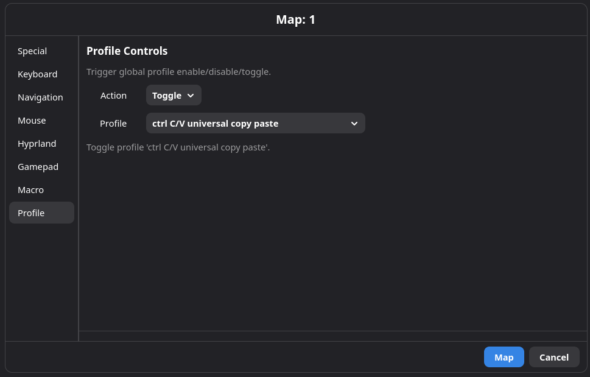
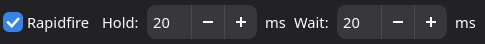
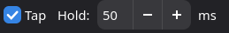

# Actions

## Overview

An action is what Keyforge does when a mapped key, combo, or super key fires.
Every mapping in Keyforge — whether it's a single key remap, a combo trigger,
or a super key slot — points to one action.

After setting up your input devices, you can reassign every key to any action
Keyforge supports — a different key, a mouse button, a macro, a shell
command, and more.

## Quick Start: Remapping a Key

1. Open the Keyforge GUI and go to the **Device** tab for the device you want
   to remap.
2. Click the key or button you want to change.
3. The action chooser dialog opens — pick the action you want from the tabs.
4. Click **Map** (or the equivalent button for your chosen action).
5. The key now performs the new action instead of its original one.

The rest of this document covers every tab and action type available in the
chooser.

<!-- 📸 SCREENSHOT: Device tab with a key selected, about to open the action chooser -->

## Special

The Special tab contains actions that don't send input to apps.

### Passthrough

Send the original input through without modification. This is useful when a
lower-priority profile remaps a key and you want a higher-priority profile to
explicitly undo that remap and let the original key through.

### Suppress

Block the key entirely. Nothing is sent — the key press is silently consumed.
Use this to disable a key you never want to fire.

### No Override

Clear the mapping so that lower-priority profiles can apply theirs. This is
different from Passthrough: Passthrough always sends the original key, while
No Override removes the mapping from this profile entirely and lets the next
profile in the stack decide.

### Execute Shell Command

Run a shell command when the key is pressed. The command runs inside your
user session (delegated to keyforge-session, not the privileged daemon).

Enter the command text and click **Map**.

### Super Key

Assign a [super key](SUPERKEYS.md) to this button. Select one from the
dropdown — the super key's tap, hold, double-tap, and tap+hold actions take
over from there.

## Keyboard

Pick a keyboard key from the visual layout (up to F12). The mapped button
will send that key press instead of its original input.

You can also use **Capture Key** to press any key on your keyboard and have
Keyforge detect it automatically, or enter a raw evdev code directly (e.g.
`125` or `key_leftmeta`). For a full list of evdev codes, see the
[Linux input event codes header](https://github.com/torvalds/linux/blob/master/include/uapi/linux/input-event-codes.h).

## Navigation

A focused set of navigation and function keys for quick access:

- Arrow keys (Up, Down, Left, Right)
- Home, End, Page Up, Page Down
- Insert, Delete
- Extended function keys F13–F24 (via dropdown)

These are the same as Keyboard actions — the Navigation tab is just a
convenience for finding these keys faster.

## Mouse

### Mouse Buttons

Map to a mouse button press: Left, Right, Middle, Side, Extra, Forward, or
Back.

### Mouse Move

Move the cursor when the key is pressed. Two modes are available:

| Mode | What it does |
|---|---|
| **Relative** | Move the cursor by a pixel offset from its current position (e.g. 100 px right, 50 px down). |
| **Absolute** | Move the cursor to an exact screen coordinate (e.g. pixel 1920, 1080). |

Set the X and Y values with the spin buttons, or use **Capture** to select a
point on screen. On supported platforms (Wayland compositors with slurp),
Capture opens a crosshair overlay — click anywhere to set the coordinates.
On other platforms, Capture gives you 2 seconds to move your cursor to the
desired position, then reads the coordinates automatically.

## Gamepad

Map to a gamepad button or trigger. Available inputs include:

- Face buttons (A, B, X, Y)
- Shoulder buttons (LB, RB)
- Triggers (LT, RT) — these output analog values, not simple on/off
- Stick clicks (LS, RS)
- D-Pad (Up, Down, Left, Right)
- Select, Start, Guide

## Compositor

Send a command to your window compositor. Currently Keyforge supports
Hyprland and KDE Plasma.

### Hyprland

Choose from a preset dropdown of common Hyprland dispatchers, or enter a
custom dispatcher and arguments manually.

**Preset examples:**

| Preset | What it does |
|---|---|
| Toggle Floating | Float or unfloat the focused window. |
| Fullscreen | Toggle fullscreen on the focused window. |
| Close Window | Close the focused window. |
| Workspace Next / Previous | Switch to the next or previous workspace. |
| Focus Left / Right / Up / Down | Move window focus in a direction. |
| Move Left / Right / Up / Down | Move the focused window in a direction. |
| Center Window | Center the focused window on screen. |
| Pin Window | Pin the focused window (stays visible across workspaces). |

For custom dispatchers, enter the dispatcher name and any arguments in the
text fields.

### KDE Plasma

Choose from a preset dropdown of supported KWin actions.

**Preset examples:**

| Preset | What it does |
|---|---|
| Desktop Next / Previous | Switch to the next or previous virtual desktop. |
| Close Window | Close the focused window. |
| Fullscreen Toggle | Toggle fullscreen on the focused window. |
| Focus Left / Right / Up / Down | Move focus in a direction. |
| Move Left / Right / Up / Down | Move the focused window in a direction. |
| Tile Left / Right / Top / Bottom | Quick-tile the focused window to an edge. |
| All Desktops Toggle | Show or hide the focused window on all desktops. |
| Show Desktop Toggle | Toggle Plasma's show-desktop mode. |

KDE compositor actions are restricted to Keyforge's supported KWin action IDs.
Unlike Hyprland dispatchers, arbitrary arguments are not supported.

### GNOME

GNOME compositor actions are routed through the Keyforge GNOME Shell bridge
extension. Unlike Hyprland, GNOME does not expose a generic dispatcher socket,
so only a small allowlisted set of actions is available.

**Preset examples:**

| Preset | What it does |
|---|---|
| Workspace Next / Previous | Switch to the next or previous GNOME workspace. |
| Workspace 1 / 2 | Switch to a specific GNOME workspace number. |
| Move To Workspace 1 / 2 | Move the focused window to a specific workspace and switch there. |
| Close Window | Close the focused window. |
| Toggle Fullscreen | Toggle fullscreen on the focused window. |
| Toggle Maximize | Toggle maximized state on the focused window. |

**Supported custom dispatchers:**

| Dispatcher | Accepted args |
|---|---|
| `workspace` | `next`, `prev`, or a 1-based workspace number |
| `move_to_workspace` | `next`, `prev`, or a 1-based workspace number |
| `close_active` | no args |
| `fullscreen` | `toggle`, `on`, `off` |
| `maximize` | `toggle`, `on`, `off` |

## Macro

Trigger macro recording controls or play a saved macro.

### Macro Controls

Two buttons at the top of the Macro tab:

| Button | What it does |
|---|---|
| **Toggle Recording** | Start or stop macro recording. Maps the key to a recording toggle. |
| **Cancel Playback** | Stop all currently running macros. |

### Playing a Macro

Select a macro from the list below the controls. When the mapped key is
pressed, the selected macro plays back.

**Playback options** (shown when a macro is selected):

| Option | What it controls |
|---|---|
| **Replay mouse movement** | Whether to replay recorded mouse movement. |
| **Replay mouse clicks** | Whether to replay recorded mouse clicks. |
| **Speed** | Playback speed multiplier (0.1× to 10×). |

See [Macros](MACROS.md) for details on creating macros, loop modes, and
editing.

## Profile

Control which profiles are active by pressing a key.

| Action | What it does |
|---|---|
| **Toggle** | Switch the profile between enabled and disabled. |
| **Enable** | Enable the profile (no effect if already enabled). |
| **Disable** | Disable the profile (no effect if already disabled). |

Select the action type from the dropdown, then pick the target profile. The
hint label below shows what the mapping will do (e.g. "Toggle profile
'Gaming'").

Profile actions fire once on key press — they don't have a press/release
lifecycle.

## Action Modifiers

Some action types support **rapidfire** and **tap** — two modifiers that
change how the action behaves when you hold the key. These appear in the
options area below the action chooser tabs.

Rapidfire and tap are **mutually exclusive** — enabling one disables the
other.

They are available for: Keyboard, Mouse, Navigation, Gamepad, and Mouse Move
actions. They are not available for: Special, Macro, Profile, or Compositor
actions.

### Rapidfire

When rapidfire is enabled, holding the key repeats the action automatically
in a continuous cycle: press → hold → release → wait → press → hold → …

This continues for as long as the key is physically held down.

| Setting | What it controls | Default | Range |
|---|---|---|---|
| **Hold (ms)** | How long each pulse is held. | 20 ms | 10–1000 ms |
| **Wait (ms)** | Pause between pulses. | 20 ms | 10–1000 ms |

**Use cases:** auto-fire in games, repeated key presses, continuous mouse
movement.

With mouse move actions, rapidfire repeats the movement offset on each cycle —
useful for continuous scrolling or nudging.

### Tap

When tap is enabled, pressing the key sends a single short pulse regardless
of how long you hold the physical key. The action presses and releases
automatically after the configured duration.

| Setting | What it controls | Default | Range |
|---|---|---|---|
| **Hold (ms)** | How long the pulse lasts. | 10 ms | 10–500 ms |

**Use cases:** sending a clean single key press from a button you might
accidentally hold, ensuring consistent short inputs.

With mouse move actions, tap emits the movement once and ignores how long the
key is held.

## Safety Note

Left and right mouse buttons are protected in the GUI — you cannot remap them
away. This prevents accidentally locking yourself out of clicking.

## See Also

- [Macros](MACROS.md) — creating, editing, and playing back macros.
- [Super Keys](SUPERKEYS.md) — tap, hold, and double-tap actions on a single
  key.
- [Combos](COMBOS.md) — multi-key triggers that fire actions.
