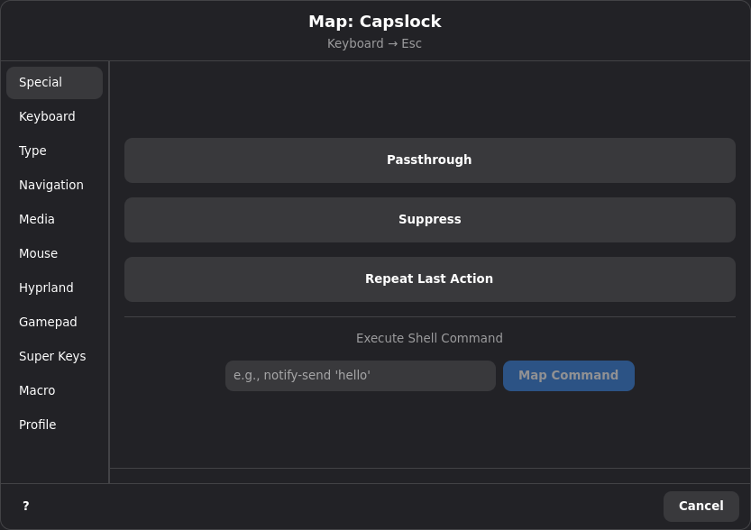
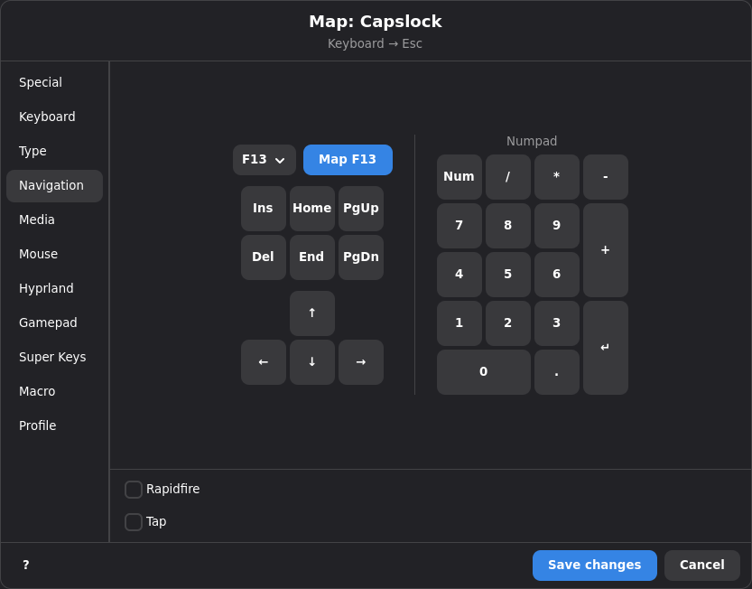
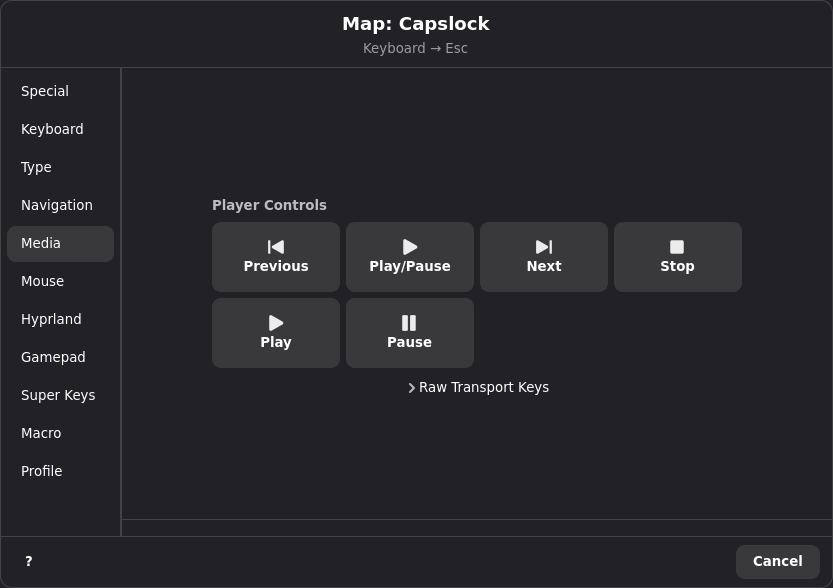
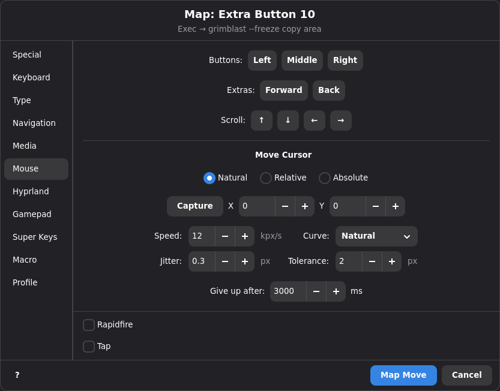
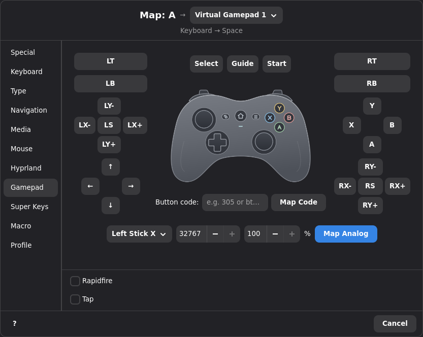
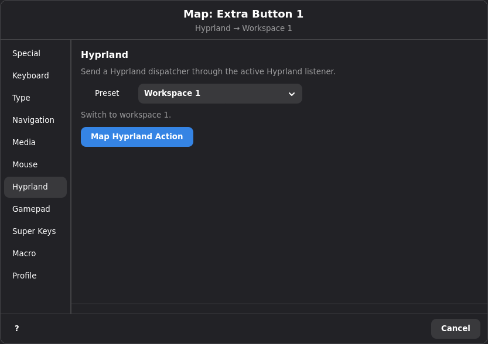
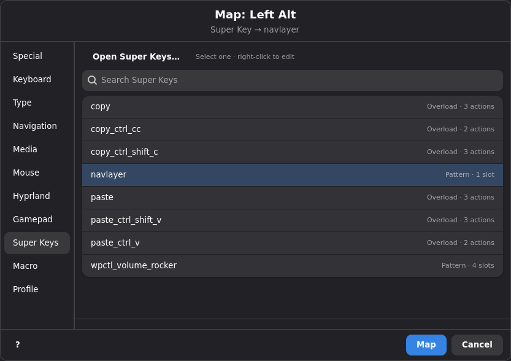
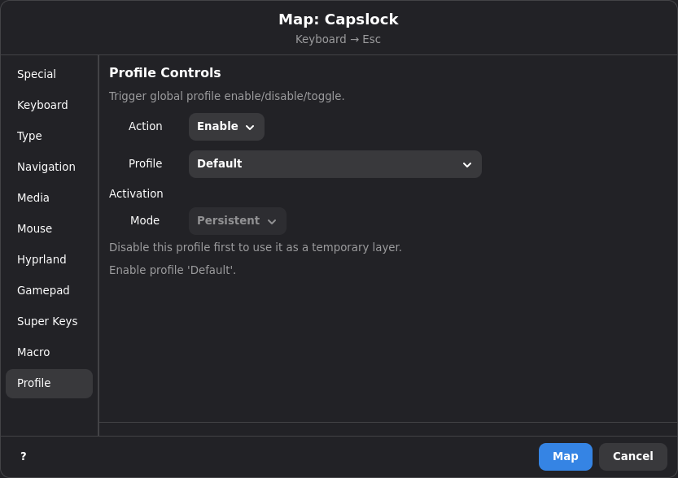

# Actions

## Overview

An action is what Keymasq does when a mapped key, combo, or super key fires.
Every mapping in Keymasq — whether it's a single key remap, a combo trigger,
or a super key slot — points to one action.

After setting up your input devices, you can reassign every key to any action
Keymasq supports — a different key, a mouse button, a macro, a shell
command, and more.

## Quick Start: Remapping a Key

1. Open the Keymasq GUI and go to the **Device** tab for the device you want
   to remap.
2. Click the key or button you want to change.
3. The action chooser dialog opens — pick the action you want from the tabs.
4. Click **Map** (or the equivalent button for your chosen action).
5. The key now performs the new action instead of its original one.

The rest of this document covers every tab and action type available in the
chooser.

<!-- 📸 SCREENSHOT: Device tab with a key selected, about to open the action chooser -->

## Special

The Special tab contains actions that don't send input to apps.

### Passthrough

Clear the mapping from the current profile. If no lower-priority profile maps
the key, the original input passes through unchanged. If a lower-priority
profile does map the key, that lower-priority mapping still applies.

### Suppress

Block the key entirely. Nothing is sent — the key press is silently consumed.
Use this to disable a key you never want to fire.

### Repeat Last Action

Repeat the most recent repeatable action Keymasq handled. This can be a normal
mapping action or original passthrough input. Choose **Repeat Last Action** in
the Special tab, then use the category toggle buttons to choose what kinds of
remembered actions it may replay:

| Toggle | What Repeat can replay |
|---|---|
| **Keys** | Keyboard key actions and passthrough keyboard key presses. |
| **Mouse** | Mouse button and wheel actions, including passthrough mouse clicks and wheel events. |
| **Gamepad** | Gamepad button and axis actions, including passthrough gamepad buttons. |
| **Macros** | Macro playback actions. |
| **Other** | Configured mouse movement actions, command/compositor actions, macro control actions, and resolved Super Key paths. |

All five toggles are enabled by default. If every toggle is off, the dialog
will not let you map the Repeat action.

Repeat never records itself, passthrough mapping actions, suppress actions,
profile actions, or the emergency reset action. Original passthrough mouse
movement is not recorded.
Repeating a remembered action also refreshes Repeat's history, so pressing
Repeat several times in a row keeps replaying the same resolved action until
another repeatable action takes its place.

Repeat has its own Rapidfire control, but rapidfire only applies when the
remembered action is a keyboard key, mouse button, mouse wheel action, or
gamepad button. Remembered configured mouse movement, macro, and other special
actions run once.

Super Key actions are remembered by the path they resolved to. For example, a
pattern super key that fired its double-tap slot is remembered as that super key's
double-tap path, and an overload super key is remembered as its overload path.
Repeating it runs that saved path once instead of replaying only the last child
action. Super Key paths that contain profile actions are not remembered.

### Execute Shell Command

Run a shell command when the key is pressed. The command runs inside your
user session (delegated to keymasq-session, not the privileged daemon).
Keymasq launches it in the background and continues handling later input.

Enter the command text and click **Map**.



Exec actions are also the preferred way to integrate device/vendor tools that
already solve their own hardware protocols. For example, a mouse button can
switch DPI through OpenRazer or ratbagd with commands such as:

```sh
razer-cli --device 'Razer DeathAdder V2' --dpi 1600
ratbagctl 'Logitech G502 HERO Gaming Mouse' dpi set 1600
```

On PipeWire systems, `wpctl` is useful for exact audio commands such as fixed
volume steps or explicit mute toggles:

```sh
# volume down
wpctl set-volume @DEFAULT_AUDIO_SINK@ 5%-

# volume up, clamped to 100%
wpctl set-volume -l 1.0 @DEFAULT_AUDIO_SINK@ 5%+

# toggle sound mute
wpctl set-mute @DEFAULT_AUDIO_SINK@ toggle

# toggle mic mute
wpctl set-mute @DEFAULT_AUDIO_SOURCE@ toggle
```

## Keyboard

Pick a keyboard key from the visual layout (up to F12). The mapped button
will send that key press instead of its original input.

The Keyboard tab also includes a compact **System Keys** row:

- Volume Up, Volume Down, and Mute
- Microphone Mute
- Brightness Up and Brightness Down

These are regular keyboard actions, so the shared Keyboard-tab options apply
when you enable them.

You can also use **Capture Key** to press any key on your keyboard and have
Keymasq detect it automatically, or enter a raw evdev code directly (e.g.
`125` or `key_leftmeta`). For a full list of evdev codes, see the
[Linux input event codes header](https://github.com/torvalds/linux/blob/master/include/uapi/linux/input-event-codes.h).


## Navigation

A focused set of navigation and function keys for quick access:

- Arrow keys (Up, Down, Left, Right)
- Home, End, Page Up, Page Down
- Insert, Delete
- Extended function keys F13–F24 (via dropdown)

These are the same as Keyboard actions — the Navigation tab is just a
convenience for finding these keys faster.



## Media

Quick access to player controls and raw transport keys:

### Player Controls

Keymasq tracks MPRIS media players and applies one consistent playback policy
across applications. Two notions of "most recent" drive that policy:

- **the player you most recently started** — the player whose playback you last
  began, and
- **the most recently detected player** — the most recent player Keymasq saw
  appear on the bus.

The `play`, `next`, and `previous` commands skip any player that reports it
can't honor the request, so a player that can't change tracks won't swallow a
`next`.

Supported commands:

| Command | Behavior |
| --- | --- |
| `play_pause` | If any players are playing, pause all of them. Otherwise resume the player you most recently started, falling back to the most recently detected player that can play. |
| `pause` | Pause every currently playing player. |
| `play` | Resume the player you most recently started, falling back to the most recently detected player that can play. |
| `next` | Skip forward on the most recently detected player that can change tracks. |
| `previous` | Skip back on the most recently detected player that can change tracks. |
| `stop` | Stop every currently playing player. |

Pausing and stopping are intentionally **cross-application**: because browsers
and many other apps register as MPRIS players, `play_pause`, `pause`, and `stop`
act on every matching player at once, not just one. Track controls (`next` /
`previous`) target the most recently detected capable player, which may not be
the same player that `play` or `play_pause` would resume.

### Raw Transport Keys

The Media tab also offers standard playback key actions:

- Play/Pause, Play, Pause, Stop
- Previous Track and Next Track

Playback media keys remain useful when you want to emit standard
Linux input key codes such as `key_playpause`, `key_play`, or `key_nextsong`.



## Mouse

### Mouse Buttons

Map to a mouse button press: Left, Right, Middle, Side, Extra, Forward, or
Back.

Mouse wheel directions can also be remapped from the device tab when the
hardware profile contains wheel inputs. Keymasq treats each wheel tick as a
pulse input, so `Scroll Up`, `Scroll Down`, and supported horizontal scroll
directions can trigger normal actions without exposing raw evdev values in the
GUI.

Mouse actions can output wheel movement too. Select a wheel target such as
Scroll Up or Scroll Down to emit a virtual `REL_WHEEL` pulse.

### Mouse Move

Move the cursor when the key is pressed. Three modes are available. The GUI
shows **Natural** first because it is the preferred mode for fixed cursor
positioning on supported desktops.

| Mode | What it does |
|---|---|
| **Natural** | Move toward an absolute screen position by emitting normal relative mouse events over time, checking realtime cursor feedback, and correcting the route until the pointer reaches the configured tolerance or times out. |
| **Relative** | Move the cursor by a pixel offset from its current position (e.g. 100 px right, 50 px down). |
| **Absolute** | Attempt to move the cursor to a screen position by first sending a large upper-left reset through the virtual mouse, then sending the configured X/Y offset. |

Set the X and Y values with the spin buttons, or use **Capture** to select a
point on screen. On supported platforms (Wayland compositors with slurp),
Capture opens a crosshair overlay — click anywhere to set the coordinates.
On other platforms, Capture gives you 2 seconds to move your cursor to the
desired position, then reads the coordinates automatically.

Absolute and Natural mouse moves are emitted by `keymasqd` through Keymasq's
virtual mouse device as relative `REL_X`/`REL_Y` events. This keeps them visible
as normal input to games or other windows that lock the pointer and ignore
compositor cursor warps. Because these are not native compositor cursor warps,
the final position can still depend on how the desktop processes relative
pointer motion.

For reliable fixed-position cursor movement, use **Natural** with a high speed
and low jitter when realtime feedback is available. The feedback loop corrects
the path while the pointer moves, so it handles desktop scaling and multi-monitor
layouts better than the one-shot Absolute mode.

**Absolute** is a compatibility fallback, not an exact cursor warp. It does not
reliably work with desktop scaling, fractional or per-monitor scaling, or
multi-monitor layouts, and pointer acceleration or sensitivity can also shift the
final position. It is mainly useful when realtime feedback is unavailable or when
you intentionally want a simple virtual-mouse reset-and-offset action.

Natural movement requires realtime, low-latency cursor feedback while the
virtual mouse is moving. Keymasq currently supports that feedback on GNOME,
Hyprland, KDE Plasma, and X11. Other Wayland compositors are not
available for Natural movement because their pointer-position paths do not
provide the feedback loop. Slurp can still be used by **Capture** to fill the
target coordinates. Configure speed, curve, jitter, tolerance, and timeout from
the Mouse tab or profile TOML:

```toml
action = "mouse_move_natural_abs"
x = 640
y = 480
speed = 12000.0
curve = "natural" # linear or natural
jitter = 0.3
tolerance = 2
max_duration_ms = 3000
```

The GUI shows natural movement speed as `kpx/s` (thousands of pixels per
second), so `12 kpx/s` is stored as `speed = 12000.0` in TOML and macro
payloads.

For desktop automation on GNOME or Hyprland, the compositor action **Set
Cursor** preset is also available when you specifically need the compositor to
place the pointer at an absolute desktop coordinate.



## Gamepad

Map to a gamepad button, trigger axis, or stick axis. Available inputs include:

- Face buttons (A, B, X, Y)
- Shoulder buttons (LB, RB)
- Triggers (LT, RT) — these output analog values, not simple on/off
- Stick axes (left/right X and Y) — set a specific analog value while held
- Stick clicks (LS, RS)
- D-Pad (Up, Down, Left, Right)
- Select, Start, Guide



To map a button outside the template, use the **Button code** field below the
controller diagram. It accepts an evdev button name (such as `btn_c` or
`btn_trigger_happy1`) or a numeric key code (decimal or `0x`-prefixed), and
routes through the same output selected above. This is an advanced option: the
chosen output must actually support the button code for it to emit. Hardware
gamepad outputs expose whatever buttons the physical device advertises, while
the virtual gamepad outputs advertise the standard Xbox 360 button set.

Gamepad actions can route to a specific output with `output_id`. Use
`virtual-gamepad-1` through `virtual-gamepad-4` for configured virtual Xbox
360 outputs, or a configured hardware gamepad ID such as `045e:028e@2`.
Omitting `output_id` uses the default output, `virtual-gamepad-1` when it
exists. Explicit targets never fall back: if the daemon cannot route to the
configured output, it logs a warning and drops the gamepad event.

Analog axis actions use `action = "gamepad_axis"`, a target such as `abs_x`
or `abs_rz`, and a raw evdev `value`. Stick axes accept `-32768..32767`;
trigger axes accept `0..255`. Releasing the source input returns the axis to
neutral `0`. LT and RT are axis actions (`abs_z` and `abs_rz`); `gamepad`
actions are button-only.

To target an axis outside the template, pick **Custom** in the axis dropdown
and enter an evdev axis name (such as `abs_hat0x`, `abs_hat0y`, `abs_throttle`,
or `abs_rudder`) or a numeric code, then enter the raw value to send. As with
custom buttons, the chosen output must support the axis for it to emit; the
virtual gamepad outputs include the standard stick, trigger, and `abs_hat0`
axes.

## Analog Controls

Analog Controls map an analog source, such as `left_stick`, `right_stick`,
`left_trigger`, or `right_trigger`, to a saved analog config. A config can:

- turn stick position or a 1D axis into continuous relative mouse movement
- turn stick or 1D axis ranges into normal digital actions
- route sticks or triggers to a selected gamepad output with an analog deadzone
  and optional left/right output side
- tune analog output and mouse movement with sensitivity and response curve
- split stick mouse movement into separate horizontal and vertical speeds

Create configs from **Analog Controls** in the app menu, then map an analog card
in a gamepad device tab to the saved config. Profile TOML uses:

```toml
[devices."045e:028e".mapping.left_stick]
action = "analog_control"
analog_control_name = "FPS Mouse"
```

An analog source can also run multiple saved configs at the same time:

```toml
[devices."045e:028e".mapping.left_stick]
action = "analog_control"
analog_control_names = ["FPS Mouse", "WASD"]
```

Overlapping action ranges are allowed and evaluated independently. Mouse wheel
and WASD-style behavior are templates over normal threshold actions, not
separate runtime modes.

## Compositor

Send a command to your window compositor. Currently Keymasq supports
Hyprland, Niri, KDE Plasma, and GNOME.

### Hyprland

Choose from a preset dropdown of common Hyprland dispatchers, or enter a
custom dispatcher and arguments manually.

**Preset examples:**

| Preset | What it does |
|---|---|
| Toggle Floating | Float or unfloat the focused window. |
| Fullscreen | Toggle fullscreen on the focused window. |
| Close Window | Close the focused window. |
| Workspace Next / Previous | Switch to the next or previous workspace. |
| Focus Left / Right / Up / Down | Move window focus in a direction. |
| Move Left / Right / Up / Down | Move the focused window in a direction. |
| Center Window | Center the focused window on screen. |
| Pin Window | Pin the focused window (stays visible across workspaces). |

For custom dispatchers, enter the dispatcher name and any arguments in the
text fields.



### Niri

Choose from presets or enter a raw Niri action using the same syntax as
`niri msg action`.

**Preset examples:**

| Preset | What it does |
|---|---|
| Close Window | Close the focused window. |
| Fullscreen / Fake Fullscreen | Toggle fullscreen or windowed fullscreen on the focused window. |
| Toggle Floating | Toggle floating mode for the focused window. |
| Previous Window / Next Window | Cycle horizontally through Niri's scrolling window strip. |
| Focus Left / Right / Up / Down | Move focus between columns and windows. |
| Move Column Left / Right | Move the focused column horizontally. |
| Move Window Up / Down | Reorder the focused window inside its column. |
| Workspace Up / Down / Previous | Switch between workspaces. |
| Workspace 1 / 2 | Focus a specific workspace by index. |
| Move To Workspace 1 / 2 | Move the focused window to a workspace and follow it. |
| Send To Workspace 1 / 2 | Move the focused window to a workspace without following it. |

Custom Niri actions use the same action name and argument style as
`niri msg action`. For example, use dispatcher `focus-workspace` with args `2`,
or dispatcher `focus-window` with args `--id 17`.
Keymasq still keeps a direct socket fast path for the common preset actions,
and the "Previous Window" / "Next Window" presets follow Niri's scrolling
model by using the looping horizontal focus actions.

### KDE Plasma

Choose from a preset dropdown of supported KWin actions.

**Preset examples:**

| Preset | What it does |
|---|---|
| Desktop Next / Previous | Switch to the next or previous virtual desktop. |
| Close Window | Close the focused window. |
| Fullscreen Toggle | Toggle fullscreen on the focused window. |
| Focus Left / Right / Up / Down | Move focus in a direction. |
| Move Left / Right / Up / Down | Move the focused window in a direction. |
| Tile Left / Right / Top / Bottom | Quick-tile the focused window to an edge. |
| All Desktops Toggle | Show or hide the focused window on all desktops. |
| Show Desktop Toggle | Toggle Plasma's show-desktop mode. |

KDE compositor actions are restricted to Keymasq's supported KWin action IDs.
Unlike Hyprland dispatchers, arbitrary arguments are not supported.

### GNOME

GNOME compositor actions are routed through the Keymasq GNOME Shell bridge
extension. Unlike Hyprland, GNOME does not expose a generic dispatcher socket,
so only a small allowlisted set of actions is available.

**Preset examples:**

| Preset | What it does |
|---|---|
| Workspace Next / Previous | Switch to the next or previous GNOME workspace. |
| Workspace 1 / 2 | Switch to a specific GNOME workspace number. |
| Move To Workspace 1 / 2 | Move the focused window to a specific workspace and switch there. |
| Close Window | Close the focused window. |
| Toggle Fullscreen | Toggle fullscreen on the focused window. |
| Toggle Maximize | Toggle maximized state on the focused window. |

**Supported custom dispatchers:**

| Dispatcher | Accepted args |
|---|---|
| `workspace` | `next`, `prev`, or a 1-based workspace number |
| `move_to_workspace` | `next`, `prev`, or a 1-based workspace number |
| `close_active` | no args |
| `fullscreen` | `toggle`, `on`, `off` |
| `maximize` | `toggle`, `on`, `off` |

## Super Keys

Assign a [super key](SUPERKEYS.md) to this button. Select one from the Super
Keys tab, then click **Map**.

Use **Open Super Keys…** to create or edit reusable super keys. Right-click a
saved super key in the selector to open the Super Keys dialog with that super
key selected.

Super keys have two modes:

- **Pattern**: Tap, Double Tap, Hold, and Tap + Hold choose one slot, and each
  slot can run an ordered bundle of actions.
- **Overload**: the source key behaves like a one-to-many normal mapping and
  forwards its down, repeat, and up cycle to multiple child actions.



## Macro

Trigger temporary macro recording slots, play temporary slots, cancel macro
playback, or play a saved macro.

Right-click a saved macro in the selector's Macro Library to open it in the
macro editor.

### Macro Controls

Recording slot buttons and playback controls appear in the Macro tab:

| Control | What it does |
|---|---|
| **Record slot** | Start or stop macro recording in that explicit temporary slot. Slots 1-4 are fixed controls. |
| **Play slot** | Play the current temporary recording in that explicit slot without saving it as a macro. |
| **Cancel Macro Playback** | Stop all currently running macros. |

Recording triggers must name a slot. Keymasq does not choose a slot
automatically for mapped recording controls. Slot playback triggers also name
the slot they play. If macro recording is disabled, the key selector replaces
the slot controls with a short disabled notice and a settings shortcut.

### Playing a Macro

Select a macro from the list below the controls. When the mapped key is
pressed, the selected macro plays back.

**Playback options** (shown when a macro is selected):

| Option | What it controls |
|---|---|
| **Replay mouse movement** | Whether to replay recorded mouse movement. |
| **Replay mouse clicks** | Whether to replay recorded mouse clicks. |
| **Speed** | Playback speed multiplier (0.1× to 10×). |

See [Macros](MACROS.md) for details on creating macros, loop modes, and
editing.


## Profile

Control which profiles are active by pressing a key.

| Action | What it does |
|---|---|
| **Toggle** | Switch the profile between enabled and disabled. |
| **Enable** | Enable the profile (no effect if already enabled). |
| **Disable** | Disable the profile (no effect if already disabled). |

Select the action type from the dropdown, then pick the target profile. The
hint label below shows what the mapping will do (e.g. "Toggle profile
'Gaming'").

Enable and Toggle can also use an activation mode when the target profile is disabled:

| Mode | Meaning |
|---|---|
| **Persistent** | Persistent behavior. The profile file is updated just like older Keymasq versions. |
| **While trigger is held** | Enable-only runtime layer that ends when the mapped key, combo, or superkey trigger ends. |
| **One-shot** | Runtime-only layer that ends after the next grabbed input press or top-level combo, wheel, or superkey action. A timeout can be enabled as a fallback. |
| **Custom** | Combine action count and timeout. Action counts are consumed by grabbed input presses and top-level combo, wheel, or superkey actions. Enable actions can also use trigger end. Timeout-only layers are configured here. |

Note: One-shot layers are consumed by the next key or button press. Combos
inside a one-shot layer usually cannot complete because the first combo input
deactivates the layer.

Toggle with **Persistent** mode is saved to the profile file. Toggle with any
temporary activation mode is runtime-only: pressing it once activates the
temporary layer, and pressing it again cancels the same temporary layer before
its conditions expire. Disable is always persistent and also cancels any runtime
activation for that profile. Profile action deactivation conditions use "any"
semantics: the first configured condition to happen deactivates the runtime
layer.

If the selected target profile is already enabled, activation controls are
disabled in the editor. Disable that profile first to use it as a temporary
layer.

TOML stores temporary activation settings under `deactivation` on profile actions:

```toml
[devices."046d:c548".mapping.btn_extra]
action = "profile_enable"
profile_name = "Nav Layer"

[devices."046d:c548".mapping.btn_extra.deactivation]
on_trigger_end = true
after_actions = 1
timeout_ms = 1500
```



## Action Modifiers

Some action types support **rapidfire** and **tap** — two modifiers that
change how the action behaves when you hold the key. These appear in the
options area below the action chooser tabs.

Rapidfire and tap are **mutually exclusive** — enabling one disables the
other.

They are available in the shared options area for: Keyboard, Mouse, Navigation,
Media, Gamepad, and Mouse Move actions. Repeat has its own Rapidfire control in
the Special tab, limited to remembered keyboard keys, mouse buttons, mouse wheel
actions, and gamepad buttons. They are not available for other Special actions,
Super Keys, Macro, Profile, or Compositor actions. Natural mouse movement is an
exception within Mouse Move: it does not support rapidfire or tap.

### Rapidfire

When rapidfire is enabled, holding the key repeats the action automatically
in a continuous cycle: press → hold → release → wait → press → hold → …

This continues for as long as the key is physically held down.

| Setting | What it controls | Default | Range |
|---|---|---|---|
| **Hold (ms)** | How long each pulse is held. | 20 ms | 0–1000 ms |
| **Wait (ms)** | Pause between pulses. | 20 ms | 1–1000 ms |

`0 ms` hold with `1 ms` wait is the fastest supported rapidfire pattern.

**Use cases:** auto-fire in games, Linux autoclicker setups, repeated key
presses, and continuous mouse movement.

With relative and absolute mouse move actions, rapidfire repeats the movement
offset on each cycle — useful for continuous scrolling or nudging.

If you want a simple autoclicker, map a key or mouse button to a mouse action
and enable Rapidfire. Use a [macro](MACROS.md) instead when you need a more
scripted pattern, such as double-clicks, cursor movement, mixed keyboard and
mouse input, or toggle/count playback.

### Tap

When tap is enabled, pressing the key sends a single short pulse regardless
of how long you hold the physical key. The action presses and releases
automatically after the configured duration.

| Setting | What it controls | Default | Range |
|---|---|---|---|
| **Hold (ms)** | How long the pulse lasts. | 10 ms | 10–500 ms |

**Use cases:** sending a clean single key press from a button you might
accidentally hold, ensuring consistent short inputs.

With relative and absolute mouse move actions, tap emits the movement once and
ignores how long the key is held.

## Safety Note

The GUI warns before editing left or right mouse click mappings. Remapping a
primary or secondary click can remove that click **everywhere**.

## See Also

- [Macros](MACROS.md) — creating, editing, and playing back macros.
- [Super Keys](SUPERKEYS.md) — pattern and overload modes for a single key.
- [Combos](COMBOS.md) — multi-key triggers that fire actions.
