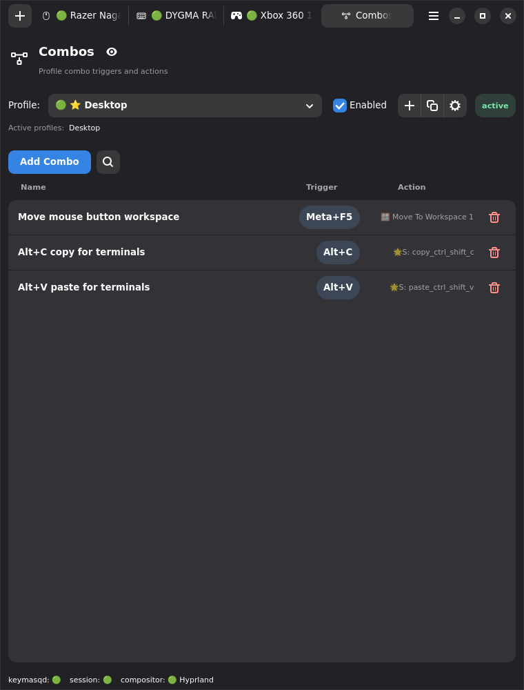
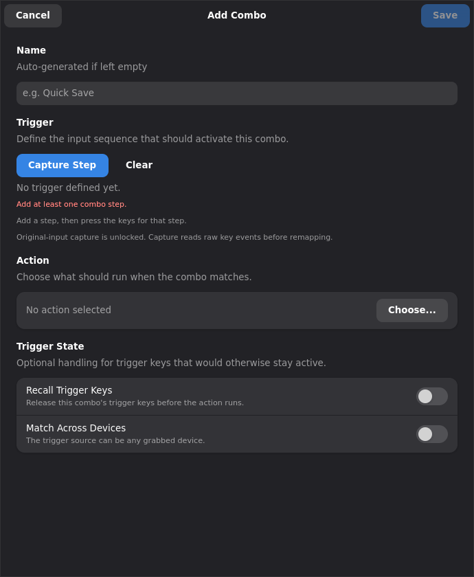
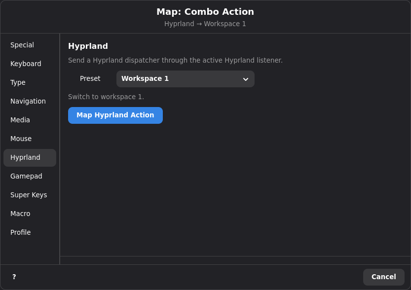

# Combo System

## Overview

A combo is a trigger made from one or more key or button presses that fires a
single action. Think of it as a keyboard shortcut that Keymasq intercepts
before it reaches your apps.

A combo can be:

- **Single-step** — one combo trigger, like `Alt+1`.
- **Multi-step** — a sequence of combo triggers, like `Alt+R` then `1`.

When a combo matches, it triggers an action — a key press, a mouse click, a
macro, a shell command, or anything else Keymasq can map to.

Combos are stored inside profiles. They can include events from multiple
devices, so a combo can combine a keyboard key and a mouse button if needed.

## Quick Start: Your First Combo

1. Open the Keymasq GUI and go to the **Combo** tab.
2. Select the profile you want the combo to belong to.
3. Click **Add Combo**.
4. Keymasq enters capture mode — press the key combination you want as the
   trigger (for example, hold `Alt` and press `1`).
5. Choose the action to fire when the combo matches.
6. Save.

Now whenever you press that combination, Keymasq runs the action instead of
sending the keys to your apps.







## How Combos Work

### Single-Step Combos

Here's what happens when you use a single-step combo like `Alt+1`:

1. You press and hold `Alt` — nothing special happens yet.
2. You press `1` — the combo is complete, so Keymasq fires the action.
3. The normal `1` key press is consumed and does not reach your apps.
4. `Alt` stays held (since you're still physically holding it), so modifier
   behavior in your compositor and apps works normally.

If you never press `1`, `Alt` just behaves like a normal key. No combo fires.

**Re-triggering:** if you release `1` while still holding `Alt` and press `1`
again, the combo fires again — you don't need to release everything and start
over.

Single-step combos are evaluated from the current held state of their first
step. Unrelated extra input does not cancel them. For example, you can hold
`Alt`, press `C`, release `C`, click the mouse or type another key, and then
press `V` to trigger a separate `Alt+V` combo without releasing `Alt`.

If multiple single-step combos are satisfied at the same time, each one
activates independently. For example, if you define `Alt+C`, `Alt+V`, and
`Alt+C+V`, then pressing `V` while `Alt+C` is still held will activate both
`Alt+V` and `Alt+C+V`.

Mouse wheel directions can be used as pulse inputs in combos. For example,
`Meta+Scroll Up` or `Mouse Back+Scroll Up` fires once for each wheel tick while
the other trigger input is held. Wheel directions do not stay held, so
wheel-triggered combo actions are pressed and released immediately.

### Multi-Step Combos

Multi-step combos also use held-state matching for step 1, then advance one
step at a time:

1. Complete step 1 (e.g. press `Alt+R`).
2. Release all keys from step 1.
3. Complete step 2 (e.g. press `1`) before the timeout expires.
4. The action fires.

Wheel directions can also complete a later step, such as `Alt+R`, then
`Scroll Down`. A wheel-only first step is only valid for a single-step combo;
multi-step combos need a held key or button with the wheel in step 1.

**Timeouts:** step 1 has no timeout — you can take as long as you need. Steps
2 and onward each have a timeout (default 600 ms). If you don't complete the
next step in time, the combo is silently cancelled. You can change per-step
timeouts in the combo editor.

### Trigger Recall And Restore

Sometimes a held modifier interferes with the combo action. For example:

- Combo trigger: `Shift+Meta+V`
- Action: run `ydotool type` to type clipboard contents
- Problem: Shift is still held when the action runs, so the typed text comes
  out UPPERCASE

**Recall Trigger Keys** fixes this by releasing the combo's trigger keys before
the action runs. The action executes without interference from held modifiers.

**Restore Trigger Keys** optionally re-presses selected trigger keys after the
action finishes, but only if those keys are still physically held. This is
useful when you want the modifier to remain active for subsequent input.

In the combo editor, you can enable recall and choose exactly which trigger
keys should be restored afterward.

By default, combo trigger keys keep their normal passthrough behavior and are
not recalled.

## Combo Capture

When you create or edit a combo's trigger, Keymasq enters capture mode and
records the raw physical input directly from your devices — not the remapped
output. This means:

- The combo is tied to the actual physical key, regardless of what it's
  currently remapped to.
- Capture works across all connected devices, so you can build combos that
  span a keyboard and a mouse, or two keyboards.
- Capture supports scroll directions as `Scroll Up`, `Scroll Down`, and
  supported horizontal scroll directions. A wheel tick finishes the captured
  step immediately.
- The captured trigger is stored with the exact device identity (`hardware_id`,
  input source, and evdev code), so matching at runtime is precise.

Capture uses the same security model as macro recording — it observes original
input and requires the recording unlock flow.

## Actions

Combos can trigger the same kinds of actions as normal key mappings:

| Action type | Example |
|---|---|
| **Keyboard** | Send a key press. |
| **Mouse** | Send a mouse button or relative movement. |
| **Gamepad** | Send a gamepad button or trigger. |
| **Macro** | Play a saved macro. |
| **Super Key** | Run a saved overload or pattern super key. |
| **Command** | Run a shell command. |
| **Suppress** | Block the key — do nothing. |
| **[Profile](ACTIONS.md)** | Enable, disable, or toggle a profile. |

For actions with a press/release lifecycle (keyboard output,
[rapidfire](ACTIONS.md), [hold macros](MACROS.md#loop-modes)), the final step
of the combo controls the lifecycle:

- The action starts when the final step completes.
- The action stops when any key from the final step is released.

If the final combo input is a wheel direction, Keymasq treats it as an
instantaneous pulse: the action starts and then stops immediately for that
wheel tick.

One-shot actions (commands, profile toggles) fire once when the combo
completes.

### Super Key Combo Actions

Combos can trigger saved **Super Keys**.

#### Overload

`Overload` superkeys fit naturally into combo actions:

- When the combo completes, the overload child actions start in list order.
- When the combo releases, held child actions stop again.
- One-shot child actions like commands, profile actions, and compositor
  actions still fire once on combo completion.
- Nested **Super Key** child actions inside an overload are not expanded again
  from a combo-triggered overload. Keymasq skips them and logs a warning
  instead of allowing recursive nesting.

#### Pattern

Pattern superkeys use the combo's own activation lifecycle:

- **Single-step combos** support the full pattern flow:
  - Tap
  - Double Tap
  - Hold
  - Tap + Hold
- **Multi-step combos** support only:
  - Tap
  - Hold

For multi-step combos, the **Double Tap** and **Tap + Hold** slots are not
used.

Combos reference saved superkeys by name. If a referenced superkey is deleted
or changed, the combo uses the current saved definition the next time runtime
state is applied.

## Profile Resolution

Combos follow the same active-profile ordering as normal mappings — later
profiles win over earlier ones. See [Profiles](PROFILES.md) for the full
ordering rules.

The combo editor won't let you save two combos with the same trigger sequence
in the same profile. Across profiles, if two combos share the same trigger,
the one from the last-applied profile wins.

`Ctrl+Alt+Esc` is reserved by default as Keymasq's emergency combo on grabbed
keyboards. The daemon injects it into the active combo set, and the GUI rejects
that exact trigger while the safety combo is enabled. One tap cancels macro
playback after a 200 ms double-tap window; a double tap releases all grabbed
devices and asks the session to reapply active profiles.

## Overlap And Conflicts

Combos with overlapping first steps can coexist:

- `Alt+C` and `Alt+V` can both be used while `Alt` stays held.
- `Alt+C` and `Alt+C+V` can both be active. The longer combo is not blocked by
  the shorter one.

The main conflict that still matters is an **exact trigger conflict** across
profiles. If two profiles define the same combo trigger, the one from the
later-applied profile wins.

### What the GUI Validates

The combo editor intentionally stays conservative. It blocks:

- Empty triggers or actions.
- Invalid timeout values.
- Exact duplicate triggers within the same profile.
- `Ctrl+Alt+Esc` while the emergency combo is enabled.

It does **not** try to detect cross-profile exact-trigger conflicts.
The runtime behavior is the source of truth.

## Storage

Combos are stored inside profile TOML files — they are not separate files like
macros or super keys.

```toml
[[combos]]
id = "combo_1"
name = "Alt+R -> 1 -> Move 20,20"

[[combos.steps]]
events = [
  { hardware_id = "abcd:ef01", source = "kbd", evdev = "key_leftalt" },
  { hardware_id = "abcd:ef01", source = "kbd", evdev = "key_r" },
]

[[combos.steps]]
timeout_ms = 600
events = [
  { hardware_id = "abcd:ef01", source = "kbd", evdev = "key_1" },
]

[combos.action]
action = "mouse_move_rel"
x = 20
y = 20
```

Each step stores the exact `hardware_id`, input source, and evdev code that
was captured. This is not a user interface — prefer the GUI for creating and
editing combos.

## Security Notes

- **Command actions** run shell commands inside your user session (delegated
  to keymasq-session, not the privileged daemon). They still execute
  automatically when the combo fires, so be mindful of what you put in them.
- **Compositor dispatcher actions** can send commands to your compositor
  (e.g. Hyprland). These interact with your desktop environment directly, so
  review what they do before assigning them to a combo.
- **Combo capture** uses the same security model as macro recording — it
  observes original input and requires the recording unlock flow.

## Troubleshooting

- **Combo doesn't fire** — check that all first-step keys are still physically
  held when you expect the combo to activate, and check that later multi-step
  steps are being entered in the right order.
- **Combo fires the wrong action** — check profile ordering. A later profile
  may have a combo with the same exact trigger that takes priority.
- **Multi-step combo times out** — increase the timeout for the step that's
  expiring. The default is 600 ms, which may be too short for complex
  sequences.
- **Combo works on one device but not another** — combos are tied to exact
  hardware IDs. If you moved to a different device, you need to recapture the
  trigger.

## Best Practices

- **Start with modifier-led combos.** Combos starting with `Alt`, `Ctrl`, or
  `Meta` behave the most predictably because the modifier passes through
  naturally.
- **Keep combos short.** One or two steps is usually enough. Longer sequences
  are harder to remember and more likely to time out.
- **Use overlap intentionally.** Overlapping first-step combos are allowed. If
  you define `Alt+C`, `Alt+V`, and `Alt+C+V`, each one can activate when its
  held condition becomes true.
- **Use descriptive names.** The combo name appears in the GUI list — a name
  like `Alt+R → 1: move mouse` is easier to manage than `combo_3`.

## See Also

- [Macros](MACROS.md) — record or build input sequences that combos can
  trigger.
- [Super Keys](SUPERKEYS.md) — map multiple actions to a single key based on
  tap, hold, and double-tap interactions.
