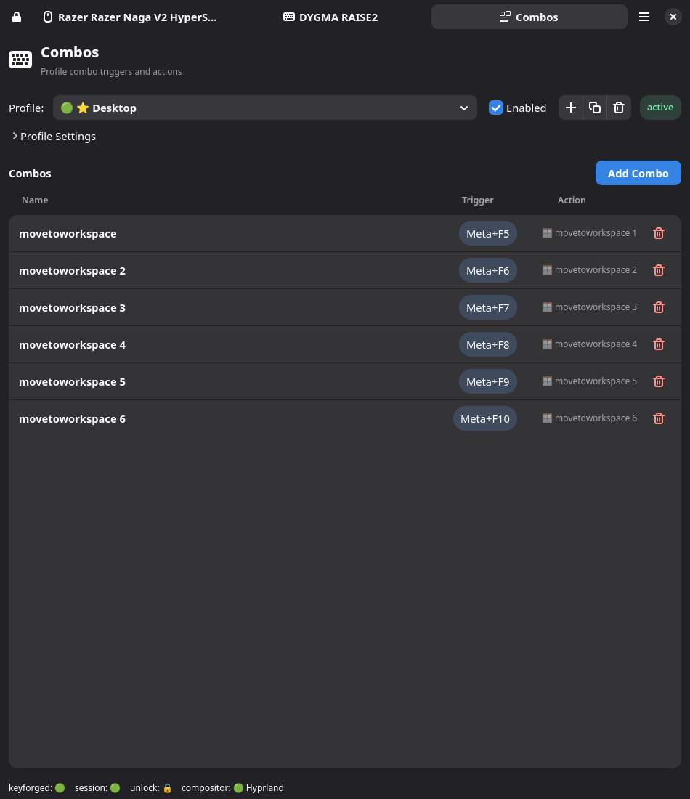
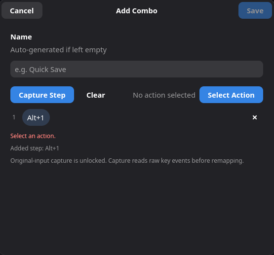
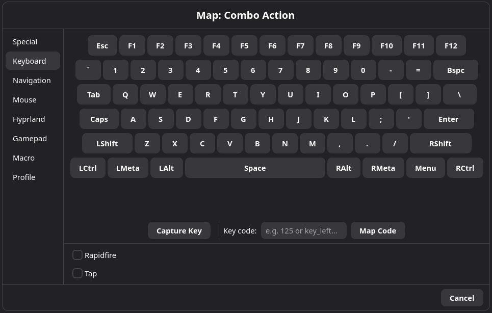

# Combo System

## Overview

A combo is a trigger made from one or more key or button presses that fires a
single action. Think of it as a keyboard shortcut that Keyforge intercepts
before it reaches your apps.

A combo can be:

- **Single-step** — one chord, like `Alt+1`.
- **Multi-step** — a sequence of chords, like `Alt+R` then `1`.

When a combo matches, it triggers an action — a key press, a mouse click, a
macro, a shell command, or anything else Keyforge can map to.

Combos are stored inside profiles. They can include events from multiple
devices, so a combo can combine a keyboard key and a mouse button if needed.

## Quick Start: Your First Combo

1. Open the Keyforge GUI and go to the **Combo** tab.
2. Select the profile you want the combo to belong to.
3. Click **Add Combo**.
4. Keyforge enters capture mode — press the key combination you want as the
   trigger (for example, hold `Alt` and press `1`).
5. Choose the action to fire when the combo matches.
6. Save.

Now whenever you press that combination, Keyforge runs the action instead of
sending the keys to your apps.







## How Combos Work

### Single-Step Combos

Here's what happens when you use a single-step combo like `Alt+1`:

1. You press and hold `Alt` — nothing special happens yet.
2. You press `1` — the combo is complete, so Keyforge fires the action.
3. The normal `1` key press is consumed and does not reach your apps.
4. `Alt` stays held (since you're still physically holding it), so modifier
   behavior in your compositor and apps works normally.

If you never press `1`, `Alt` just behaves like a normal key. No combo fires.

**Re-triggering:** if you release `1` while still holding `Alt` and press `1`
again, the combo fires again — you don't need to release everything and start
over.

This transparent behavior applies to all modifier-led combos using `Shift`,
`Ctrl`, `Alt`, or `Meta`.

### Multi-Step Combos

Multi-step combos advance one step at a time:

1. Complete step 1 (e.g. press `Alt+R`).
2. Release all keys from step 1.
3. Complete step 2 (e.g. press `1`) before the timeout expires.
4. The action fires.

**Timeouts:** step 1 has no timeout — you can take as long as you need. Steps
2 and onward each have a timeout (default 600 ms). If you don't complete the
next step in time, the combo is silently cancelled. You can change per-step
timeouts in the combo editor.

## Combo Capture

When you create or edit a combo's trigger, Keyforge enters capture mode and
records the raw physical input directly from your devices — not the remapped
output. This means:

- The combo is tied to the actual physical key, regardless of what it's
  currently remapped to.
- Capture works across all connected devices, so you can build combos that
  span a keyboard and a mouse, or two keyboards.
- The captured trigger is stored with the exact device identity (`hardware_id`,
  input source, and evdev code), so matching at runtime is precise.

Capture uses the same security model as macro recording — it observes original
input and requires the recording unlock flow.

## Actions

Combos can trigger the same kinds of actions as normal key mappings:

| Action type | Example |
|---|---|
| **Keyboard** | Send a key press. |
| **Mouse** | Send a mouse button or relative movement. |
| **Gamepad** | Send a gamepad button or trigger. |
| **Macro** | Play a saved macro. |
| **Command** | Run a shell command. |
| **Suppress** | Block the key — do nothing. |
| **[Profile](ACTIONS.md)** | Enable, disable, or toggle a profile. |

For actions with a press/release lifecycle (keyboard output,
[rapidfire](ACTIONS.md), [hold macros](MACROS.md#loop-modes)), the final step
of the combo controls the lifecycle:

- The action starts when the final step completes.
- The action stops when any key from the final step is released.

One-shot actions (commands, profile toggles) fire once when the combo
completes.

## Profile Resolution

Combos follow the same active-profile ordering as normal mappings — later
profiles win over earlier ones. See [Profiles](PROFILES.md) for the full
ordering rules.

The combo editor won't let you save two combos with the same trigger sequence
in the same profile. Across profiles, if two combos share the same trigger,
the one from the last-applied profile wins.

## Silent Shadowing

Keyforge does **not** warn you at runtime when one combo makes another
unreachable. This can happen with **prefix shadowing**:

- You have a short combo: `Alt+R` → Suppress.
- You have a longer combo: `Alt+R` → `1` → Move mouse.
- When you press `Alt+R`, the short combo matches immediately and fires.
- The longer combo never gets a chance to reach step 2.

This can also happen across profiles, not just within one. If a combo isn't
firing, check whether a shorter combo is matching first (see
Troubleshooting).

### What the GUI Validates

The combo editor intentionally stays conservative. It blocks:

- Empty triggers or actions.
- Invalid timeout values.
- Unsupported action types (e.g. super keys cannot be combo actions).
- Exact duplicate triggers within the same profile.

It does **not** try to detect prefix shadowing or cross-profile conflicts.
The runtime behavior is the source of truth.

## Storage

Combos are stored inside profile TOML files — they are not separate files like
macros or super keys.

```toml
[[combos]]
id = "combo_1"
name = "Alt+R -> 1 -> Move 20,20"

[[combos.steps]]
events = [
  { hardware_id = "abcd:ef01", source = "kbd", evdev = "key_leftalt" },
  { hardware_id = "abcd:ef01", source = "kbd", evdev = "key_r" },
]

[[combos.steps]]
timeout_ms = 600
events = [
  { hardware_id = "abcd:ef01", source = "kbd", evdev = "key_1" },
]

[combos.action]
action = "mouse_move_rel"
x = 20
y = 20
```

Each step stores the exact `hardware_id`, input source, and evdev code that
was captured. This is not a user interface — prefer the GUI for creating and
editing combos.

## Security Notes

- **Command actions** run shell commands inside your user session (delegated
  to keyforge-session, not the privileged daemon). They still execute
  automatically when the combo fires, so be mindful of what you put in them.
- **Compositor dispatcher actions** can send commands to your compositor
  (e.g. Hyprland). These interact with your desktop environment directly, so
  review what they do before assigning them to a combo.
- **Combo capture** uses the same security model as macro recording — it
  observes original input and requires the recording unlock flow.

## Troubleshooting

- **Combo doesn't fire** — check whether a shorter combo with the same
  starting keys is matching first (prefix shadowing).
- **Combo fires the wrong action** — check profile ordering. A later profile
  may have a combo with the same trigger that takes priority.
- **Multi-step combo times out** — increase the timeout for the step that's
  expiring. The default is 600 ms, which may be too short for complex
  sequences.
- **Combo works on one device but not another** — combos are tied to exact
  hardware IDs. If you moved to a different device, you need to recapture the
  trigger.

## Best Practices

- **Start with modifier-led combos.** Combos starting with `Alt`, `Ctrl`, or
  `Meta` behave the most predictably because the modifier passes through
  naturally.
- **Keep combos short.** One or two steps is usually enough. Longer sequences
  are harder to remember and more likely to time out.
- **Watch for shadowing.** If you create both `Alt+R` and `Alt+R → 1`, the
  shorter one will always win. Design your combos so shorter ones don't block
  longer ones.
- **Use descriptive names.** The combo name appears in the GUI list — a name
  like `Alt+R → 1: move mouse` is easier to manage than `combo_3`.

## See Also

- [Macros](MACROS.md) — record or build input sequences that combos can
  trigger.
- [Super Keys](SUPERKEYS.md) — map multiple actions to a single key based on
  tap, hold, and double-tap interactions.

---

## Roadmap

The following features are planned but not yet implemented:

**First-step activation policies** — currently, the first step always uses
transparent matching (keys pass through while incomplete, and the combo fires
the moment the last key is pressed). This works well for modifier-led combos
like `Alt+1` but is less ideal for non-modifier chords like `F+G`, where
you may not want `F` to go through if the combo was intended.

Planned modes:

| Mode | Behavior |
|---|---|
| **Transparent** | Current default — keys pass through until the chord completes. |
| **Must Hold** | All keys in the first step must be held together for a configurable time before the combo fires. If released early, the original keys are replayed. |
| **Must Tap** | All keys in the first step must be pressed and released within a configurable time. Holding too long cancels the combo and replays the keys. |

These would be opt-in per combo. Transparent matching would remain the default.
