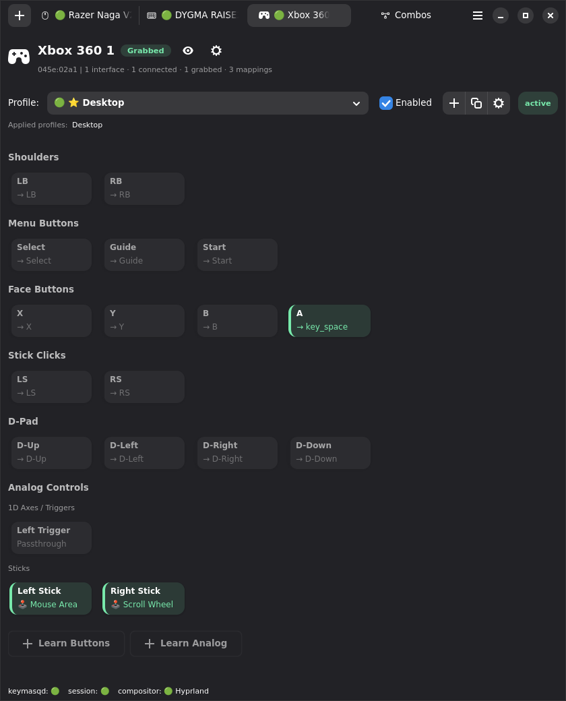
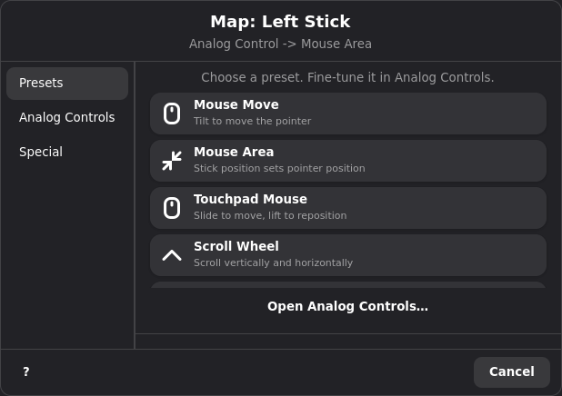
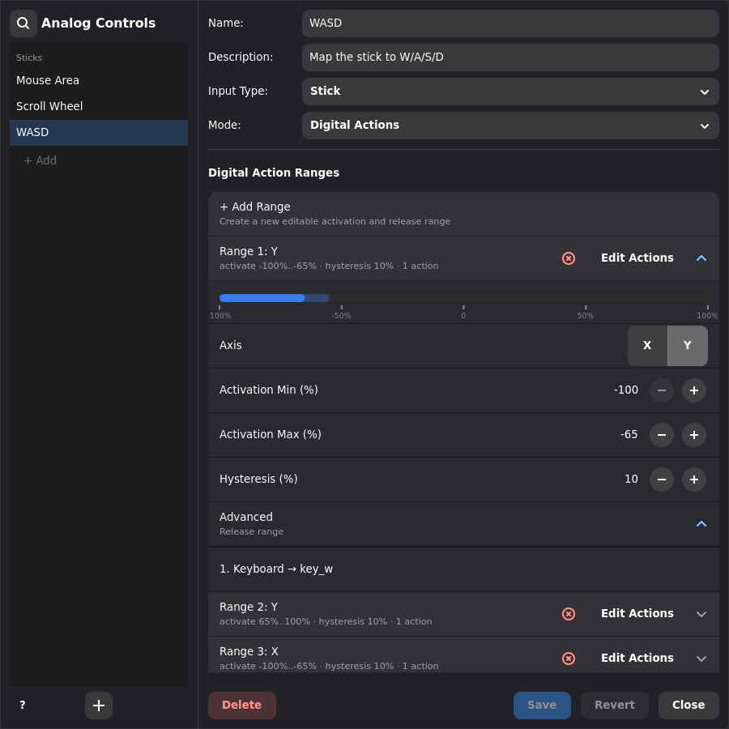

# Game Controller Support

Keymasq can remap game controller buttons, sticks, triggers, wheels, and
other analog axes. It can also turn keyboard and mouse input into virtual
gamepad output for games that expect a controller.

## Adding a Controller

When you add a game controller in the hardware setup flow, Keymasq detects
its buttons and analog axes from evdev capabilities and creates the hardware
profile automatically. Standard buttons (face, shoulders, start/select/guide,
stick clicks, digital D-pad) are added when the controller reports them.
Third-party uinput controllers and wheels are shown in the picker when they
report gamepad capabilities; Keymasq's own virtual output devices stay hidden.

When Keymasq grabs a physical gamepad, it creates a passthrough uinput clone
for unmapped events. That clone reuses the source controller name and input
IDs, so Steam and other tools see it as the same controller model.

If the physical controller reports force feedback, the passthrough clone
advertises the same force-feedback capability set and Keymasq proxies effect
upload, erase, play/stop, gain, and autocenter events back to the grabbed
controller. Hardware motor behavior still depends on the controller driver and
the physical device's own force-feedback support.

Keymasq's synthetic Xbox-style gamepad outputs do not advertise force feedback,
because they have no physical motor to drive. Use the physical controller's
passthrough clone when a game needs rumble.

While the grab is active, Keymasq hides the original physical gamepad source
and leaves the passthrough clone visible. This prevents Steam, SDL games, and
controller pickers from showing two identical controllers where one is the
grabbed-but-silent original. The physical source is restored when Keymasq
releases the grab or stops.

## Button Mapping

Keymasq uses an Xbox 360 controller as the template for game controllers.
When you add a controller, buttons that the hardware reports are included
automatically. Buttons the controller does not advertise are omitted — you
can add extra buttons later from the device tab using the listen/capture
flow.

Remap any button from the device tab: click it in the grid and pick an
action. Each button supports the same options as keyboard/mouse mappings,
including rapidfire and tap (see [Actions](ACTIONS.md)).



### Axis Output

You can map any key or button to a gamepad axis value — useful for binding
keyboard keys to stick or trigger output. The mapping sends a fixed axis
value while the source is held and returns to neutral on release.

Triggers are analog axes, not buttons. Gamepad button mappings do not
produce trigger output — use axis mappings instead.


## Analog Controls

Analog Controls let you map sticks, triggers, and other analog axes to
mouse movement, keyboard/button actions, or gamepad output. They are
reusable configs — create one and assign it to any analog input across
devices and profiles.

Configs are saved in `~/.config/keymasq/analog_controls/` and managed from
the **Analog Controls** dialog (accessible from the main menu).

### Learning Analog Inputs

The controller template already includes standard left and right stick
inputs, so most controllers are ready for analog remapping out of the box.
Use **Learn Analog** when your controller has additional or non-standard
analog axes that the template does not cover. You can also delete a
template stick and re-add its axes individually as 1D axes — useful when
you want to remap a single stick direction to an analog trigger or other
1D output.

1. Open the **Device** tab for your controller.
2. Click **Learn Analog**.
3. Choose the input type:
   - **Stick** — a 2D input like a thumbstick (captures two axes)
   - **Generic Axis** — a 1D input like a trigger, slider, or pedal
4. Give it an ID and label (e.g. `left_stick` / "Left Stick").
5. Start the capture and move the physical control through its full range.
6. Review the detected axes: evdev code, min/max values, and center or rest
   position. Edit if needed.
7. Save — the input is now available for remapping.

Right-click a learned analog input label on the device tab to rename or
delete it.

### Assigning an Analog Control

Open the **Device** tab and select the analog input. The mapping dialog opens
on the **Presets** tab when no analog controls exist yet.

**Quick start (presets):** Click a preset card — for sticks: Mouse Move, Mouse
Area, Scroll Wheel, or WASD Keys; for triggers: Trigger Left Click, Trigger
Right Click, Trigger Scroll Up, or Trigger Scroll Down. The preset is saved as a
normal analog control, mapped to the input, and the dialog closes. Reopen the
input later to fine-tune it or pick others.



**From saved controls:** On the **Analog Controls** tab, select one or more
saved configs by name. Right-click a config (or use **Open Analog Controls…**)
to edit it in the manager. One input can fan out to multiple configs — each
receives the same normalized input and handles its output independently:

```toml
[devices."045e:028e".mapping.right_stick]
action = "analog_control"
analog_control_names = ["FPS Mouse", "WASD"]
```

### Input Types

| Type | Axes | Normalized Range | Use Cases |
|------|------|-----------------|-----------|
| **Stick** | X + Y | `-1.0` to `1.0` per axis | Thumbsticks, flight sticks, analog D-pads |
| **Axis** | X only | `-1.0` to `1.0` for signed ranges | Triggers, sliders, pedals, throttles |

### Modes

Each analog control operates in one mode:

#### Mouse Movement

Converts analog input into continuous mouse cursor movement. The stick or
axis controls the speed and direction of movement — tilt further to move
faster.

**Stick settings:**
- **Horizontal Speed** / **Vertical Speed** — maximum pixels per second for
  each axis (can be split or linked)
- **Invert Axes** — flip X or Y direction

**Axis settings:**
- **Speed** — maximum pixels per second
- **Direction** — which way the axis moves the cursor: `left`, `right`,
  `up`, `down`, `horizontal` (both left/right), or `vertical` (both
  up/down)
- **Invert Axis** — reverse the selected output direction

**Shared settings:**
- **Deadzone** — fraction of travel to ignore near center (0.0–0.95)
- **Sensitivity** — output multiplier (0.1–2.0); higher reaches full speed
  sooner
- **Response Curve** — exponent shaping the input-to-output curve
  (0.25–4.0); below 1.0 is faster near center, above 1.0 is slower near
  center

#### Mouse Area (stick only)

Maps the stick position directly to a cursor position within a 2D area.
Instead of controlling speed, the stick controls where the cursor is — push
right and the cursor moves right, release and it returns to the origin.

- **Horizontal Radius** / **Vertical Radius** — size of the area in pixels
  from the center point
- **Anchor to a Start Position** — when enabled, the cursor jumps to a
  fixed screen coordinate when the stick first leaves rest, then moves
  relative to that anchor
- **Start Position** — the anchor coordinate; use **Capture** to click a
  point on screen
- **Deadzone**, **Sensitivity**, **Response Curve** — same as Mouse
  Movement
- **Invert Axes** — flip X or Y

#### Digital Actions

Fires keyboard, mouse, or other actions when the analog input enters an
activation range. Useful for turning a stick into WASD or a trigger into a
button press.

Each threshold defines:
- **Axis** — `x` or `y` (sticks) or `x` (axes)
- **Activation Min / Activation Max (%)** — the input range that presses
  the action
- **Hysteresis (%)** — how far the input must move back out of the
  activation range before the action releases, which prevents flicker at the
  boundary
- **Advanced → Release Min / Release Max (%)** — the exact release range,
  for cases where you need to tune the hysteresis bounds directly
- **Actions** — one or more actions to fire (keyboard, mouse, gamepad, etc.)

Stick and 1D axis thresholds are shown as percentages from `-100%` to
`100%`. Positive ranges cover one direction; negative ranges cover the
opposite direction. Multiple thresholds can overlap — they are evaluated
independently. The saved TOML uses normalized `-1.0` to `1.0` values; see
[Analog Controls Config Format](ANALOG_CONTROLS.md) for the field-level
reference.

**Templates** (stick only):
- **WASD** — maps stick to W/A/S/D keys
- **Arrow Keys** — maps stick to arrow keys
- **Mouse Wheel** — maps stick Y to scroll up/down and stick X to side-scroll
  left/right, all with rapidfire

Templates append thresholds to the existing list and are fully editable
after applying.



#### Analog Output

For a 1D control, choose an **Output Axis** on the destination: a trigger,
an individual stick axis, a Hat 0 axis, or a learned hardware axis. Output uses
that axis's range and neutral value. **Use Axis Neutral** supplies the default
release value; disable it for a manual override. Hat output uses three states
with hysteresis. See [Individual axis routing](ANALOG_CONTROLS.md#individual-axis-routing)
for direction, scaling, and compatibility details.

Routes the analog source to a gamepad axis on a selected output device.
Use this to remap one stick to another, route a trigger to a different
controller, or pass through with adjusted tuning.

- **Output** — target device: a virtual gamepad, the same physical device
  (`same-device`), or another grabbed controller by hardware ID
- **Output Axis** — for 1D controls, choose `Same Axis` or an individual
  supported destination axis, including components of a stick
- **Output Control** — for sticks, preserve the source side, force `Left` or
  `Right`, or select a learned hardware or template stick
- Physical and template-backed virtual outputs use the target axis ranges and
  rest values when available. The built-in standard gamepad uses its standard
  stick range.
- **Output Deadzone** — values below this are sent as centered/released
- **Output Rest** — manual release value when **Use Axis Neutral** is disabled
- **Output Direction** — `Min`, `Max`, or `Both` (1D axes):
  - `Min` maps from rest toward the minimum endpoint
  - `Max` maps from rest toward the maximum endpoint
  - `Both` treats the input as signed across the full range
- **Invert Output Axis** — for 1D axes using `Both`, reverse the signed
  output around the rest value
- **Invert Output Axes** — for stick output, flip X and/or Y independently
- **Sensitivity** — output multiplier (0.1–2.0)
- **Response Curve** — exponent for output shaping (0.25–4.0)

### Tuning: Sensitivity and Response Curve

All modes share the same input shaping math. The analog input is first
normalized and deadzone-removed, then shaped:

```text
distance = magnitude of normalized input
shaped   = clamp((distance ^ response_curve) * sensitivity, 0, 1)
```

- **Sensitivity = 1.0, Response Curve = 1.0** — linear (default)
- **Higher sensitivity** — reaches full output before full physical travel
- **Response Curve < 1.0** — faster response near center, coarser at edges
- **Response Curve > 1.0** — finer control near center, faster at edges
  (good for aiming)

Stick controls apply this radially. Mouse Movement then multiplies the
shaped value by speed. Analog Output maps it to the target axis range.

### Creating and Editing Analog Controls

Open **Analog Controls** from the GUI main menu. The dialog has two panels:

- **Left panel**: lists all saved analog controls, grouped by type
  (sticks / axes). Use **+** to create or **Delete** to remove.
- **Right panel**: edit the selected config's name, description, input
  type, mode, and mode-specific settings.

Start typing while focus is outside an editor field to search the saved Analog
Controls immediately. Ctrl+F and the search button provide the same filter.


Use **Save** to apply changes. If you switch selection or close the dialog
with unsaved edits, Keymasq asks whether to save, discard, or keep editing.

## Example Profile

```toml
[profile]
name = "Controller Remap"
enabled = true
is_permanent = true
priority = 0

# Button remaps
[devices."045e:028e".mapping.btn_south]
action = "gamepad"
target = "btn_a"

[devices."045e:028e".mapping.btn_east]
action = "gamepad"
target = "btn_b"
rapidfire_enabled = true
rapidfire_hold_ms = 30
rapidfire_wait_ms = 20

# Button to trigger axis
[devices."046d:c548".mapping.btn_back]
action = "gamepad_axis"
target = "abs_z"
value = 255

# Analog control (stick to mouse)
[devices."045e:028e".mapping.right_stick]
action = "analog_control"
analog_control_name = "FPS Mouse"

# Multiple analog controls on one input
[devices."045e:028e".mapping.left_stick]
action = "analog_control"
analog_control_names = ["WASD", "Mouse Wheel"]
```

## Game Compatibility

The built-in Xbox output appears as a standard Xbox 360 controller:

- **SDL2/SDL3** — full support
- **Steam Input** — full support
- **Wine/Proton** — works via evdev translation
- **Native Linux games** — works with evdev-compatible games

Template-backed joysticks are exposed through Linux evdev and SDL's joystick
API. Games launched through Steam can open them directly, including through
Wine/Proton when the game supports a joystick. Steam Input itself does not
provide remapping for flight sticks and wheels, so do not expect a joystick
template in Steam's gamepad configurator.

Use [jstest-gtk](https://github.com/Grumbel/jstest-gtk) to verify that
your virtual gamepad buttons and axes are working as expected.

## Technical Details

### Virtual Gamepads

When you map an input to a gamepad action, Keymasq creates virtual gaming
devices with Linux uinput. The existing virtual gamepads are instances of the
built-in Xbox 360 template.

Keymasq creates one virtual gamepad by default. You can configure 0–4 from
the GUI hamburger menu under **Settings**. The setting is stored in
`~/.config/keymasq/settings.toml`:

```toml
[gamepads]
virtual_count = 1
```

If the setting cannot be written to disk, the requested count remains active
for the current session and Keymasq shows a warning that it may revert after a
restart.

Each standard numbered virtual gamepad uses Xbox 360 hardware IDs:

- **Name**: `keymasq-gamepad` (first), `keymasq-gamepad-2` through `-4`
- **Vendor**: `0x045e` (Microsoft)
- **Product**: `0x028e` (Xbox 360 controller)
- **Capabilities**: 17 digital buttons, 8 analog axes

### Template-backed virtual devices

Open **Settings → Custom virtual devices** to create stable output instances
from a template. Keymasq ships two built-in templates:

- **Standard gamepad**, used by the existing 0–4 **Virtual gamepads** setting,
  with two sticks, two triggers, and directional controls
- **Flight stick**, with 12 joystick buttons and six
  axes: X, Y, twist, throttle, and a two-axis hat

The standard gamepad uses the Xbox 360 identity (`045e:028e`). The flight stick
uses the Logitech Extreme 3D Pro identity (`046d:c215`) and Linux capability
layout. These model references describe the emulated identities used for game
detection; the GUI uses generic template names. Existing template IDs, Linux
device names, and vendor/product IDs remain unchanged.

An output instance keeps its configured
`output_id` across restarts, so profiles do not depend on discovery order.

The built-in flight stick has a dedicated mapping picker. Direction pads select
stick and hat directions; twist selects left or right, and throttle shortcuts
select Idle, Half, or Full. Grip buttons and base buttons surround a joystick
illustration. Base buttons 7–12 correspond to the template's Base 1–6 controls.
Tooltips show each control's Linux code.

The axis editor accepts exact values or percentages of travel from rest. Stick
and twist percentages range from -100 to 100; throttle ranges from 0 at idle to
100 at full travel. The throttle's raw range is reversed: idle is 255 and full
is 0. Select **Map axis** to use the chosen value. Custom templates retain their
gamepad or flight stick layout, with shortcuts using the configured axis ranges.
Only controls defined by the template are available to map. Other buttons appear
in a numbered **Additional buttons** grid below the illustration and axis editor.
The shortcut above the illustration jumps to this grid; search by label, number,
control ID, or Linux code to find a button.

Analog mappings to a virtual template resolve **Same**, **Left**, and **Right**
using the destination's event codes, ranges, and rest values. A destination that
does not contain the requested control receives no axis events. Choose a named
destination control when the source and destination use different codes. Motion
mappings also offer the template's named sticks instead of assuming two gamepad
sticks.

Use **Add output** on a template to create a controller from it. The output
dialog selects that template and suggests an unused output ID. Identity overrides
are optional and otherwise inherit the template's values.

When applying changes, Keymasq prepares replacement outputs before removing the
old ones. If creating or initializing a replacement fails, the existing outputs
and their configuration remain available.

Use **Customize** on a built-in template, or **Duplicate** on a custom template,
to create an editable copy. Copies receive an unused ID that can be changed before
saving. **New template** lets you start from the gamepad or flight stick. The
**Layout** choice controls the mapping illustration independently of the template
ID. Changing it preserves the configured buttons, axes, and device identity.

The template editor has **Identity**, **Buttons**, and **Axes** tabs. Expand a
control to edit its label and select a Linux code from a searchable list. Axis
controls remain available in the mapping picker's axis selector. **Add numbered
buttons** adds a batch of buttons using unused `BTN_TRIGGER_HAPPY*` codes, up to
the template's 40-button total. Rename these buttons to describe their purpose.
Axis rows include minimum, maximum, and rest fields. Control IDs, fuzz, flat, and
resolution are under **Advanced**; the Linux device name, USB IDs, and bus type are under **Device
identity**. Validation errors keep the editor open with your changes intact.
Axis metadata must fit signed 32-bit integers. Linux aliases for the same button
or axis count as one event code and cannot define separate controls.

A template defines:

- a template ID, display label, Linux device name, bus type, vendor ID,
  product ID, and version
- 1–40 named buttons, each bound to a Linux `BTN_*` code
- 2–8 named axes, each bound to an `ABS_*` code with minimum, maximum, rest,
  fuzz, flat, and resolution values

Keymasq requires `ABS_X` and `ABS_Y` plus a joystick-classifying button or
axis. This prevents custom devices that Linux exposes through uinput but SDL
silently ignores. `BTN_TRIGGER_HAPPY*` controls are supported, but a template
made only from TriggerHappy buttons still needs a classifying axis such as
`ABS_RZ`.

**Use changes** returns edits to the virtual devices dialog. Changes are drafts
until **Apply** is pressed; closing with unapplied changes asks before discarding
them. Applying reconnects affected
uinput devices, so close games that currently have them open first.

Named virtual outputs preserve raw axis values when mappings and superkeys are
saved. At runtime, Keymasq limits those values to the target template's axis
range and releases the axis to its declared rest value. The standard numbered
virtual gamepads retain their existing axis limits.

The advanced format is stored in
`~/.config/keymasq/virtual_devices.toml`. Built-in templates are referenced by
ID and are not copied into the file. This creates a flight stick output:

```toml
[[devices]]
output_id = "flight-stick"
template = "logitech-extreme-3d-pro"
```

Identity fields can be overridden per output:

```toml
[[devices]]
output_id = "left-seat-stick"
template = "logitech-extreme-3d-pro"
name = "Left Seat Stick"
vendor_id = "046d"
product_id = "c215"
version = "0110"
bustype = "usb"
```

A custom template and output use arrays of button and axis tables:

```toml
[[templates]]
id = "space-panel"
label = "Space Panel"
layout = "flight-stick"
name = "Keymasq Space Panel"
vendor_id = "4b4d"
product_id = "2001"
version = "0100"
bustype = "usb"

[[templates.buttons]]
id = "fire"
label = "Fire"
evdev = "btn_trigger_happy1"

[[templates.buttons]]
id = "mode"
label = "Mode"
evdev = "btn_trigger_happy2"

[[templates.axes]]
id = "x"
label = "Stick X"
evdev = "abs_x"
minimum = -32768
maximum = 32767
rest = 0

[[templates.axes]]
id = "y"
label = "Stick Y"
evdev = "abs_y"
minimum = -32768
maximum = 32767
rest = 0

[[templates.axes]]
id = "twist"
label = "Twist"
evdev = "abs_rz"
minimum = -32768
maximum = 32767
rest = 0

[[devices]]
output_id = "space-rig"
template = "space-panel"
```

The mapper shows the selected template's control labels and axis endpoints.
Profiles continue to store the corresponding evdev target, such as
`btn_trigger_happy1` or `abs_rz`, together with the stable `output_id`. Axis
actions return to the template's declared `rest` value when released.

### Output Routing

Gamepad actions can set `output_id` to route output to a specific device.
Valid values:

| Value | Target |
|-------|--------|
| `virtual-gamepad-1` … `virtual-gamepad-4` | A configured virtual gamepad |
| A configured template output ID (for example `flight-stick`) | A template-backed virtual device |
| A hardware ID (e.g. `045e:028e@2`) | A grabbed physical controller |

If `output_id` is omitted, output goes to `virtual-gamepad-1`. If the
target is not configured, connected, or grabbed, `keymasqd` logs a warning
and drops the output with no fallback.

Macro gamepad events use the same `output_id` routing. Events without
`output_id` play through the default gamepad.

### Linux Gamepad Specification

Keymasq follows the
[Linux Gamepad Specification](https://kernel.org/doc/html/latest/input/gamepad.html).
Button positions are based on physical location, not labels.

## Limitations

- **Touchpads**: controller touchpads are not supported for remapping yet.
- **Dedicated drivers**: vendor-specific features may still need their
  native driver or Steam Input.

## See Also

- [Analog Controls Config Format](ANALOG_CONTROLS.md) — TOML reference for
  analog control configs
- [Actions](ACTIONS.md)
- [Super Keys](SUPERKEYS.md)
