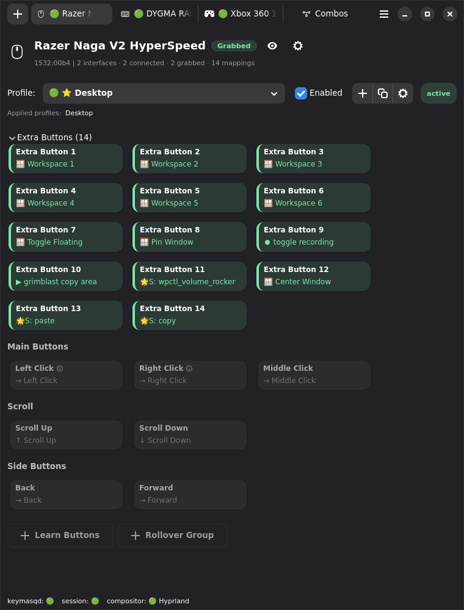
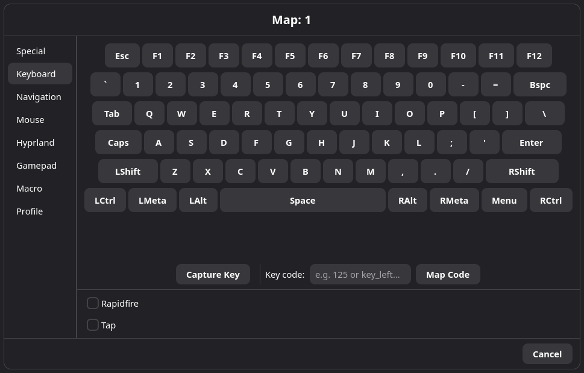

# Getting Started

This guide walks you through your first remap after installing Keymasq.

## Open the GUI

After installation, launch Keymasq from your application menu or run:

```bash
keymasq
```

The **Welcome** tab opens while Keymasq loads your devices and checks
compositor support. The status bar at the bottom shows connection state —
green indicators for keymasqd, session, and compositor mean everything is
connected.

<!-- SCREENSHOT: Welcome tab showing "Loading devices..." with status bar at bottom -->

## Add Your First Device

Click the **+** button in the top left to open the **Add New Device** dialog.
Keymasq shows detected devices with their hardware ID, interface count, and
device types (Mouse, Keyboard, etc.).

Select a device from the list and click **Next**.

<!-- SCREENSHOT: Add New Device dialog with device list -->

Keymasq asks how to configure the device based on its capabilities. For a
keyboard with a trackpoint, you might see options like **Mouse + Keyboard**,
**Mouse**, or **Keyboard**. Pick the template that matches what you want to
remap and click **Save**.

<!-- SCREENSHOT: Template selection showing Mouse + Keyboard dropdown -->

The device tab opens showing all available buttons organized by category.
Each button displays its current output (e.g., "→ Capslock" means it sends
Capslock). The **Default** profile is selected automatically.



## Create a Simple Remap

Let's remap Caps Lock to Escape — a common first remap.

1. Click **Capslock** in the Keyboard (Left) section.
2. The mapping dialog opens. Select **Keyboard** on the left.
3. Click **Esc** on the visual keyboard layout.



The dialog closes and the key now shows its new mapping: "→ Esc".

## Test It

Open any text editor and press Caps Lock. It should send Escape instead. Your
remap is working.

If you want to undo the remap, click the key again and choose **Passthrough**
from the Special tab to clear the mapping from this profile.

## Create a Profile (Optional)

So far your mappings live in the **Default** profile, which is always active.
To create a new profile for different mappings:

1. Click the **+** button in the Profile row (next to the Enabled checkbox).
2. Enter a name like "Gaming" or "Terminal".
3. Click **Create**.

<!-- SCREENSHOT: Create Profile dialog with name field -->

The new profile is now selected. Any mappings you create will be saved to this
profile. You can switch between profiles using the dropdown.

## Make It App-Specific (Optional)

To make a profile activate only when a specific app is focused:

1. Select your profile from the **Profile** dropdown.
2. Expand **Profile Settings** (collapsed by default).
3. Set **Type** to **Conditional**.
4. Click **Edit** next to Rules.

<!-- SCREENSHOT: Profile Settings expanded showing Conditional selected -->

The rules dialog opens. You can either:

- Click **Capture Window** and then click the target application — Keymasq
  fills in the class automatically.
- Click **Add Rule** to add a rule manually. Set **Field** to `class` and
  **Pattern** to the application class (e.g., `firefox` or `steam_app_730`).

<!-- SCREENSHOT: Rules dialog with Add Rule showing Field and Pattern -->

Click **Apply** to save. Now this profile's mappings only activate when that
application is focused.

## Next Steps

You've created your first remap and optionally set up a profile. Explore
further:

- [Actions](ACTIONS.md) — all the action types available for mappings
- [Profiles](PROFILES.md) — how profiles stack and merge
- [Macros](MACROS.md) — record and play input sequences
- [Combos](COMBOS.md) — trigger actions from key combinations
- [Super Keys](SUPERKEYS.md) — tap, hold, and double-tap behaviors

## Troubleshooting

If remaps don't work:

1. Check that both services are running:
   ```bash
   systemctl status keymasqd
   systemctl --user status keymasq-session
   ```

2. Make sure the device is added and the profile is enabled.

3. Check [Troubleshooting](TROUBLESHOOTING.md) for common issues.
