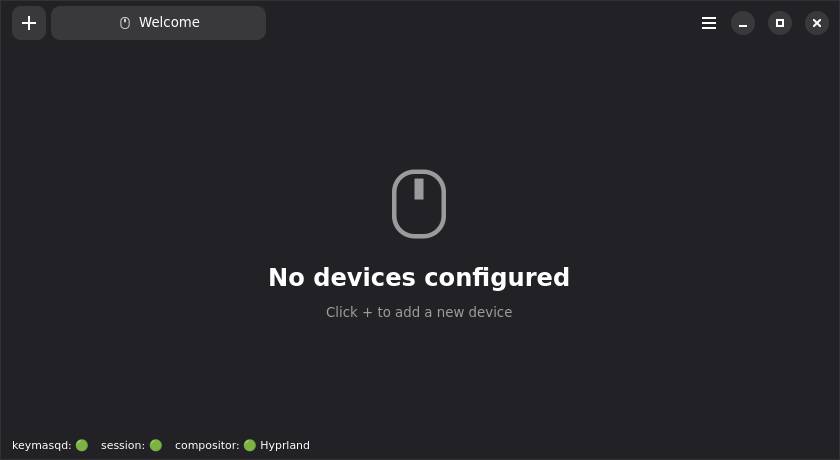
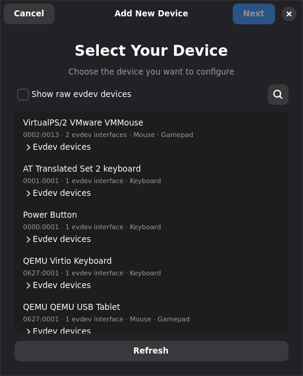
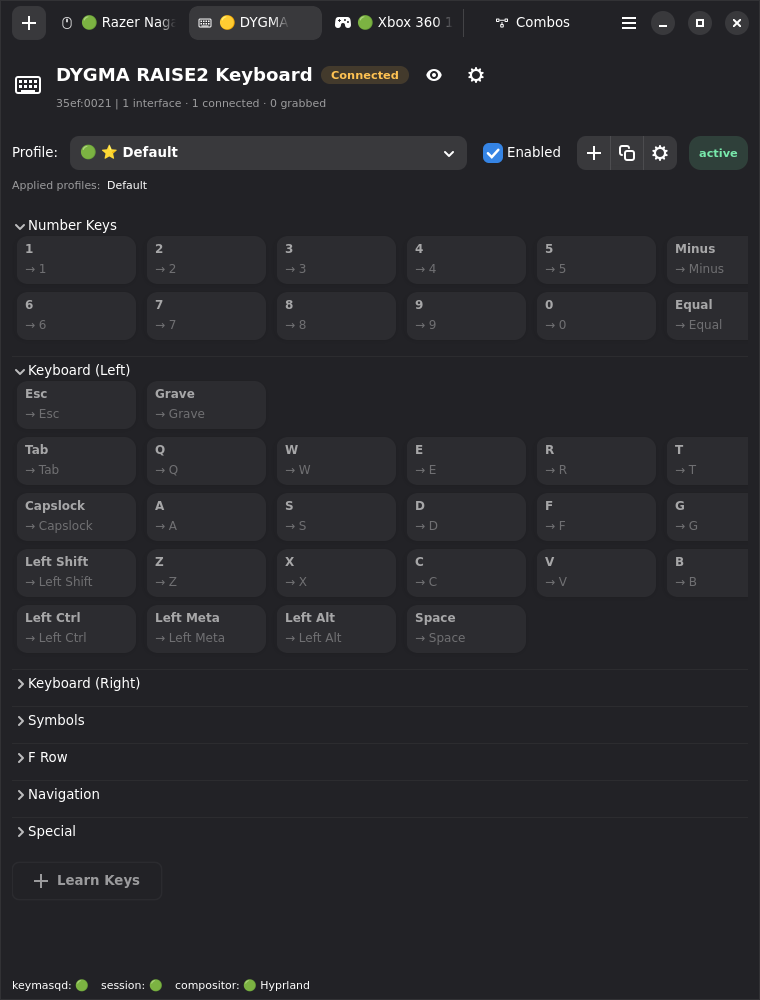
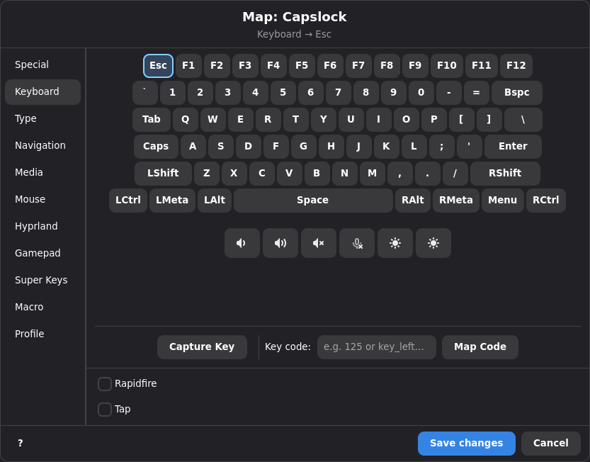
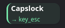

# Getting Started

This guide walks you through your first remap after [installing Keymasq](INSTALL.md).

## Open Keymasq

Launch Keymasq from your application menu or run:

```bash
keymasq
```

The status bar at the bottom shows connection state. All indicators should be green before continuing.



## Add Your Device

Click the **+** button in the top left. Select your device, pick a template, and click **Save**.



The device tab opens showing all available buttons.



## Remap a Key

Let's remap Caps Lock to Escape.

1. Click **Capslock** in the Keyboard (Left) section.
2. Select **Keyboard** on the left.
3. Click **Esc**.



The key now shows its new mapping. Press Caps Lock anywhere — it sends Escape.



To undo, click the key and choose **Passthrough** from the Special tab.

## Next Steps

You've created your first remap. Explore further:

- [Profiles](PROFILES.md) — create profiles for different apps or contexts
- [Actions](ACTIONS.md) — all available action types
- [Macros](MACROS.md) — record and play input sequences
- [Macro timeline editor](MACRO_EDITOR.md): build macros and refine recordings
- [Combos](COMBOS.md) — trigger actions from key combinations
- [Super Keys](SUPERKEYS.md) — tap, hold, and double-tap behaviors

If remaps don't work, see [Troubleshooting](TROUBLESHOOTING.md).
