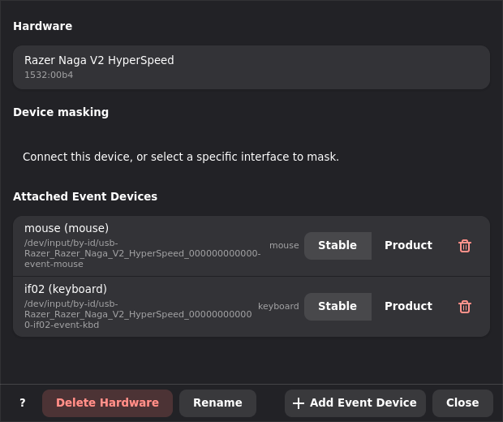
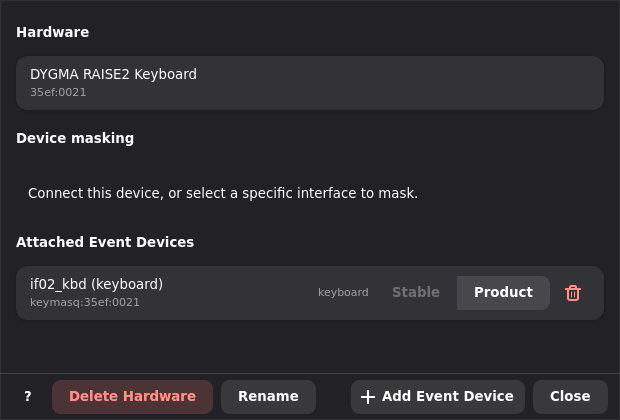

# Hardware Configuration

A hardware definition describes the physical device Keymasq can grab and the
source IDs that profiles map. The two stay separate on purpose: hardware says
*where* a source ID comes from, and a profile says *what to do* with it.

Hardware files live in:

```text
~/.config/keymasq/hardware/<hardware_id>.toml
```

Use the GUI for normal setup. The TOML files are plain text, so they're handy
for inspection, backup, and the occasional advanced fix.

## Mental Model

A hardware definition has three parts:

- a hardware ID, used as the profile/config key
- one or more attached evdev event devices
- source controls — buttons and keys, plus analog inputs like sticks and axes

The hardware ID is usually the USB vendor/product pair, such as `046d:c08b`.
When you have two of the same model, the second gets a numbered ID like
`046d:c08b@2`. These IDs are profile keys, so changing one means the matching
profile device layer has to use the new ID too.

Each attached event device has its own `id`, such as `mouse`, `kbd`, or
`if02_kbd`. Buttons and analog inputs point back at that `id` through their
`source` field, which is how a single hardware ID can gather controls from
several event devices without mixing them up.

## Event Device Detection

Every attached evdev device has a `path`, and the GUI offers two ways to find
it again after a reboot or reconnect.

### Stable Path

Stable Path detection stores a kernel-provided link such as:

```text
/dev/input/by-id/usb-Example_Device-event-mouse
```

This is the preferred method when Linux exposes a useful `/dev/input/by-id`
link — it points at one specific interface and is easy to read.

### Product ID

Product ID detection stores a logical Keymasq path instead:

```text
keymasq:046d:c08b
```

That isn't a real file. At runtime, `keymasqd` matches live devices by
vendor/product ID plus interface metadata (type, topology hint, capabilities).
Reach for it when a device doesn't expose a stable `/dev/input/by-id` link.

If you own two of the same model, set the second one up through the normal Add
Device flow so it gets its own hardware ID. The hardware settings dialog won't
switch an event device to Product ID detection while another definition already
uses that vendor/product pair, since that would also need a fresh hardware ID.

## Hardware Settings in the GUI

Open hardware settings from the gear button in a device tab.



The dialog lists the hardware name and ID, every attached event device with its
detection control, and the rename, delete, and add/remove actions.

Clicking the identity row (or `Rename`) opens the same rename dialog as the
device tab. Renaming only changes the display name — hardware IDs, mappings, and
device identity stay put. `Delete Hardware` uses the normal delete flow and
leaves your global profiles alone unless you also choose to remove the matching
profile layers.

## Adding and Removing Event Devices

`Add Event Device` attaches another raw evdev device to the same hardware ID
through the Add Device dialog in raw evdev mode. This is what you want for
hardware that exposes more than one interface, like a mouse with an extra
keyboard endpoint.

Each device row has a remove button. Removing a device drops its evdev entry and
the controls whose `source` points at it, and optionally clears the profile
mappings for those controls. Controls from the other attached devices are
untouched.

## Switching Detection Methods

Each event device row has a compact toggle:

```text
Stable | Product
```



`Stable` uses the `/dev/input/by-id` path; `Product` uses the logical
`keymasq:<vendor_id>:<product_id>` path. If a device is on Product detection and
no stable by-id link is known, `Stable` is greyed out, and the tooltip explains
whether the device is disconnected or simply has no `/dev/input/by-id` link.

Switching saves the hardware file and reloads the session. Existing mappings
keep working because they refer to the hardware ID and source control IDs, never
to the evdev path string.

## TOML Reference

```toml
[hardware]
name = "Logitech G502 Hero"
vendor_id = "046d"
product_id = "c08b"

[hardware.evdev]
devices = [
  { path = "/dev/input/by-id/usb-Logitech_G502_Hero-event-mouse", id = "mouse", type = "mouse" },
]

[[hardware.layout.buttons]]
id = "btn_back"
label = "Back"
evdev = "btn_side"
source = "mouse"

[[hardware.layout.buttons]]
id = "wheel_up"
label = "Scroll Up"
evdev = "rel_wheel"
evdev_code = 8
evdev_value = 1
type = "wheel"
source = "mouse"

[[hardware.layout.analogs]]
id = "left_stick"
label = "Left Stick"
type = "stick"
source = "joystick"

[[hardware.layout.analogs.axes]]
role = "x"
evdev = "abs_x"
evdev_code = 0
```

`[hardware]`

- `name`: display name
- `vendor_id` / `product_id`: ID strings
- `hardware_id`: optional explicit profile/config key, usually for duplicates
  such as `046d:c08b@2`
- `image`: optional image filename

`[hardware.evdev].devices`

- `path`: `/dev/input/by-id/...`, `/dev/input/by-path/...`,
  `/dev/input/eventN`, or logical `keymasq:<vendor_id>:<product_id>`
- `id`: source interface ID used by controls
- `type`: `keyboard`, `mouse`, `gamepad`, or `other`
- `phys`: optional kernel physical/topology hint
- `capabilities`: optional capability list used for Product ID matching

`[[hardware.layout.buttons]]`

- `id`: source ID used in profile mappings
- `label`: display label
- `evdev`: evdev name such as `btn_side`, `key_f13`, or `rel_wheel`
- `evdev_code`: optional numeric evdev code
- `evdev_value`: optional value, used for wheel direction
- `source`: optional event device `id`
- `zone`, `row`, `col`, `type`: optional UI/layout metadata

`[[hardware.layout.analogs]]`

- `id`: source ID used in profile mappings
- `label`: display label
- `type`: `stick` or `axis`
- `source`: optional event device `id`
- `axes`: axis definitions with `role`, `evdev`, optional `evdev_code`, and
  optional calibration fields

## Profile Interaction

Profiles map hardware source IDs:

```toml
[devices."046d:c08b".mapping.btn_back]
action = "keyboard"
target = "key_1"
```

Here `046d:c08b` is the hardware ID and `btn_back` is the button ID — event
device paths never appear as profile keys. See [Profiles](PROFILES.md) for
layering and merge behavior.
