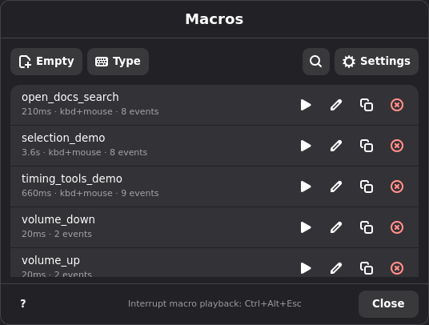
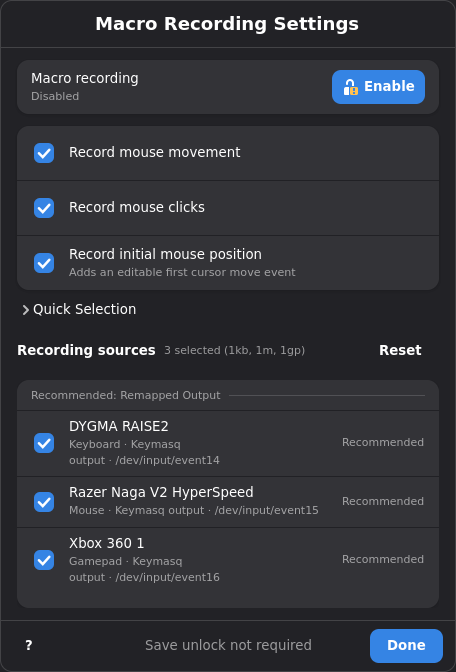
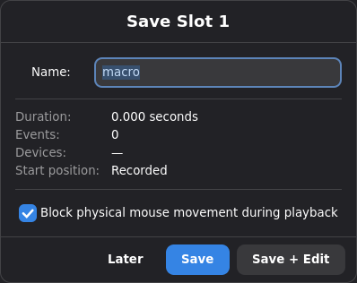
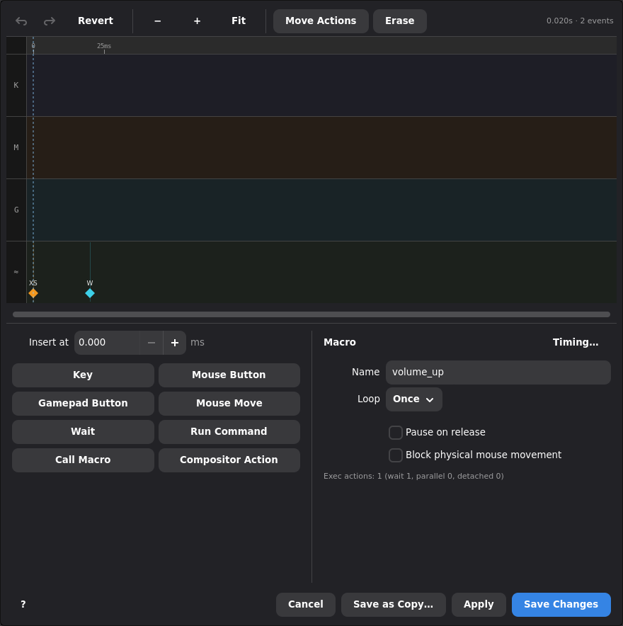
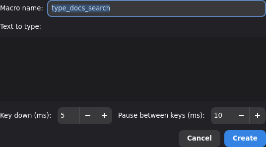
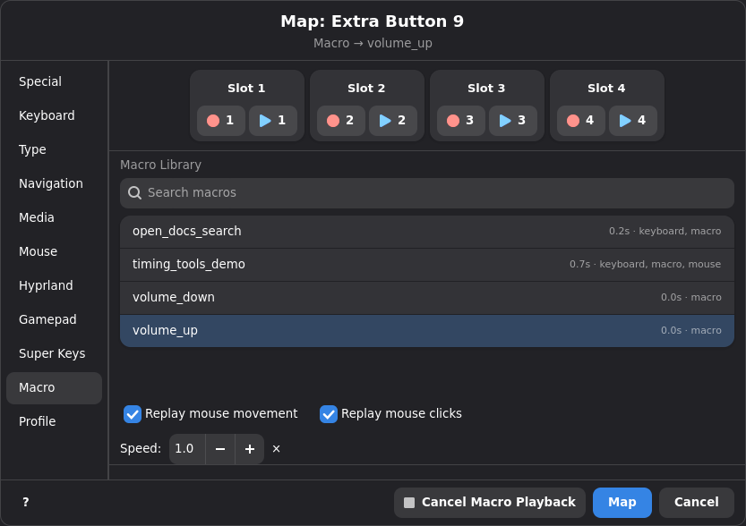
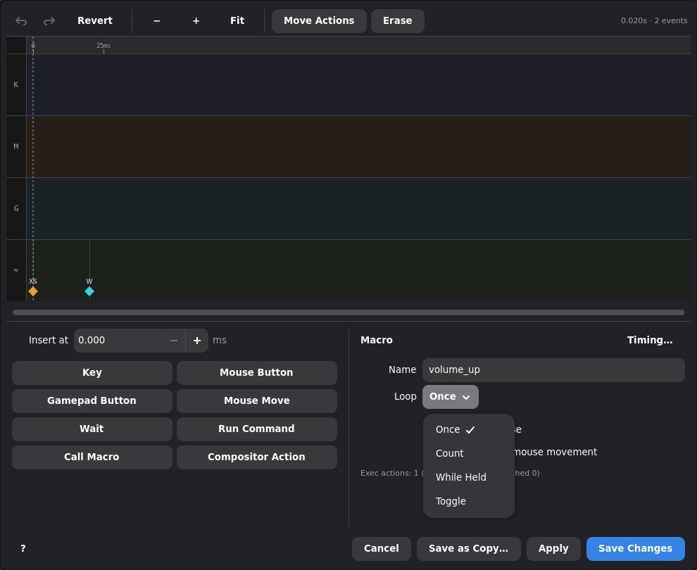
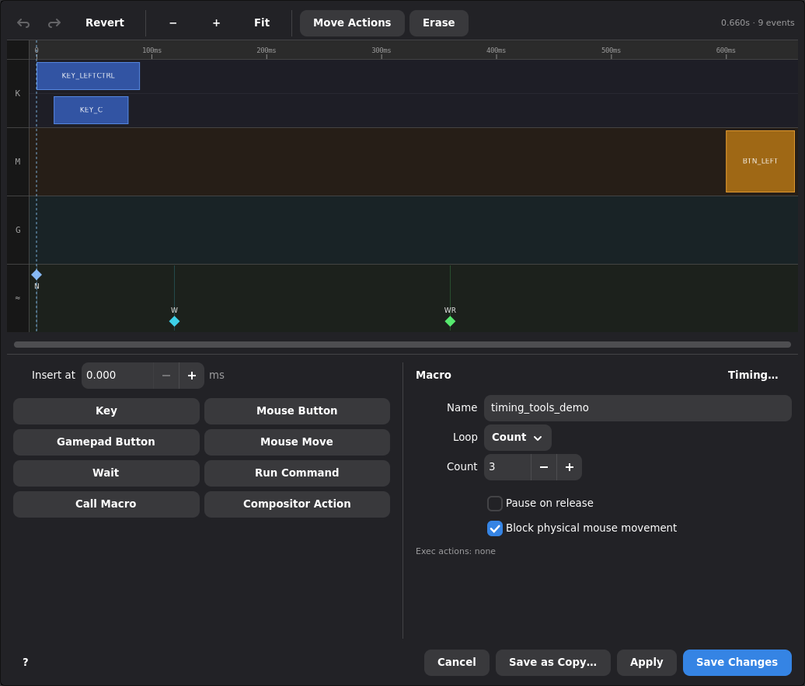
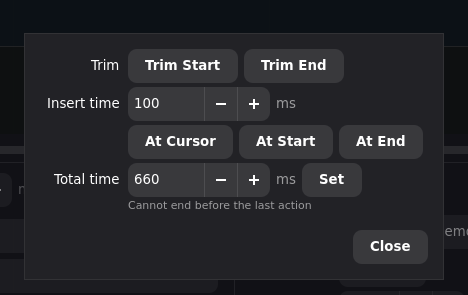

# Macro System

## Overview

In Keymasq, a macro is a saved sequence of input actions that you can replay
later. A macro can type text, press keys, click mouse buttons, move the mouse,
or combine several of those actions with recorded timing.

Macros are saved centrally by Keymasq and can be reused from profiles,
superkeys, combos, or the CLI. You create and edit them in the GUI, and
Keymasq plays them back by macro name.

Macros are also one of the ways to build a Linux autoclicker in Keymasq. For
simple repeated clicks, a rapidfire mouse action is usually the fastest setup.
Use a macro when you need more control over timing, double-click patterns,
cursor movement, mixed keyboard and mouse input, or toggle/count playback.

## Quick Start: Your First Macro

The fastest way to get started is to create an empty macro, add a few events
by hand, and assign it to a key. This doesn't require any special permissions
or unlock steps.

1. Open the Keymasq GUI and go to **Macro Manager**.
2. Click **Empty Macro…** and give it a name.
3. The macro editor opens with a blank timeline. Add the key presses or mouse
   actions you want — for example, a Ctrl+C shortcut.
4. Save the macro.
5. Go to the **Device** tab for your keyboard, pick a key, and set its action
   to **Play Macro**. Choose the macro you just created.
6. Press that key — your macro plays back exactly as you built it.

That's it. The sections below cover the other creation methods (live recording
and type templates), loop modes, timing adjustments, and more.




## Creating Macros

There are three ways to create a macro:

- **Live recording** — capture what you do in real time.
- **Empty macro** — start from a blank timeline and add events by hand.
- **Type macro template** — enter text and let Keymasq build the keystrokes
  for you.

### Live Recording

Live recording captures your actual keyboard, mouse, and movement inputs as
you perform them. This is the most accurate option and is recommended when:

- You need exact timing (for example, a game combo or an app shortcut).
- Your macro involves mouse movement or clicks.
- You use a non-standard keyboard layout.
- The target application is sensitive to input speed.

**Before you start:** opt in to macro recording from the Macro Manager or
**Settings > Macro recording**, then bind **Toggle Recording** to a specific
temporary slot (1-4) on your device.
Toggle Recording starts and stops that slot from whatever window you're in, so
you can record in the target application without switching back to the GUI.
Bind **Play Slot** for the same slot if you want to replay the temporary
recording before saving it.
The GUI does not need to stay open after recording is enabled. You should also
bind **Cancel Macro Playback** — it immediately stops every running macro and
is a useful safety net.

When Keymasq has grabbed a keyboard, `Ctrl+Alt+Esc` is also reserved as an
emergency combo. Tap it once to cancel all macro playback after a 200 ms
double-tap window. Double-tap it to run a full daemon runtime reset, release
grabbed devices, and let the session reapply active profiles. It is injected
by `keymasqd` and does not need to be added to your profiles.

**How to record:**

1. Enable macro recording once from the Macro Manager or **Settings > Macro recording**.
2. Switch to the application you want to record in.
3. Press your **Toggle Recording** key for the chosen slot to start capturing.
4. Perform the inputs you want to capture.
5. Press the same **Toggle Recording** key again to stop.
6. Save the temporary slot from the save dialog, or click **Later** and save it
   from Macro Manager.

The session sends desktop notifications when a recording starts and when it
stops, including the temporary slot number.

Temporary recording slots live in daemon-private slot storage until they are
overwritten or deleted. They survive `keymasqd` restarts and can be relisted by
Macro Manager after the session reconnects. Saving a slot duplicates it into a
regular macro and keeps the slot available for playback. Closing the save
dialog keeps the slot for Macro Manager; deleting a slot from Macro Manager
removes it.
The slot that is currently recording cannot be played until recording stops;
pressing its **Play Slot** action is ignored and Keymasq sends a desktop
notification. Completed recordings in other slots remain playable.
Starting a new recording in the same slot replaces that slot; starting a
different slot requires a binding that explicitly names that different slot.
Keymasq never round-robins or infers a recording slot for mapped recording
triggers.

Starting and stopping from a hotkey keeps the recording clean. If you click
buttons in the GUI to start or stop, those clicks and any mouse movement to
reach them will be captured too, which is rarely what you want.

> **Fallback:** you can also select a slot and click **Record** in Macro
> Manager, then **Stop** in the GUI, but be aware that interacting with the GUI
> during a recording will capture those inputs.

**Options available when saving:**

| Option | What it does |
|---|---|
| Move to start | Before playback, move the cursor to the position it was at when recording began. |
| Block mouse movement | Prevent accidental mouse movement during playback (requires a grabbed mouse device). |

**Recording sources:** the recording settings dialog separates Keymasq output
devices from direct physical input sources.

- Prefer **Recommended: Remapped Output** if you want the macro to capture what
  Keymasq emits after your mappings, combos, and passthrough handling.
- Use **Direct Input Sources** only when you explicitly need raw hardware events
  before Keymasq remapping.
- **Selected sources below are authoritative.** The quick-selection buttons for
  keyboards, mice, and gamepads only update the source list below; they are not
  separate recording state.
- If both a managed physical device and its matching Keymasq passthrough device
  are selected, Keymasq records the passthrough stream and skips the matching
  raw stream to avoid duplicate events.

Recording preferences are stored in
`~/.config/keymasq/recording_settings.toml`. Device-specific overrides use
stable recording IDs instead of volatile `/dev/input/eventN` paths.





### Empty Macro

An empty macro gives you a blank timeline that you build up manually in the
editor. No recording, no unlock step — just open the editor and add the events
you need.

**How to create one:**

1. Open **Macro Manager**.
2. Click **Empty Macro…**.
3. Enter a name for the macro.
4. The editor opens with an empty timeline. Add key presses, mouse clicks, or
   movement events and arrange their timing.
5. Save.

**When to use it:** when you know exactly which inputs you want and don't need
to capture live timing — for example, a simple keyboard shortcut, a short
button sequence, or a starting point you plan to refine in the editor.



### Type Macro Template

Type macro templates are a shortcut for creating simple text-typing macros
without recording. You type the text you want, choose a delay between
keystrokes, and Keymasq builds the macro automatically.

If the text contains Unicode or formatted characters, the dialog shows an
optional Unicode input mode. When enabled, unsupported characters are emitted
with the Linux `Ctrl+Shift+U`, hexadecimal codepoint, `Enter` sequence. This is
best-effort: it works in many text fields, but some apps, games, terminals,
remote sessions, or input method setups may not accept it.

**How to create one:**

1. Open **Macro Manager**.
2. Click **Type Macro…**.
3. Enter the text and adjust the delay settings.
4. Save.

**When to use it:** quick typed phrases, email signatures, chat responses, or
any short text that doesn't need precise timing.

**When to prefer live recording instead:** if you use a non-QWERTY layout, if
the target app does not accept Unicode input sequences, or if you need exact
control over timing, live recording will give more reliable results.



### Type Binding

When mapping a key or button, use the **Type** tab to bind typed text directly.
This creates a normal type macro with a generated `type_text_*` name and maps it
in one step. The macro appears in the Macro Library and can be edited, renamed,
reused, or deleted like any other macro.

Use the Macro Manager's **Type Macro…** button instead when you want a named,
reusable macro that can be edited and selected from multiple mappings.

### Type Macro Inline Controls

Type macro text supports inline controls. These work from the Macro Manager's
**Type Macro…** dialog, the key selector's **Type** tab, and `keymasq type`.

| Control | Description |
|---|---|
| `<tab>` | Press Tab |
| `<enter>` | Press Enter |
| `<space>` | Press Space |
| `<esc>` | Press Escape |
| `<backspace>` | Press Backspace |
| `<delete>` | Press Delete |
| `<up>` / `<down>` / `<left>` / `<right>` | Press an arrow key |
| `<home>` / `<end>` | Press Home or End |
| `<pageup>` / `<pagedown>` | Press Page Up or Page Down |
| `<KEY:COUNT>` | Repeat a named key control up to 100 times; for example, `<tab:3>` or `<down:5>` |
| `<shortcut:MOD+KEY>` | Press a keyboard shortcut; for example, `<shortcut:ctrl+l>` or `<shortcut:ctrl+shift+v>` |
| `<move:X:Y>` | Move the pointer to absolute coordinates using the fast natural-move defaults |
| `<click>` / `<lclick>` / `<leftclick>` | Left click |
| `<rclick>` / `<rightclick>` | Right click |
| `<doubleclick>` | Double left click |
| `<click:X:Y>` / `<rclick:X:Y>` / `<doubleclick:X:Y>` | Move to absolute coordinates, then click if the move succeeds |
| `<settle>` | Wait 300 ms |
| `<wait:MS>` | Wait a fixed number of milliseconds |
| `<wait:MIN:MAX>` | Wait a random number of milliseconds in the inclusive range |

Shortcut modifiers are `ctrl`, `shift`, `alt`, and `super`, with `control`,
`meta`, and `win` accepted as modifier aliases.

`<move:X:Y>` uses the same natural cursor movement as the compact `play`
`move:X:Y` token with the fast defaults: `100000` px/s, zero jitter, linear
curve, `2` px tolerance, `3000` ms timeout, and `stop_on_failure=false`. The
type syntax does not expose tuning arguments for this control.

Use `\<` to type a literal `<`. Backslashes are otherwise treated as normal
text, so `\\<tab>` types `\<tab>`.

## Using Macros

### Playback Triggers

Once a macro is saved, you can trigger it in several ways:

| Trigger | Where to set it up |
|---|---|
| Mapped key or button | Device tab → pick a key → set action to **Play Macro** |
| Superkey action | Superkey editor → add a macro action |
| Combo | Combo tab → set the combo's action to **Play Macro** |
| CLI command | Terminal: `keymasq macro play <name>` |
| GUI button | Macro Manager → click **Play** next to a macro |

**Playback options** (available from the mapping or the play command):

- **Speed multiplier** — make the macro faster or slower than it was recorded.
- **Replay mouse movement** — on or off.
- **Replay mouse clicks** — on or off.
- **Move to start** — jump the cursor to the original recording position
  before playing (if configured when saved).
- **Block mouse movement** — temporarily prevent mouse movement during
  playback (requires a grabbed mouse device).



### Example: Build a Linux Autoclicker with a Macro

If you want Keymasq to act as a Linux autoclicker, a looped macro is the
better choice when you need a specific click pattern instead of a simple
"repeat while held" pulse.

One straightforward setup:

1. Open **Macro Manager** and create an **Empty Macro**.
2. Add a mouse click press event for the button you want, such as left click.
3. Add the matching mouse click release event shortly after it.
4. If needed, adjust the gap between clicks in the timeline.
5. Save the macro with a clear name such as `auto_left_click`.
6. Go to the **Device** tab and bind a key or mouse button to **Play Macro**.
7. Set the loop mode to **Hold** if you want clicking only while the trigger is held, or **Toggle** if you want one press to start and another to stop.

Use this approach when you want:

- a repeated click pattern with exact timing
- double-click or burst-click behavior
- a click sequence that also moves the cursor
- a trigger that starts and stops on toggle instead of only while held

For a simpler autoclicker, map a mouse button action and enable
[Rapidfire](ACTIONS.md#rapidfire) instead.

### Loop Modes

By default a macro plays once and stops. Loop modes let you repeat it
automatically.

| Mode | Behavior |
|---|---|
| **None** | Play once and stop. |
| **Count** | Play a fixed number of times, then stop. |
| **Hold** | Keep replaying for as long as you hold the trigger key down. Release stops after the current run by default. |
| **Toggle** | Press the trigger once to start looping. Press it again to stop after the current run by default. |

**Hold** and **Toggle** are especially useful for repeated actions — auto-fire
in a game, continuous scrolling, or any workflow where you want the macro to
keep running without pressing the trigger again and again.

For **Hold** and **Toggle** macros, the editor has a **Finish current run
before stopping** option. When it is enabled, releasing a held trigger or
pressing a toggle trigger again lets the current macro pass complete and only
prevents the next repeat. When it is disabled, stop input cancels playback
immediately.

Macro duration is the minimum timeline length of one pass. If the pass reaches
the end of its events before `duration_us`, playback waits until that duration
has elapsed before looping or finishing. This trailing duration is scaled by
macro speed; explicit wait controls keep their own wall-clock duration.



### Concurrency

Multiple macros can run at the same time. Here's how overlapping playback
works:

- **None** and **Count** macros can overlap freely with other running macros.
- **Hold** macros will not start a second copy from the same trigger while one
  is already running. Releasing the trigger either finishes the current run or
  cancels it immediately, depending on the macro's loop stop behavior.
- **Toggle** macros use the trigger as an on/off switch — pressing it while
  the macro is running either finishes the current run or cancels it
  immediately, depending on the macro's loop stop behavior.
- **Cancel All** (from the GUI or CLI) stops every running macro at once, not
  just one.

There is no built-in limit on how many macros can run at once or how long they
can be. If you create a very long macro or trigger many simultaneously, you're
responsible for the result.

## Editing Macros

Open a saved macro in the editor from Macro Manager (or from a profile's macro
action context). The editor shows your macro as a visual timeline of keyboard,
mouse, and movement events.

You can:

- Add or delete individual events.
- Mass-delete events: toggle **Erase** in the toolbar, then drag across a lane.
  Events touched by the band light up red and are deleted on release — touching
  any part of a press/release pair deletes the whole pair, and sweeping the ≈
  lane also erases recorded mouse movement in the span. A pair that fully spans
  the band (held down before it, released after it) is left alone. Right-drag
  instead to ripple delete: the band sweeps all lanes at once and the deleted
  time span is collapsed, pulling later events left; spanning pairs survive the
  ripple and are shortened by the collapsed amount. **Undo All** restores the
  macro to its loaded state if you delete too much.
- Move events forward or backward in time.
- Change which key or button an event uses.
- Insert wait controls.
- Insert compositor actions.
- Use timing tools to trim, scale, or adjust gaps.
- Click **Apply** to save without closing the editor, or **Save Changes** to
  save and close it.
- If you close the editor with unsaved changes, Keymasq asks whether to save,
  discard, or keep editing.

### Event Types

The editor lets you insert several kinds of events into the timeline:

| Event type | Description |
|---|---|
| **Key press / release** | Any keyboard key — letters, modifiers, function keys, media keys, etc. |
| **Mouse click** | Press or release of any mouse button. |
| **Gamepad button** | Press or release of a gamepad button. Routed events can target a configured virtual or hardware gamepad output. |
| **Natural mouse movement** | Move toward an exact screen coordinate with the same natural movement engine used by mappings. Prefer this for fixed UI targets when realtime cursor feedback is available. Playback waits for the move to finish before continuing. |
| **Relative mouse movement** | Move the pointer by a delta (pixels). Useful for macros that should work regardless of where the cursor starts. |
| **Absolute mouse movement** | Attempt to move the pointer to a screen coordinate with the older reset-and-offset virtual mouse action. Use it as a fallback when natural movement is unavailable. |
| **Wait** | Pause macro playback for a fixed duration. The editor stores it at its timestamp and does not move later events. |
| **Wait (random)** | Pause macro playback for a random duration in a configured range. The editor stores it at its timestamp and does not estimate the eventual delay. |
| **Exec (synchronous)** | Run an external program and wait for it to finish before the macro continues. Macro playback is paused until the process exits. |
| **Exec (asynchronous)** | Fire-and-forget an external program. The macro continues immediately — the launched process runs independently. |
| **Compositor action** | Send a compositor dispatch through the active session listener. This uses the same Hyprland, Niri, KDE, or GNOME action picker as normal mappings. |

Exec events are powerful but be cautious: a synchronous exec that hangs will
stall the macro indefinitely. Prefer asynchronous exec for anything that
doesn't need to gate later events.

Exec events are the recommended way to call existing hardware/vendor tooling
from a macro. For example, DPI changes can be delegated to OpenRazer or
ratbagd tooling:

```sh
razer-cli --device 'Razer DeathAdder V2' --dpi 800
ratbagctl 'Logitech G502 HERO Gaming Mouse' dpi set 800
```

Compositor events fire at their timestamp and macro playback continues
immediately. They are available only when the current session has a supported
compositor listener with compositor dispatch enabled.

Playback errors are silent — if a macro fails mid-sequence (for example, the
target device is gone), the GUI won't notify you.

Natural mouse move events are stored at a single timestamp. During playback,
`keymasqd` runs the movement to completion, then shifts later event deadlines
back by the actual elapsed move time. Enable **Stop macro if target can't be
reached** on a natural move when later clicks or key presses should not run
after a timeout or missing cursor feedback.

### Wait Controls

A wait control is a real macro event you place on the timeline. It is stored
with the macro and replayed by `keymasqd`. The GUI edits wait timing in
milliseconds, while the macro file stores wait durations in microseconds.

**Why use them?** Sometimes you need a delay at a specific point in your
macro — for example, waiting for a menu to open before clicking an option.
Instead of dragging every event after that point by hand, insert a wait and
set how long the pause should be. Later event timestamps do not change in the
editor; during playback, `keymasqd` sleeps at the wait and pushes later
deadlines back by the actual elapsed wait time. Macro speed changes event
timestamps, but explicit wait durations remain wall-clock delays.

Wait controls appear as **W** or **WR** markers on the timeline. You can move
them, edit their duration, or delete them at any time.



### Timing Tools

The **Timing Tools** menu provides bulk adjustments to your macro's timing:

| Tool | What it does |
|---|---|
| **Trim Start** | Remove silence at the beginning of the macro. |
| **Trim End** | Remove trailing silence after the last event. |
| **Scale** | Multiply all timing gaps by a factor (e.g. 0.5× = twice as fast). |
| **Apply Gap Limits** | Set a minimum and/or maximum gap between events, clamping any that fall outside. |
| **Total Time** | Set the minimum macro duration to the entered time, adding or removing trailing empty time. |
| **Insert Wait** | Add a real wait control at a specific time. |



## CLI Usage

The `keymasq` CLI lets you work with macros from a terminal. It's best for
quick operations — use the GUI for creating and editing.

| Command | What it does |
|---|---|
| `keymasq macros list` | Show all saved macros with basic info. |
| `keymasq macros play <name>` | Play a macro by name. |
| `keymasq macros cancel` | Stop all currently running macros. |

## Storage

Macros are stored in `/var/lib/keymasq/macros/`, owned by the `keymasq`
system user. Persistent macros use compressed `.kmacro.xz` files. Do not edit
these files by hand — use the GUI or CLI instead.

During live recording, Keymasq keeps unsaved recordings in temporary slots
backed by daemon-owned private files instead of sending the full event list
through the session. Saving a slot copies that pending recording into
compressed macro storage and leaves the slot in place; deleting or overwriting
the slot removes the temporary recording.

### Deleting Macros

To delete a macro, open **Macro Manager** and click the delete button next to
it.

Deleting a macro does **not** automatically unbind it from keys, superkeys, or
combos that reference it. Those mappings will stay in place but stop working —
pressing the trigger will do nothing because the macro no longer exists.

## Security Notes

Keymasq treats macros with care because recording captures raw input, which
could be misused as a keylogger.

- **Recording is opt-in.** A default install will not start macro recording
  until you enable it through the Polkit-backed `keymasq-record` helper.
  You can disable the opt-in again from **Settings > Macro recording**.
  Playback and normal macro management remain available. This makes macro
  recording a deliberate user choice instead of an always-available background
  capture surface.

- **Temporary slots are not macro bodies.** Recording creates an opaque
  pending slot. It can be replayed only through an explicit **Play Slot**
  action for that slot; it cannot be fetched, inspected, or edited as a macro
  until it is saved into normal macro storage. Slot storage is daemon-private
  and exists so slots survive daemon restarts, not as a macro library API.

- **Saving a slot requires unlock.** Persisting a temporary recording into the
  macro library goes through the capture unlock flow even after macro
  recording has been enabled.

- **Macros are stored in `/var/lib/keymasq/macros/`**, owned by the `keymasq`
  system user, not mixed into your profile files. They are compressed on disk.
  The GUI asks Keymasq to save or play them; it does not write files there
  directly.

- **Emergency playback cancellation** is enabled by default. Tap `Ctrl+Alt+Esc`
  on a keyboard grabbed by Keymasq to cancel all running macro playback after
  a 200 ms double-tap window. Double-tap it to release all grabbed devices and
  rebuild the active runtime mappings.

**Optional security settings** (in `/etc/keymasq/security.toml`). Most users
do not need to change these — they are intended for system administrators:

- **Disable the capture unlock requirement** (not recommended). Macro recording
  still requires its separate opt-in:

  ```toml
  [recording_guard]
  unlock_required = false
  ```

- **Require unlock for editing too** (stricter):

  ```toml
  [recording_guard]
  macro_edit_requires_unlock = true
  ```

- **Disable the emergency combo** (not recommended):

  ```toml
  [gui]
  emergency_cancel_combo_enabled = false
  ```

- **Block recording entirely** for GUI/CLI users:

  ```toml
  [session_command_acl]
  client = [
    "deny:start_recording",
    "deny:stop_recording",
    "deny:save_recording",
    "deny:delete_recording_slot",
  ]
  ```

## Best Practices

- **Name macros clearly.** Use descriptive, stable names like
  `fps_loot_cycle` or `email_signature`. Profiles and combos refer to macros
  by name, so renaming means updating every reference.
- **Reuse, don't duplicate.** If you need the same sequence in multiple
  places, point them all at one saved macro instead of recreating it.
- **Slow down for fragile UIs.** If a target app drops inputs, lower the speed
  multiplier. Explicit wait controls keep their configured wall-clock duration.
- **Record layout-specific text.** Type macro templates assume a standard
  QWERTY layout. Optional Unicode input can preserve many special characters,
  but record the macro live if the target app does not accept those sequences
  or if you use a different keyboard layout.
- **Use wait controls for runtime pauses.** They keep the recorded timeline
  intact while still delaying later playback.
