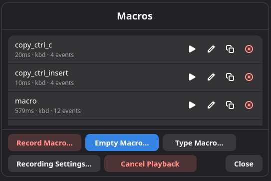
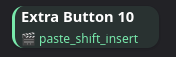
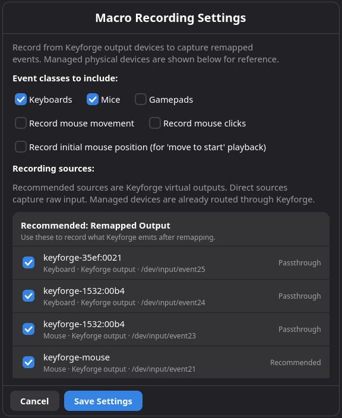
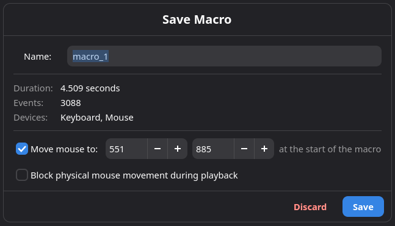
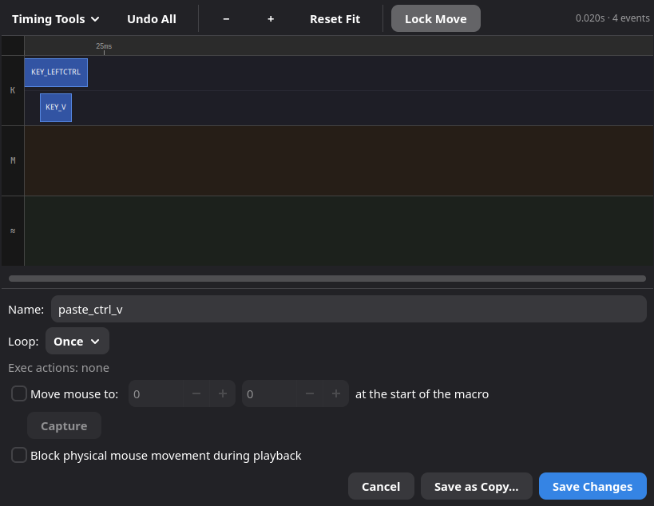
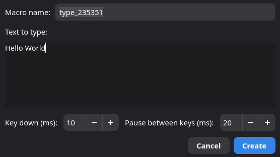
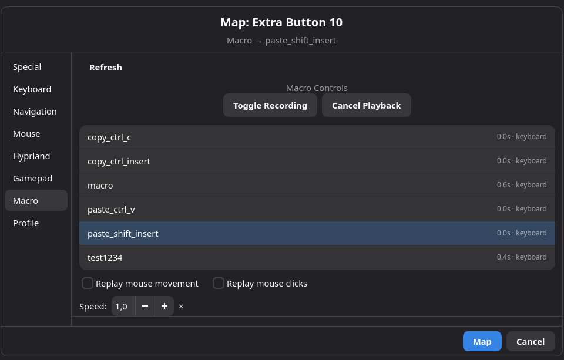
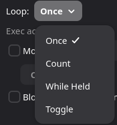
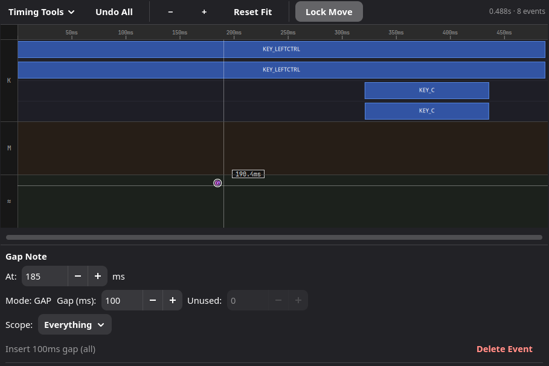
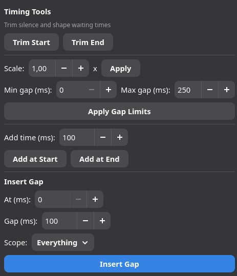

# Macro System

## Overview

In Keymasq, a macro is a saved sequence of input actions that you can replay
later. A macro can type text, press keys, click mouse buttons, move the mouse,
or combine several of those actions with recorded timing.

Macros are saved centrally by Keymasq and can be reused from profiles,
superkeys, combos, or the CLI. You create and edit them in the GUI, and
Keymasq plays them back by macro name.

## Quick Start: Your First Macro

The fastest way to get started is to create an empty macro, add a few events
by hand, and assign it to a key. This doesn't require any special permissions
or unlock steps.

1. Open the Keymasq GUI and go to **Macro Manager**.
2. Click **Empty Macro…** and give it a name.
3. The macro editor opens with a blank timeline. Add the key presses or mouse
   actions you want — for example, a Ctrl+C shortcut.
4. Save the macro.
5. Go to the **Device** tab for your keyboard, pick a key, and set its action
   to **Play Macro**. Choose the macro you just created.
6. Press that key — your macro plays back exactly as you built it.

That's it. The sections below cover the other creation methods (live recording
and type templates), loop modes, timing adjustments, and more.





## Creating Macros

There are three ways to create a macro:

- **Live recording** — capture what you do in real time.
- **Empty macro** — start from a blank timeline and add events by hand.
- **Type macro template** — enter text and let Keymasq build the keystrokes
  for you.

### Live Recording

Live recording captures your actual keyboard, mouse, and movement inputs as
you perform them. This is the most accurate option and is recommended when:

- You need exact timing (for example, a game combo or an app shortcut).
- Your macro involves mouse movement or clicks.
- You use a non-standard keyboard layout.
- The target application is sensitive to input speed.

**Before you start:** bind **Toggle Recording** to a key on your device. Toggle
Recording starts and stops a live recording from whatever window you're in, so
you can record in the target application without switching back to the GUI.
It requires the GUI to be running and unlocked. You should also bind **Cancel
Playback** — it immediately stops every running macro and is a useful safety
net.

**How to record:**

1. Make sure the Keymasq GUI is running and unlocked.
2. Switch to the application you want to record in.
3. Press your **Toggle Recording** key to start capturing.
4. Perform the inputs you want to capture.
5. Press **Toggle Recording** again to stop.
6. The GUI opens a save dialog — give the macro a name and save it.

Starting and stopping from a hotkey keeps the recording clean. If you click
buttons in the GUI to start or stop, those clicks and any mouse movement to
reach them will be captured too, which is rarely what you want.

> **Fallback:** you can also click **Record Macro…** in Macro Manager and
> **Stop Recording** in the GUI, but be aware that interacting with the GUI
> during a recording will capture those inputs.

**Options available when saving:**

| Option | What it does |
|---|---|
| Move to start | Before playback, move the cursor to the position it was at when recording began. |
| Block mouse movement | Prevent accidental mouse movement during playback (requires a grabbed mouse device). |





### Empty Macro

An empty macro gives you a blank timeline that you build up manually in the
editor. No recording, no unlock step — just open the editor and add the events
you need.

**How to create one:**

1. Open **Macro Manager**.
2. Click **Empty Macro…**.
3. Enter a name for the macro.
4. The editor opens with an empty timeline. Add key presses, mouse clicks, or
   movement events and arrange their timing.
5. Save.

**When to use it:** when you know exactly which inputs you want and don't need
to capture live timing — for example, a simple keyboard shortcut, a short
button sequence, or a starting point you plan to refine in the editor.



### Type Macro Template

Type macro templates are a shortcut for creating simple text-typing macros
without recording. You type the text you want, choose a delay between
keystrokes, and Keymasq builds the macro automatically.

**How to create one:**

1. Open **Macro Manager**.
2. Click **Type Macro…**.
3. Enter the text and adjust the delay settings.
4. Save.

**When to use it:** quick typed phrases, email signatures, chat responses, or
any short text that doesn't need precise timing.

**When to prefer live recording instead:** if you use special characters, a
non-QWERTY layout, or need exact control over timing, live recording will
give more reliable results.



## Using Macros

### Playback Triggers

Once a macro is saved, you can trigger it in several ways:

| Trigger | Where to set it up |
|---|---|
| Mapped key or button | Device tab → pick a key → set action to **Play Macro** |
| Superkey action | Superkey editor → add a macro action |
| Combo | Combo tab → set the combo's action to **Play Macro** |
| CLI command | Terminal: `keymasq macro play <name>` |
| GUI button | Macro Manager → click **Play** next to a macro |

**Playback options** (available from the mapping or the play command):

- **Speed multiplier** — make the macro faster or slower than it was recorded.
- **Replay mouse movement** — on or off.
- **Replay mouse clicks** — on or off.
- **Move to start** — jump the cursor to the original recording position
  before playing (if configured when saved).
- **Block mouse movement** — temporarily prevent mouse movement during
  playback (requires a grabbed mouse device).



### Loop Modes

By default a macro plays once and stops. Loop modes let you repeat it
automatically.

| Mode | Behavior |
|---|---|
| **None** | Play once and stop. |
| **Count** | Play a fixed number of times, then stop. |
| **Hold** | Keep replaying for as long as you hold the trigger key down. Release to stop. |
| **Toggle** | Press the trigger once to start looping. Press it again to stop. |

**Hold** and **Toggle** are especially useful for repeated actions — auto-fire
in a game, continuous scrolling, or any workflow where you want the macro to
keep running without pressing the trigger again and again.



### Concurrency

Multiple macros can run at the same time. Here's how overlapping playback
works:

- **None** and **Count** macros can overlap freely with other running macros.
- **Hold** macros will not start a second copy from the same trigger while one
  is already running. Releasing the trigger stops the running instance.
- **Toggle** macros use the trigger as an on/off switch — pressing it while
  the macro is running stops it instead of starting another copy.
- **Cancel All** (from the GUI or CLI) stops every running macro at once, not
  just one.

There is no built-in limit on how many macros can run at once or how long they
can be. If you create a very long macro or trigger many simultaneously, you're
responsible for the result.

## Editing Macros

Open a saved macro in the editor from Macro Manager (or from a profile's macro
action context). The editor shows your macro as a visual timeline of keyboard,
mouse, and movement events.

You can:

- Add or delete individual events.
- Move events forward or backward in time.
- Change which key or button an event uses.
- Insert gap notes (pauses).
- Use timing tools to trim, scale, or adjust gaps.

### Event Types

The editor lets you insert several kinds of events into the timeline:

| Event type | Description |
|---|---|
| **Key press / release** | Any keyboard key — letters, modifiers, function keys, media keys, etc. |
| **Mouse click** | Press or release of any mouse button. |
| **Relative mouse movement** | Move the pointer by a delta (pixels). Useful for macros that should work regardless of where the cursor starts. |
| **Absolute mouse movement** | Move the pointer to an exact screen coordinate. Useful when a macro always targets a fixed UI element. |
| **Exec (synchronous)** | Run an external program and wait for it to finish before the macro continues. Macro playback is paused until the process exits. |
| **Exec (asynchronous)** | Fire-and-forget an external program. The macro continues immediately — the launched process runs independently. |

Exec events are powerful but be cautious: a synchronous exec that hangs will
stall the macro indefinitely. Prefer asynchronous exec for anything that
doesn't need to gate later events.

Playback errors are silent — if a macro fails mid-sequence (for example, the
target device is gone), the GUI won't notify you.

### Gap Notes

A gap note is a pause marker you place on the timeline. Think of it as a
"wait here" instruction.

**Why use them?** Sometimes you need a delay at a specific point in your
macro — for example, waiting for a menu to open before clicking an option.
Instead of dragging every event after that point by hand, you drop in a gap
note and set how long the pause should be. All the events that follow shift
automatically.

**Scope** controls which types of events are delayed:

| Scope | What gets delayed |
|---|---|
| Everything | All later events |
| Keyboard | Only later keyboard events |
| Mouse | Only later mouse-button events |
| Movement | Only later pointer-movement events |

Scoped gap notes are helpful when you want to slow down one track (say,
keyboard) without affecting another (say, mouse movement).

Gap notes appear as **G** markers on the timeline. You can move them, edit
their duration, or delete them at any time.



### Timing Tools

The **Timing Tools** menu provides bulk adjustments to your macro's timing:

| Tool | What it does |
|---|---|
| **Trim Start** | Remove silence at the beginning of the macro. |
| **Trim End** | Remove trailing silence after the last event. |
| **Scale** | Multiply all timing gaps by a factor (e.g. 0.5× = twice as fast). |
| **Apply Gap Limits** | Set a minimum and/or maximum gap between events, clamping any that fall outside. |
| **Insert Gap** | Add a delay at a specific time, scoped to Everything, Keyboard, Mouse, or Movement. |



## CLI Usage

The `keymasq` CLI lets you work with macros from a terminal. It's best for
quick operations — use the GUI for creating and editing.

| Command | What it does |
|---|---|
| `keymasq macro list` | Show all saved macros with basic info. |
| `keymasq macro play <name>` | Play a macro by name. |
| `keymasq macro cancel` | Stop all currently running macros. |

## Storage

Macros are stored in `/var/lib/keymasq/macros/`, owned by the `keymasq`
system user. Do not edit these files by hand — use the GUI or CLI instead.

### Deleting Macros

To delete a macro, open **Macro Manager** and click the delete button next to
it.

Deleting a macro does **not** automatically unbind it from keys, superkeys, or
combos that reference it. Those mappings will stay in place but stop working —
pressing the trigger will do nothing because the macro no longer exists.

## Security Notes

Keymasq treats macros with care because recording captures raw input, which
could be misused as a keylogger.

- **Recording is allowed by default**, but guarded by an unlock step. Before
  you can record a macro, Keymasq asks you to confirm through a one-time
  unlock prompt. This is intentional — recording captures your raw keystrokes,
  so the unlock prevents anything from silently recording in the background
  without your knowledge.

- **Macros are stored in `/var/lib/keymasq/macros/`**, owned by the `keymasq`
  system user, not mixed into your profile files. The GUI asks Keymasq to save
  or play them; it does not write files there directly.

**Optional security settings** (in `/etc/keymasq/security.toml`). Most users
do not need to change these — they are intended for system administrators:

- **Disable the unlock requirement** (not recommended):

  ```toml
  [recording_guard]
  unlock_required = false
  ```

- **Require unlock for editing too** (stricter):

  ```toml
  [recording_guard]
  macro_edit_requires_unlock = true
  ```

- **Block recording entirely** for GUI/CLI users:

  ```toml
  [session_command_acl]
  client = [
    "deny:start_recording",
    "deny:stop_recording",
    "deny:save_recording",
    "deny:discard_recording",
  ]
  ```

## Best Practices

- **Name macros clearly.** Use descriptive, stable names like
  `fps_loot_cycle` or `email_signature`. Profiles and combos refer to macros
  by name, so renaming means updating every reference.
- **Reuse, don't duplicate.** If you need the same sequence in multiple
  places, point them all at one saved macro instead of recreating it.
- **Slow down for fragile UIs.** If a target app drops inputs, lower the speed
  multiplier.
- **Record layout-specific text.** Type macro templates assume a standard
  QWERTY layout. If you use special characters or a different keyboard layout,
  record the macro live instead.
- **Use gap notes for timing tweaks.** They're faster and more reliable than
  manually nudging individual events.
