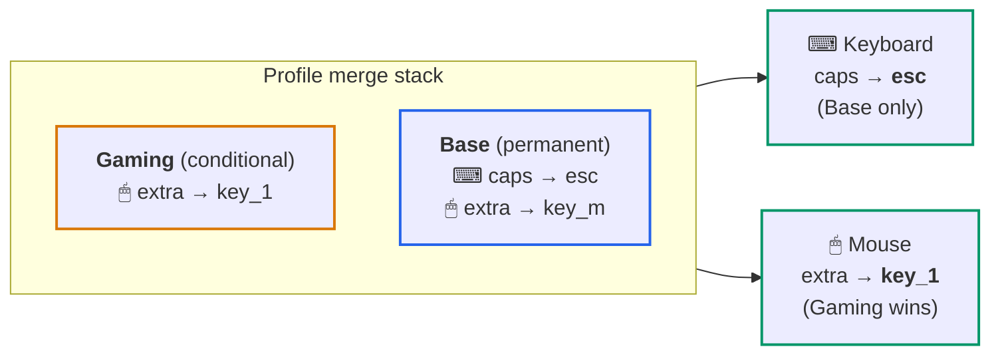

# Profile System

The profile system is how Keymasq stores and applies remaps. A profile is a
named set of mappings that can include layers for one device or several
devices.
Keymasq can activate more than one profile at the same time, then merge those
profiles into the final mapping for each device based on profile type,
priority, and active window rules.

> **Profiles are global, not per-device.** A single profile can contain
> mappings for your keyboard, mouse, and gamepad together.

## Mental Model

The easiest way to think about profiles is:

- a profile is a named layer of remaps
- more than one profile can be active at once
- for each device, Keymasq merges the matching layers from the active profiles



What "matching layers" means:

- a profile can contain a keyboard layer, a mouse layer, a gamepad layer, or
  any combination of them
- when input comes from your mouse, Keymasq only looks at the mouse parts of
  the active profiles
- when input comes from your keyboard, Keymasq only looks at the keyboard
  parts of the active profiles

Gamepad actions can route to a specific output with `output_id`:

```toml
[devices."046d:c548".mapping.btn_back]
action = "gamepad"
target = "btn_a"
output_id = "virtual-gamepad-2"
```

Valid output IDs are `virtual-gamepad-1` through `virtual-gamepad-4`, or a
configured hardware gamepad ID. Explicit output IDs are strict: unavailable
outputs log a daemon warning and emit nothing.

Simple example:

- `Base` is your normal everyday profile
- `Gaming` is a profile that should only apply while a game window is focused
- `Base` contains keyboard and mouse mappings
- `Gaming` contains only mouse mappings

When you are on the desktop:

- only `Base` is active
- your keyboard uses the keyboard layer from `Base`
- your mouse uses the mouse layer from `Base`

When you focus the game window:

- `Base` is still active
- `Gaming` becomes active too
- your keyboard still uses only `Base`, because `Gaming` has no keyboard layer
- your mouse uses the merged result of `Base` and `Gaming`

So the system is not "one profile per device". It is "one or more active
profiles, each of which may contribute a layer to each device".

## Where Profiles Live

Profiles are stored in:

```text
~/.config/keymasq/profiles/<profile_name>.toml
```

The visible profile name can contain arbitrary characters. The on-disk filename is derived from that name by replacing unsafe filename characters so the file always stays inside `profiles/`.

Keymasq keeps at least one editable profile. On startup when no valid profile can
be loaded, and whenever the session reloads an empty profiles directory,
`keymasq-session` seeds a permanent profile named `Default` so new devices can
be remapped immediately. Existing files are never overwritten; filename
collisions use `Default_2.toml`, `Default_3.toml`, and so on.

Hardware definitions are still separate:

```text
~/.config/keymasq/hardware/<hardware_id>.toml
```

See [Hardware Configuration](HARDWARE.md) for hardware IDs, attached evdev
devices, detection methods, and source button/key IDs.

## Profile Types

There are two runtime profile types. In the GUI, the type is derived from
Window Rules:

- no window rules means the profile is permanent
- one or more window rules means the profile is conditional

To make a profile permanent again, remove its window rules.

### Permanent profiles

- Always active when enabled
- Applied before all conditional profiles
- Good for your baseline remaps

### Conditional profiles

- Active only when their window rules match the focused window
- Applied after permanent profiles
- Good for app-specific or game-specific overlays

## Activation And Merge Rules

Keymasq can have more than one active profile at once.

For each device, Keymasq resolves the final mapping by layering active profiles in this order:

1. Enabled permanent profiles
2. Enabled conditional profiles whose window rules match
3. Runtime profile activations created by profile actions with a temporary activation mode

Within the permanent and conditional groups, profiles are applied in ascending:

1. `priority`
2. `created_at`
3. profile name, case-insensitive

The last applied mapping wins. In practice:

- higher `priority` overrides lower `priority`
- if priorities are equal, newer `created_at` overrides older
- if both are equal, name order is the tiebreaker

`created_at` is internal ordering bookkeeping. Keymasq stores it as a quoted,
timezone-naive ISO timestamp. Missing, malformed, timezone-aware, or native TOML
datetime values are replaced with the current time and repaired to that
canonical form when the profile loads.

Conditional profiles always override permanent profiles, even if the permanent profile has a higher numeric priority.

Runtime profile activations are temporary overlays. They do not write
`enabled` to the profile TOML file. If a runtime-activated profile is already
active through normal permanent or window-rule resolution, Keymasq includes it
once at the runtime overlay position. When the runtime activation expires, the
profile falls back to its normal active position if it is still enabled and
matches the current window.

Action-count activations behave like one-shot keyboard layers: each grabbed
input press consumes one count, even when that input falls through to a lower
profile or has no mapping. Combo completions, wheel ticks, and top-level
superkey activations each consume one count.

Only one runtime activation can own a profile at a time. A new runtime
activation for the same profile replaces the previous activation and stale
expiry events from the daemon are ignored by the session.

## Unmapped Buttons and Overrides

Buttons not listed in a device layer pass through unchanged.

If a higher-priority profile does not map a button, lower-priority profiles can
still map it. To override a lower-priority remap and restore the button's
original behavior, bind the button to its own original key or button.

## Exclusive Input Capture

`always_grab_all` is a per-device layer setting that makes Keymasq capture all
input from the device, even buttons that are not remapped. This prevents the
original input from reaching your apps.

For a given device, this is enabled if any active layer for that device sets it
to `true`.

## Window Rules

Conditional profiles use window rules to decide when to activate. All rules in
a profile must match for it to become active.

Typical fields are:

- `class` — the application identifier your compositor assigns (e.g.
  `steam_app_730`, `firefox`). The GUI fills this in automatically when you
  pick a window.
- `title` — the window title text.
- `tag` — the workspace or tag name (compositor-dependent).

## TOML Format

Each profile file contains:

- one `[profile]` section for global profile metadata
- one `[devices."<hardware_id>"]` section per device layer. Hardware IDs are
  USB vendor:product IDs such as `046d:c548` for the first configured device of
  a model. Additional identical devices use numbered internal IDs such as
  `046d:c548@2`.
- one `[devices."<hardware_id>".mapping.<button_id>]` section per mapped button

Example:

```toml
[profile]
name = "Gaming"
enabled = true
is_permanent = false
priority = 50
notify_on_activation = true
activation_macro = "game_enter"
deactivation_macro = "game_leave"
created_at = "2026-03-09T12:34:56"

[[profile.window_rules]]
field = "class"
pattern = "steam_app_730"

[devices."1234:5678"]
always_grab_all = false

[devices."1234:5678".mapping.btn_back]
action = "keyboard"
target = "key_1"

[devices."1234:5678".mapping.btn_forward]
action = "keyboard"
target = "key_2"

[devices."abcd:ef01"]
always_grab_all = true

[devices."abcd:ef01".mapping.key_f13]
action = "mpris"
command = "play_pause"
```

`activation_macro` and `deactivation_macro` are optional stored macro names.
When set, `keymasq-session` asks `keymasqd` to play the macro after the global
active profile set changes. They fire once when a profile enters or leaves the
active set, not on unchanged reevaluations, device reconnects, or mapping-only
refreshes.

## Common Patterns

### Base profile plus app overlay

- Create a permanent `Base` profile for your normal remaps
- Create a conditional `Gaming` profile with window rules for the game
- Put only the buttons you want to change in `Gaming`

When the game window is focused, `Gaming` overlays `Base`.

### One profile across multiple devices

Use one profile when a workflow spans several devices. Example:

- mouse side buttons for push-to-talk and weapon swap
- keyboard function keys for overlays
- keypad buttons for OBS or Discord

All of those can live in one `Streaming` profile.

### Restoring a button's original behavior

If `Base` maps `btn_extra` to `key_m`, a higher conditional profile can restore
normal behavior by mapping that button to its own original input:

```toml
[devices."1234:5678".mapping.btn_extra]
action = "mouse"
target = "btn_extra"
```

## GUI Behavior

In the GUI:

- profiles are global
- each device tab edits that device's layer inside the selected profile
- enabling or disabling a profile affects every device layer in that profile
- active-state displays show the active profiles contributing to that device
- device tabs show live runtime status from keymasq-session/keymasqd: green means
  connected and grabbed, yellow means connected but not fully grabbed, red means
  configured but not connected, and neutral means runtime status is unavailable
- when live runtime status is available, the device header lists the configured
  interface count, connected count, grabbed count, and selected-profile mapping count
- `Passthrough` removes the mapping from the selected profile so lower profiles can still apply one
- the app remembers the last selected device or combo tab and restores it on launch
- selecting a profile in a device or combo tab remembers it and restores it
  the next time the GUI opens
- hardware settings are covered in [Hardware Configuration](HARDWARE.md)
- deleting a hardware control can clear saved mappings for that control across profiles

Deleting a hardware definition does not delete global profiles. Any layers for that hardware remain in the profile file and stay dormant until that hardware exists again.

## CLI

Profile commands operate on profile names:

```bash
keymasq profiles list
keymasq profiles enable Gaming
keymasq profiles disable Gaming
keymasq profiles toggle Gaming
```

`list` shows:

- global profile metadata
- which devices each profile has layers for
- active profiles per device

## Profile Actions

Profile control actions inside mappings now target only a profile name:

- enable profile
- disable profile
- toggle profile

With **Persistent** mode, these actions keep the traditional saved-profile
behavior: enable/toggle writes `enabled = true`, disable/toggle off writes
`enabled = false`, and disable also cancels any runtime activation for the
profile.

With a temporary activation mode, Enable creates a runtime-only profile
activation. Toggle with a temporary activation mode is also runtime-only: it
creates the activation when the profile is not temporarily active, and cancels
the current activation when it is. Disable does not use temporary activation
modes and also cancels any runtime activation for the profile.

## Combos

Profiles can also contain combo definitions.

Combos follow the same active-profile ordering rules as mappings, but runtime prefix conflicts are resolved by the combo matcher, not by the GUI.

See `docs/COMBOS.md` for combo behavior, timeouts, storage, and shadowing rules.
