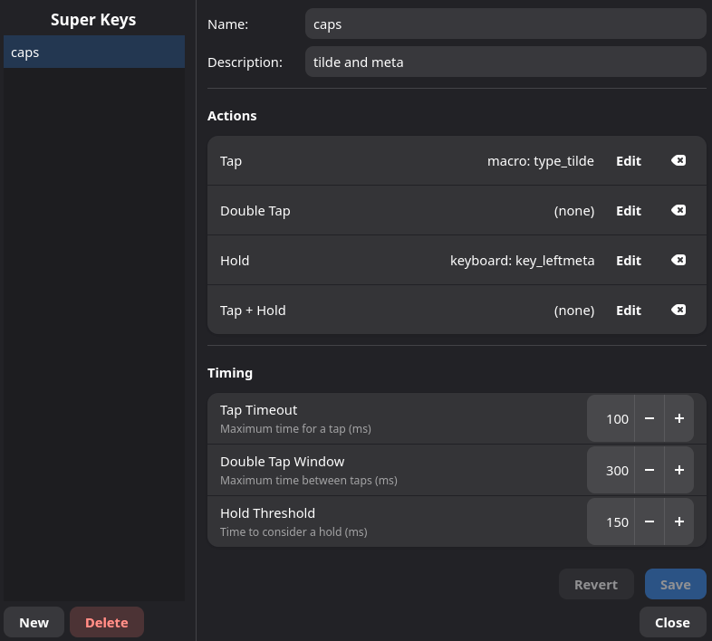
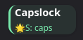

# Super Keys

## Overview

A super key turns a single physical key or button into up to four different
actions, depending on how you press it:

| Interaction | What it means |
|---|---|
| **Tap** | Quick press and release. |
| **Double Tap** | Two quick taps in a row. |
| **Hold** | Press and hold down. |
| **Tap + Hold** | Tap once, then press and hold a second time. |

Each of those four slots can trigger a different action — a keyboard key, a
mouse button, a gamepad input, a shell command, or a macro. You don't have
to fill every slot; leave any you don't need empty.

Super keys are saved separately from profiles and can be reused across
multiple profiles and devices.

## Quick Start: Your First Super Key

1. Open the Keyforge GUI and go to **Manage Super Keys** (from the menu or
   toolbar).
2. Click **New** in the left panel.
3. Give it a name — for example, `side_button_actions`.
4. In the **Actions** section, click **Edit** next to **Tap** and pick the
   action you want for a quick press (say, Ctrl+C).
5. Click **Edit** next to **Hold** and pick a different action (say, Ctrl+V).
6. Click **Save**.
7. Go to the **Device** tab for your device, pick a key, and set its action
   to **Super Key**. Choose the one you just created.
8. Try it — tap the key for one action, hold it for the other.





## Creating and Editing Super Keys

Open **Manage Super Keys** from the GUI. The dialog has two panels:

- **Left panel** — lists all your saved super keys. Use **New** to create one
  or **Delete** to remove one.
- **Right panel** — edit the selected super key's name, description, actions,
  and timing.

### Setting Actions

Each of the four action slots (Tap, Double Tap, Hold, Tap + Hold) has an
**Edit** button that opens the action chooser. From there, pick one of:

| Action type | What it does |
|---|---|
| **Keyboard** | Send a keyboard key (selected from a visual layout). |
| **Mouse** | Send a mouse button (left, right, middle, side buttons, etc.). |
| **Gamepad** | Send a gamepad button or analog trigger. |
| **Macro** | Play a saved macro by name. |
| **Command** | Run a shell command. |

Use the **Clear** button on any row to remove that slot's action.

### Rapidfire

Hold and Tap + Hold actions have an optional **rapidfire** mode. When enabled,
the action repeats automatically for as long as you hold the key — like
holding down a fire button in a game.

Rapidfire settings:

| Setting | What it controls | Default |
|---|---|---|
| **Hold (ms)** | How long each pulse is held down. | 20 ms |
| **Wait (ms)** | Pause between pulses. | 20 ms |

### Timing

The **Timing** section controls how Keyforge distinguishes between a tap, a
hold, and a double tap. All values are in milliseconds.

| Setting | What it controls | Default | Range |
|---|---|---|---|
| **Tap Timeout** | How quickly you must release for a tap to register. | 200 ms | 50–1000 ms |
| **Double Tap Window** | How long Keyforge waits after a tap for a possible second tap. | 300 ms | 50–1000 ms |
| **Hold Threshold** | How long you must hold before the hold action triggers. | 300 ms | 50–2000 ms |

**Tips for tuning:**

- If taps feel unresponsive, increase the **Tap Timeout**.
- If double taps fire accidentally, shorten the **Double Tap Window**.
- If holds trigger too early, increase the **Hold Threshold**.
- If you only use Tap and Hold (no Double Tap), the Tap Timeout and Hold
  Threshold are the main settings that matter.

## How Super Keys Work at Runtime

When you press a key mapped to a super key, Keyforge watches what you do next
to decide which action to fire. Here's the decision flow:

```
Press key
 ├─ Release quickly? → Tap
 │   └─ Press again quickly?
 │       ├─ Release quickly? → Double Tap
 │       └─ Keep holding? → Tap + Hold
 └─ Keep holding past threshold? → Hold
```

Because Keyforge has to wait and see what you do, there is a small built-in
delay before a tap fires. This is normal — the timing settings control how
long that wait is.

**What happens when a slot is empty:**

- If you double-tap but no Double Tap action is set, Keyforge fires the Tap
  action instead.
- If you hold but no Hold action is set, nothing extra happens.
- If no Tap action is set, a quick press does nothing.

## Using Super Keys

### Assigning to a Key

Once a super key is saved, assign it to a physical key from the **Device**
tab:

1. Pick a key or button on your device.
2. Set the action to **Super Key**.
3. Choose the super key by name.

The same super key can be assigned to different keys on different devices.

### Reusing Across Profiles

Super keys are saved globally, not inside profiles. Any profile can reference
any super key by name. If you update a super key's actions or timing, the
change applies everywhere it's used.

### Deleting a Super Key

Click **Delete** in the Manage Super Keys dialog. If the super key is
currently used in any profiles, Keyforge will warn you and list which profiles
are affected.

Deleting a super key replaces all references to it with **Suppress** (the key
does nothing) in affected profiles. This is automatic — you won't have broken
references.

### Concurrency

The same super key can be assigned to multiple keys at once — even on
different devices. Each key gets its own independent state machine, so
pressing one doesn't interfere with the other. You can tap one key while
holding another, and both will behave correctly according to the super key's
timing and actions.

## Storage

Super keys are stored as individual TOML files in your user configuration
directory:

```
~/.config/keyforge/superkeys/
```

Each file contains the super key's name, description, timing overrides (only
non-default values are written), and configured actions. Here's an example of
what a file looks like:

```toml
name = "caps_superkey"
description = "Tap for Escape, hold for Ctrl"

[timing]
hold_threshold_ms = 250

[actions.tap]
action = "keyboard"
target = "key_esc"

[actions.hold]
action = "keyboard"
target = "key_leftctrl"
```

While the files are human-readable, prefer using the GUI to create and edit
super keys. Manual edits are not validated and can cause load errors if the
format is wrong.

## Security Notes

- **Command actions** run shell commands inside your user session (delegated
  to keyforge-session, not the privileged daemon). They still execute
  automatically on a key press, so be mindful of what you put in them.
- **Compositor dispatcher actions** can send commands to your compositor
  (e.g. Hyprland). These interact with your desktop environment directly, so
  review what they do before assigning them to a super key.

## Best Practices

- **Name super keys by purpose**, not by the key they're on. A name like
  `copy_paste_toggle` is more useful than `side_button_1` — it makes sense
  even when reused on a different device.
- **Start with two slots.** Tap + Hold is the most natural combination. Add
  Double Tap and Tap + Hold only if you actually need four actions on one key.
- **Test your timing.** The defaults work for most people, but if you have a
  fast or slow pressing style, adjust the timing to match.

## See Also

- [Macros](MACROS.md) — record or build input sequences that super keys can
  trigger.
- [Combos](COMBOS.md) — trigger actions from multi-key combinations instead
  of single-key interactions.
