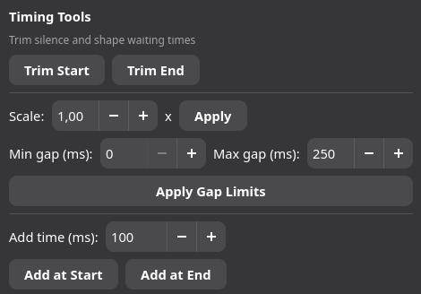

# Text Snippet Macro

Use a macro to type a reusable text snippet, such as an email address, support
reply, command, or signature.

Keymasq records and replays keyboard events. It does not translate text by
language or keyboard layout. For localized text, accents, symbols, or anything
layout-sensitive, record the text on your own keyboard layout and then clean up
the timing in the macro editor.

## When To Use Type Macro

Use **Type Macro** for simple snippets made from standard letters, numbers, and
common symbols.

For example:

```text
support@example.com
```

For text in your preferred language, text with accented characters, or text
that depends on your keyboard layout, use a recording instead.

## Record The Snippet

Create a recording with the layout you actually type with:

1. Bind **Toggle Recording** to a temporary key.
2. Open a plain text editor.
3. Press **Toggle Recording** to start recording.
4. Type the snippet normally.
5. Press **Toggle Recording** again to stop recording.
6. Save the recording as a macro, for example:

```text
email_signature
```

Do not worry about typing speed while recording. The next step normalizes the
timing.

## Normalize The Timing

Open the recorded macro in the editor.

Use **Timing Tools** to shape the replay:

1. Click **Trim Start** to remove the pause before the first key.
2. Click **Trim End** to remove trailing silence.
3. Set **Max gap (ms)** to a small value such as `50` or `100`.
4. Click **Apply Gap Limits**.
5. Use **Scale** if you want to make the whole sequence faster or slower.



The goal is not to make every key instant. The goal is to remove human pauses
and leave a steady sequence that the target application can still receive
reliably.

## Bind The Macro

Bind the macro to a key, mouse button, combo, or superkey slot.

When choosing the macro action, use **Speed** as the final tuning control:

- Increase speed until the target application starts missing characters.
- Back off to the fastest reliable value.
- Use a lower speed for terminals, remote desktops, chat apps, or slow web
  forms.

Shape the macro once in the timeline. Fine-tune replay speed where you bind
the macro.

## Why This Shape

The recording captures the exact key events your layout produces. The editor
then turns that human recording into a fast, reusable macro without Keymasq
needing to understand your language or keyboard layout.

