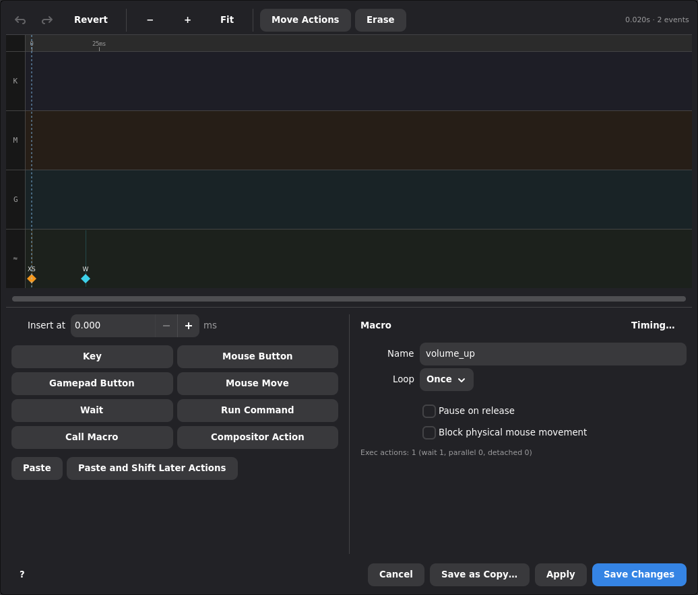
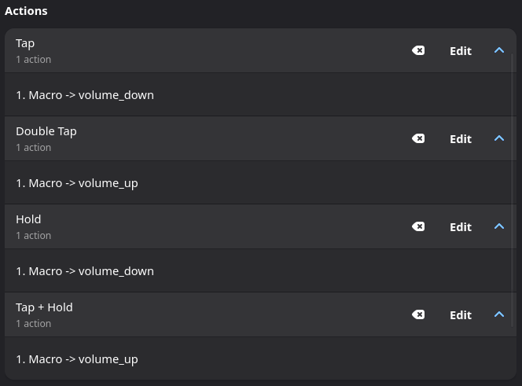
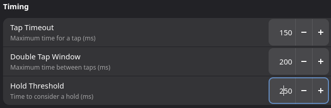

# Volume Rocker Key

Use one key as a small volume rocker:

| Press pattern | Result |
|---|---|
| Tap | Volume down once |
| Double tap | Volume up once |
| Hold | Keep turning volume down |
| Tap + hold | Keep turning volume up |

Use the **rapidfire media-key** setup first. It is simpler and does not need
macros. Use the **PipeWire command macro** setup when you want Keymasq to call
`wpctl` directly instead of sending `key_volumeup` and `key_volumedown`.

## Option A: Media Keys With Rapidfire

Open **Super Keys**, create a new superkey, and choose **Pattern** mode.

Suggested name:

```text
volume_rocker
```

Set the pattern slots like this:

| Slot | Action | Rapidfire |
|---|---|---|
| Tap | Keyboard: `key_volumedown` | Off |
| Double Tap | Keyboard: `key_volumeup` | Off |
| Hold | Keyboard: `key_volumedown` | On |
| Tap + Hold | Keyboard: `key_volumeup` | On |

For the held actions, start with:

| Setting | Value |
|---|---|
| Rapidfire Hold | 20 ms |
| Rapidfire Wait | 20-80 ms |

Increase **Rapidfire Wait** if the volume changes too quickly.

## Option B: PipeWire Command Macros

Use this path when media keys are not handled correctly by your desktop, or
when you want fixed volume steps controlled by PipeWire.

Create the down macro:

1. Click **Open Macros**.
2. Click **Empty**.
3. Set **Name** to `volume_down`.
4. Set **Loop** to **While Held**.
5. Right-click in the timeline.
6. Select **Insert Exec Sync**.
7. Set **At** to `0 ms`.
8. Set **Command** to:

```sh
wpctl set-volume @DEFAULT_AUDIO_SINK@ 5%-
```

Right-click in the timeline again and insert a wait:

1. Set **At** to `20 ms`.
2. Set **Wait (ms)** to `150 ms`.

Save the macro.

Create the up macro by duplicating the down macro:

1. Duplicate `volume_down`.
2. Set **Name** to `volume_up`.
3. Click the exec event in the timeline.
4. Replace **Command** with:

```sh
wpctl set-volume -l 1.0 @DEFAULT_AUDIO_SINK@ 5%+
```

5. Save the macro.

The `-l 1.0` option clamps the upper volume limit at 100%.

The wait controls how fast the volume changes while the key is held. Lower it
for faster volume changes, or raise it for slower changes.

The completed `volume_up` macro should look similar to this:



Then create the same **Pattern** superkey, but use macro actions:

| Slot | Action |
|---|---|
| Tap | Play Macro: `volume_down` |
| Double Tap | Play Macro: `volume_up` |
| Hold | Play Macro: `volume_down` |
| Tap + Hold | Play Macro: `volume_up` |

Macros bound to tap slots do not keep looping, so the same **While Held**
macro can be used for both tap and hold patterns. Tap runs one volume step;
hold repeats the macro until you release the key.

The completed superkey actions should look similar to this:



## Timing

Suggested superkey timing:

| Setting | Value |
|---|---|
| Tap Timeout | 180-220 ms |
| Double Tap Window | 250-350 ms |
| Hold Threshold | 250-350 ms |



Use shorter timings if the key feels sluggish. Use longer timings if double
tap or tap + hold is hard to trigger reliably.

## Bind It To A Key Or Combo

Bind `volume_rocker` anywhere a superkey can be used:

- **Device tab**: choose a key or button and set its action to **Super Key**.
- **Combos tab**: create a combo and set its action to **Super Key**.

In either place, select:

```text
volume_rocker
```

## Which Option To Pick

Use **Option A** when your desktop already reacts to volume media keys. It is
the normal Keymasq setup for this workflow.

Use **Option B** when you want direct control over the PipeWire command,
volume step size, target sink, or behavior on a desktop that does not handle
media keys the way you want.
