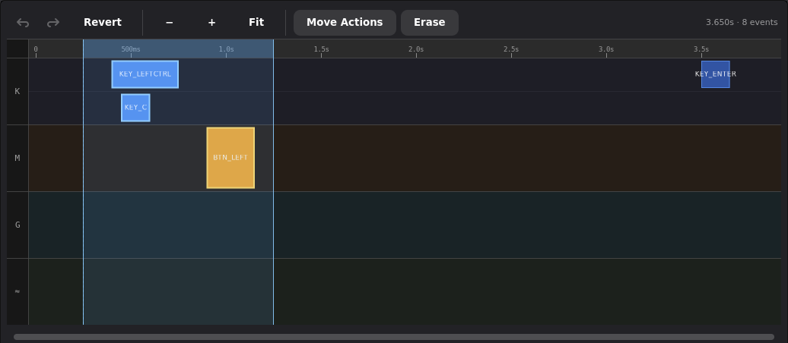
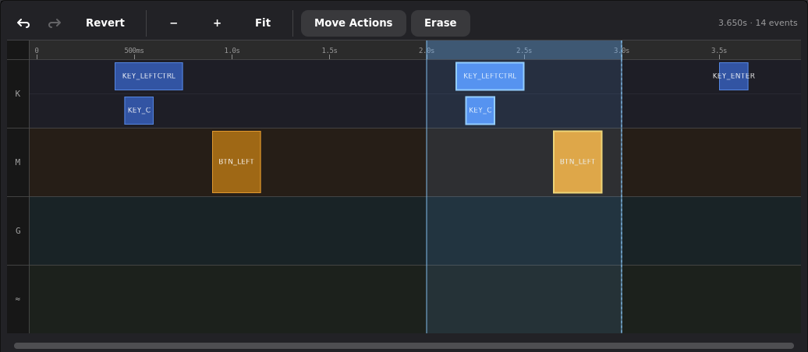
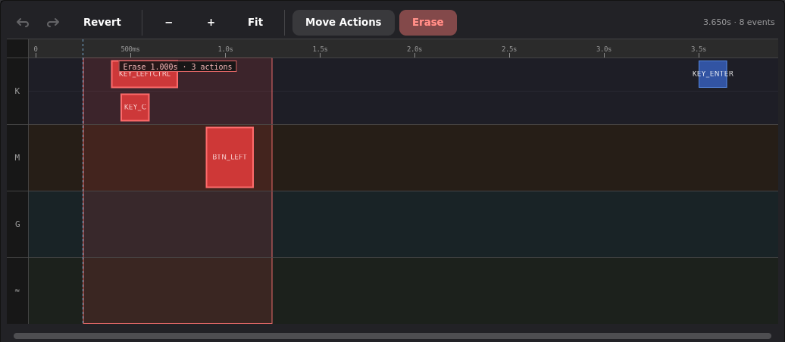
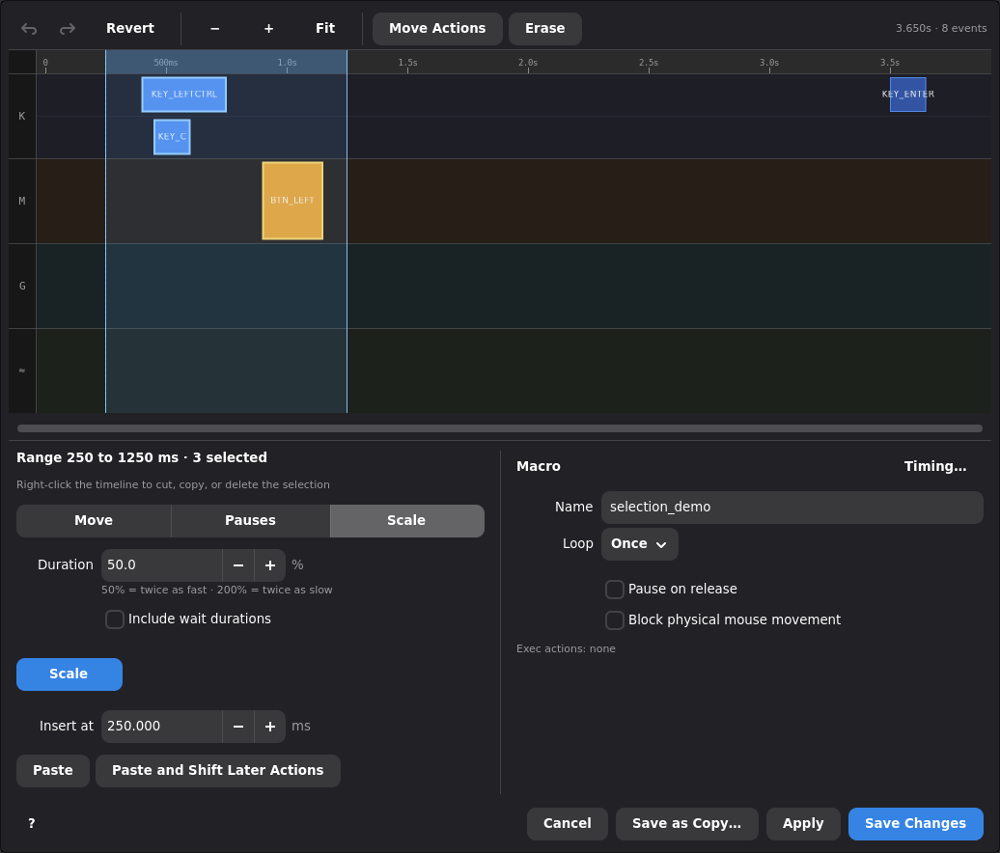

# Macro timeline editor

Use the timeline editor to build a macro by hand, refine a recording, or reuse
parts of an existing macro. For recording, assigning triggers, and playback
settings, see [Macros](macros.md).

- [Open the editor](#open-the-editor)
- [Read and navigate the timeline](#read-and-navigate-the-timeline)
- [Add and edit actions](#add-and-edit-actions)
- [Select actions or time](#select-actions-or-time)
- [Move a selection](#move-a-selection)
- [Copy and paste](#copy-and-paste)
- [Delete actions or erase time](#delete-actions-or-erase-time)
- [Adjust timing](#adjust-timing)
- [Save and undo changes](#save-and-undo-changes)
- [Keyboard shortcuts](#keyboard-shortcuts)

## Open the editor

In **Macro Manager**, click a saved macro's row or its pencil button. You can
also open the editor from a profile's macro action context menu. To start from
scratch, choose **Empty** in Macro Manager and name the new macro.

The editor normally opens as a dialog inside the current window. **Shift-click**
a saved macro's pencil button in Macro Manager to open an independent, resizable
editor window instead. Normal clicks keep the existing dialog behavior.

When a **Macro Call** event is selected, the small pencil button beside the child
macro name opens that macro in an independent window. You can arrange the parent
and child editors side by side and use **Apply** in either editor without closing
it. Closing the parent editor does not close the child window. Opening a macro
that is already being edited focuses its existing editor, including unsaved edits.
An existing dialog stays in its original window when opened from another editor.

Save a temporary recording slot as a regular macro before editing it. Clicking
a temporary slot opens its save dialog.

The **?** button at the bottom left opens this guide in your browser.

## Read and navigate the timeline

Time runs from left to right. The **ruler** is the strip of time labels above
the tracks. It changes between seconds and milliseconds as you zoom.

| Track | Contents |
|---|---|
| **K** | Keyboard actions. |
| **M** | Mouse-button actions. |
| **G** | Gamepad actions. |
| **≈** | Recorded mouse movement, inserted mouse moves, and control actions such as waits and commands. |

A key or button rectangle spans its press and release. Overlapping actions
appear in separate lanes within the same track. A selected press/release pair
counts as one action, but the event count at the top counts its press and
release separately. Recorded movement and other raw events can also be selected.

The **insertion cursor** is the dotted vertical line. It marks where new
actions are added, where Ctrl+V pastes, and where a Shift+click time selection
starts. Click empty timeline space or the ruler to place it, or enter an exact
time in **Insert at** in the inspector while nothing is selected. Right-clicking
also moves it. It starts at zero in a newly opened
editor and does not indicate playback progress.

Use **+** and **−** to zoom, or hold Ctrl or Shift while scrolling over the
timeline. **Reset Fit** fits the macro to the available width. Scroll normally
or use the horizontal scrollbar to move through a zoomed timeline. Dragging
near either edge scrolls while you select or move actions.

## Add and edit actions

With nothing selected, the inspector lists everything that can be added at the
insertion cursor: **Key**, **Mouse Button**, **Gamepad Button**, **Mouse Move**,
**Wait**, **Run Command**, **Call Macro**, and **Compositor Action**. Waits,
commands, and compositor actions go in immediately and stay selected so you
can finish them in the inspector.

Right-clicking at the desired time offers the same commands. The track you
click determines the input action in the menu:

| Location | Command |
|---|---|
| Keyboard track | **Add Keystroke** |
| Mouse-button track | **Add Mouse Click** |
| Gamepad track | **Add Gamepad Button** |
| Movement/control track | **Add Mouse Move**, **Insert Wait**, **Run Command**, **Call Macro**, or **Insert Compositor Action**. |

Choose the key, button, or action in the dialog that opens. A key or mouse-button
action includes its press and release, so you do not need to insert them
separately.
For example, to build Ctrl+C, add Ctrl and C on the keyboard track, then make
the Ctrl hold begin before C and end after C.

The gamepad picker also offers axis values. Gamepad events retain the virtual
or hardware gamepad output chosen in the picker.

Click an action to show its properties in the inspector below the timeline. The
inspector has two columns, with the selected action on the left and the macro's
own settings on the right. For a held key or button, edit **Press**,
**Duration**, and **Release** in milliseconds. Use **Change Key…** to change
the input. Other action types show their own timing and configuration fields.
For a keyboard key, the small line below its name shows the evdev code and
the unmodified character on Keymasq's configured keyboard layout, when the
key produces one. For example, `KEY_LEFTBRACE` shows `Code 26 · de: ü` on a
German layout. The character is a layout hint; held modifiers and dead-key
sequences can change what the macro types.
Properties edit the selected action immediately, and
[saving](#save-and-undo-changes) writes the changes to the macro library.

### Rapidfire keys and buttons

Enable **Rapidfire** in the key selector when adding a keyboard key, mouse
button, or gamepad button, or use **Change Key…** on an existing action.
The pulses stay in one editable timeline block. **Edit Rapidfire…** reopens
the selector, with the current key or button highlighted. Adjust the timings
and click **Save changes** to keep that target without selecting it again.
Disabling Rapidfire and saving restores a continuous hold.

**Hold** sets each press's duration and **Wait** sets the preferred gap.
Keymasq spaces the pulses evenly, adjusting the gaps so the final release
lands at the block's end. Resizing the block recalculates the pulses.
If two pulses cannot fit, one hold spans the block. The properties panel
shows the pulse count and fitted gap.

### Mouse movement

**Add Mouse Move** opens the mouse-action picker. Choose a natural move to a
screen position, a relative movement by X/Y offsets, or the older absolute
move as a fallback. The selected move's properties let you adjust its time
and coordinates. **Capture** can fill in a target position when cursor capture
is available for the current session.

For natural moves, use **Stop macro if target can't be reached** when later
clicks should not run after a failed move. See
[mouse movement playback](macros.md#mouse-movement) for how moves affect timing.

### Waits, commands, and macro calls

Insert a wait with **Wait**. It starts as a fixed pause. Check **Random
duration** in the inspector to give it minimum and maximum delays instead. The
**W** and **WR** markers stay at a single timeline position. Click a marker to
change its delay or position.

An empty timeline gap and a Wait are different. Playback speed scales an
empty gap, while an explicit Wait keeps its configured duration. Inserting a
Wait does not move later actions in the editor. See
[Wait Controls](macros.md#wait-controls) for playback behavior.

**Run Command** inserts a command at the clicked time. In its properties,
choose **Wait for completion**, **Run in parallel**, or **Run detached** and
set the timeout where available. See
[commands and compositor actions](macros.md#commands-and-compositor-actions)
for their playback and cancellation behavior.

**Call Macro** opens the Macro Library. Pick a saved macro, then configure
**Run and wait** or **Run in parallel**, repeat behavior, speed, and mouse replay
options in its properties. The **MW** or **MP** marker remains editable. A call
uses the saved macro by name. Pasting creates independent actions instead.
See [Calling macros from macros](macros.md#calling-macros-from-macros).

**Insert Compositor Action** uses the same action picker as normal mappings.
It is available when the session supports compositor dispatch.

## Select actions or time

### Select individual actions

Click an action to select it. Ctrl+click adds or removes individual actions.
Drag empty track space to draw a selection box. Ctrl+drag adds to the current
selection. The box selects every action it touches, including complete held
keys, mouse buttons, recorded movement samples, and raw event markers.

Use Ctrl+A or **Select All** in the right-click menu to select every action. Escape clears the selection and gap highlight.

### Select a time span, including silence

1. Click empty timeline space or the ruler to set the insertion cursor.
2. Hold Shift and click at the other end of the desired span, anywhere in the
   timeline. The click may land on an action or empty space.
3. The time between those positions is selected across every track, including
   silence before, between, and after its actions.

Further Shift+clicks adjust the endpoint from the same insertion cursor, in
either direction. You can also drag along the ruler to select a time span.

This example selects 0.25 to 1.25 seconds. The highlighted band includes the
silence around the three actions. The summary below reports its bounds and
action count.

If a boundary crosses a held key or button, the span expands to include its
complete press/release pair. An action starting exactly at the right boundary
is excluded. A span may contain only silence. Clicking an action without Shift
or making a new box selection returns to action selection, without outer padding.

## Move a selection

Turn on **Move Actions**, then drag a selected action to move the whole group.
The button uses the theme's accent color while enabled. Selection and keyboard
editing also work with Move Actions off, which is the default.

The group keeps its relative timing, holds, and overlaps. Moving left stops
the whole group at time zero. Moving right can extend the macro. A time
selection keeps its leading and trailing silence. Unselected actions stay in
place. Use [Selection Timing](#adjust-selected-timing) for an exact offset.
Its Move operation preserves the same padding and stops the whole range at zero.

## Copy and paste

Copy with Ctrl+C or **Copy** in the right-click menu. The menu only lists
commands that apply to the current selection. Ctrl+X
cuts the selection. It copies the actions and removes them without collapsing
the surrounding time.

For action selection, the copied section runs from the earliest selected
action to the latest selected end. Copy leaves out unselected actions and outer
silence. A time selection copies its full span, including silence.

| Paste command | Result |
|---|---|
| **Paste**, Ctrl+V | Place the copied section at the insertion cursor. Existing actions stay put and may overlap the pasted actions. |
| **Paste at …** in the right-click menu | Paste at the clicked time. |
| **Paste and Shift Later Actions** | Make room for the copied section by moving later actions forward by its full duration, including silence. |

A key held across a **Paste and Shift Later Actions** insertion remains held
through the inserted section. Pasted actions stay selected, and the insertion
cursor advances to the section's end for repeated pastes.

The example's one-second section is pasted at 2 seconds. Its first action
starts at 2.15 seconds, preserving the leading silence. The original actions
stay in place, and the cursor advances to 3 seconds. Copying the pasted time
selection again keeps its padding.

### Reuse a section in another macro

Copy and paste work between macro dialogs and Keymasq instances. To turn a
section into a separate macro:

1. Select and copy the section.
2. Close the editor, then create and name a new empty macro from Macro Manager.
3. Press Ctrl+V. The section starts at zero, including any selected silence.
4. Choose its playback settings and save.

The clipboard survives closing the source editor. Copying other content
replaces it. Calls inside a copied section keep referring to their original
saved macro names. Ctrl+V works as soon as the editor opens. Text fields keep
their normal text paste behavior.

## Delete actions or erase time

Select actions and press **Delete** or **Backspace** to remove them immediately,
without confirmation. This keeps the surrounding time in place, including
when the actions were selected using a time span. **Delete Selected Actions**
in the right-click menu does the same thing.

To remove time as well, turn on **Erase** and left-drag across the interval on
any track or the ruler. The red band spans all tracks and shows the duration
and affected actions. Releasing the mouse removes that time and moves later
actions earlier. This also works on pure silence.

A key or button held before and after the entire erased interval survives
with a shorter hold. Other intersecting press/release pairs are deleted
together. Silence outside the erased interval is kept. Right-click still
opens the context menu in Erase mode. Undo reverses the whole erase in one step.

## Adjust timing

### Adjust selected timing

Select several actions or a time span. The inspector shows Selection Timing in
place of the add list. **Selection Timing…** in the right-click menu opens the
same form at the pointer.

| Tab | What changes |
|---|---|
| **Move** | Shift selected actions by an exact number of milliseconds. Negative values move earlier. Holds and spacing stay unchanged. |
| **Pauses** | Set every positive idle gap between selected actions to one value, or limit each gap to a range so short pauses grow to the minimum and long ones shrink to the maximum. Holds and overlaps stay unchanged. |
| **Scale** | Scale spacing and key hold durations around the first selected action. 50% makes the section twice as fast, and 200% makes it twice as slow. |

Pauses keeps actions connected by overlapping holds together. For example,
a modifier held across several keys keeps that section intact. Selected
recorded mouse movement samples also stay together with their sampling
intervals unchanged.

If the selection has no positive gaps between these groups, the Pauses tab
explains that there are no pauses to adjust and disables **Set Pauses**.
To separate overlapping actions, move an individual action or edit its gap.

Scale leaves explicit Wait and Random Wait durations unchanged unless
**Include wait durations** is checked. Command timeouts, child macro settings,
and natural movement settings stay unchanged.

Choose an operation, enter its value, and apply it. Enter in the value field
also applies it, and Escape cancels. Each application is one Undo step. These
operations leave unselected actions in place, so their results can overlap
other actions. Recorded movement and raw events participate in selection timing.

### Edit an individual gap

Double-click empty time between two actions to open the gap editor. Turning
on **Move Actions** also highlights gaps on hover, and a single click on a
highlighted gap opens it. Enter the gap in milliseconds. Negative values
create an overlap.

| Move scope | What moves |
|---|---|
| **Next action only** | The action immediately after the gap. |
| **Following actions in this track** | Later actions of the same input type. Available for track gaps. |
| **Everything after this time** | The rest of the macro together. |

Inside a track, the gap uses the next action of that input type by start time,
regardless of its display lane. Activity in other tracks does not affect it.
Use the ruler for a macro-wide gap or an overlap with no empty interval to click.

For ruler gaps, actions starting together count as one step, and the gap begins
after the last active editable action ends. Recorded movement samples,
key-repeat markers, and raw passthrough events do not split these gaps.

Cancel, Escape, clicking elsewhere, or turning Move Actions off closes the gap
editor and clears its highlight.

### Use Timing Tools

The **Timing…** button in the Macro column opens a dialog that changes the
timeline itself rather than any action. To scale or limit the pauses of the
whole macro, select all with Ctrl+A and use Selection Timing.

| Tool | What it does |
|---|---|
| **Trim Start** | Remove silence before the first action. |
| **Trim End** | Remove silence after the last action. |
| **Insert time, At Cursor** | Add the entered amount of empty time at the insertion cursor. Everything at or after the cursor moves later. |
| **Insert time, At Start** | Add leading silence. |
| **Insert time, At End** | Add trailing silence. |
| **Total time** | Set the macro's length by adding or removing trailing silence. It cannot end before the last action. |

Right-click also offers **Set Startpoint** and **Set Endpoint**. These trim
actions outside the chosen boundary. Set Startpoint moves the retained section
to time zero. Use Total time to adjust trailing silence without trimming actions.

## Save and undo changes

| Control | What it does |
|---|---|
| **Apply** | Save changes and keep the editor open. |
| **Save Changes** | Save and close the editor. |
| **Save as Copy…** | Save the whole macro under another name, leaving the original saved macro unchanged. |
| **Undo / Redo** | Step backward or forward through edits in this editor session. A paste, group move, timing operation, or erase is one step. |
| **Revert** | Restore the last loaded or saved state. Revert can itself be undone. |

The **Name** field renames the macro when saved. Names may contain letters,
numbers, underscores, and hyphens. Existing names are not overwritten. Renaming
does not update references from profiles or other macros.

The controls below the timeline also set the macro's loop behavior, starting
cursor options, and mouse blocking. See [Loop Modes](macros.md#loop-modes) and
[Playback Triggers](macros.md#playback-triggers) for what these settings mean.

Closing with unsaved changes asks whether to save, discard, or keep editing.
The editor is temporarily read-only while loading or saving. If loading fails,
it reports the error and closes instead of displaying an empty macro. Save
failures are reported without discarding edits. If a rename saves the new macro
but cannot remove the old one, it reports that both names remain.

Undo history holds up to 100 edits for the open editor. Applying changes keeps
that history, and closing the editor ends it.

## Keyboard shortcuts

| Shortcut | Action |
|---|---|
| Ctrl+A | Select all actions. |
| Ctrl+C / Ctrl+X | Copy / cut the selection. |
| Ctrl+V | Paste at the insertion cursor. |
| Delete / Backspace | Delete selected actions without removing time. |
| Ctrl+Z | Undo. |
| Ctrl+Shift+Z / Ctrl+Y | Redo. |
| Escape | Clear the selection and gap highlight. In a popover, cancel it. |

Selection shortcuts apply while the timeline has focus. Paste, Undo, and Redo
also work while editor buttons have focus. Text fields and open popovers keep
their own keyboard handling. Pasting returns focus to the timeline, so Ctrl+Z
can immediately undo it.
