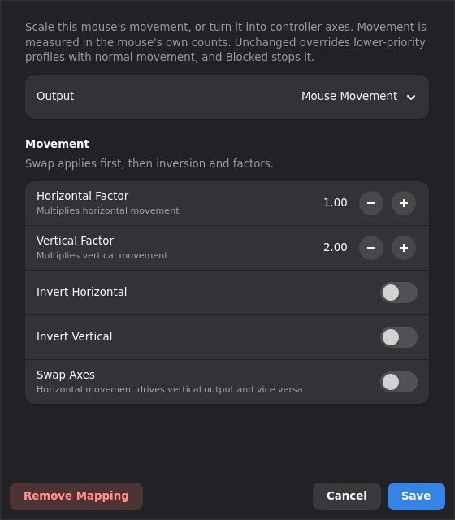
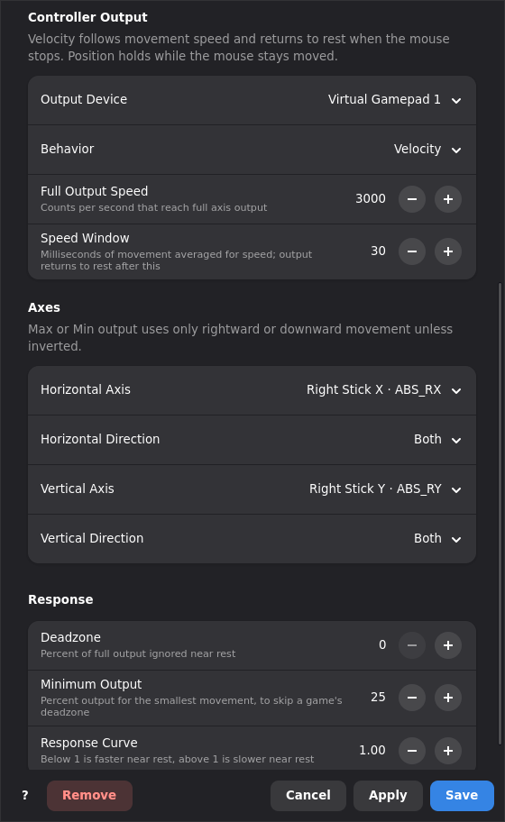

# Pointer movement

Pointer Movement changes what a mouse's movement does while a profile is active. It can
scale the movement, or turn it into controller axes such as a stick or trigger. Each profile
stores its own setting, so a window rule can give one game a different mouse speed.

Open a mouse's tab, select a profile, and click the **Pointer Movement** card. The card
appears for hardware with a mouse event device, or an event device that reports relative X and
Y movement. Buttons and the wheel keep their own mappings. The card does not appear when
another control on the hardware already uses the ID `pointer`.

**Output** selects what happens to the movement:

- **Mouse Movement** scales it.
- **Controller Axes** turns it into controller axes.
- **Unchanged** keeps normal movement. Use it in a higher-priority profile to override a
  lower-priority Pointer Movement mapping.
- **Blocked** stops pointer movement.

As with other mappings, the highest-priority active profile that maps the pointer decides its
behavior. Settings from lower-priority profiles are not combined with it.

**Apply** saves the settings without closing the editor. You can then fine tune them while a
game is running. **Save** applies and closes, and **Remove** deletes the mapping.

Right-clicking a number field's **+** or **−** button moves the value to the next step on
the same side. The factors move to the next whole number, so right-clicking **+** at 0.35 or
**−** at 1.35 returns to 1.

All distances and speeds use the mouse's own counts, the raw units it reports before desktop
pointer acceleration. A 1600 DPI mouse reports about 630 counts per centimeter.

## Mouse movement



**Horizontal Factor** and **Vertical Factor** multiply the counts. For example, a vertical
factor of 2 doubles vertical movement. A factor of 0 blocks that direction. Fractions carry
over between reports, so slow movement is not lost at factors below 1.

Factors can stand in for DPI controls that a mouse or its Linux driver lacks. Set a high DPI
once, for example with vendor software on another system, then lower it per profile. A
superkey or button that enables a profile with a lower factor works as a precision button.

Keymasq writes the result to the mouse's own passthrough device. Desktop pointer acceleration
still applies afterwards. With an adaptive acceleration profile, doubled counts also reach a
higher point on the acceleration curve, so fast movement increases by more than the factor.
A flat profile keeps the result proportional.

**Swap Axes** applies first. **Invert Horizontal**, **Invert Vertical**, and the factors then
apply to the resulting horizontal and vertical movement.

## Controller axes



**Controller Axes** stops pointer movement and drives controller axes instead. Choose the
output device, then an axis for horizontal and vertical movement. Any axis the device offers
can be used: stick components, triggers, throttles, or hats. Choose **None** to ignore a
direction. New mappings use the right stick. The factors, inversion, and swap still apply
first.

Pointer Movement writes both of its axes on every mouse report, and Velocity writes rest
after the mouse stops. As with other mappings that share a destination axis, the last write
wins: a controller or another mouse that sends to the same axes is overwritten. Use a
different output device or axis for each source.

**Horizontal Direction** and **Vertical Direction** select how the movement is written to its
axis:

- **Both** uses both directions of movement across the axis's full range.
- **Max** and **Min** use only rightward or downward movement and drive the axis from rest
  toward its maximum or minimum. Use the inversion switch to use leftward or upward movement.
  This suits triggers and throttles.

### Velocity

The axis follows movement speed. **Full Output Speed** is the speed in counts per second that
reaches full output. Keymasq averages the counts from the last **Speed Window** milliseconds.
The axis returns to rest one window after the mouse stops. A longer window smooths uneven
slow movement but responds later.

Velocity suits camera control. For example, move the right stick while the mouse moves.

### Position

The axis follows how far the mouse moved from a center. **Full Output Distance** is the
distance in counts that reaches full output. The axis stays deflected while the mouse holds
still. The center is the position when the profile became active.

**Beyond Full Output** selects what happens when the mouse moves past full output. With a
full distance equal to 5 cm, move the mouse 10 cm right and then 5 cm back:

- **Drag** moves the center along, like a pointer at the edge of a screen. The axis is back
  at rest after the 5 cm return. This is the default.
- **Keep** remembers the extra distance. The axis stays at full output after the 5 cm return
  and reaches rest only after another 5 cm.

For **Max** and **Min** axes, movement toward rest stops at rest with either setting. Pulling
a trigger past rest does not have to be undone before the trigger responds again.

**Recenter After Idle** returns the axis to rest after that many milliseconds without
movement. It is off at 0, the default.

Position suits steering, flight, or movement with one hand. For example, map the mouse to the
left stick with Position and the mouse buttons to gamepad buttons.

### Response

**Deadzone** ignores small output near rest. **Minimum Output** makes the smallest movement
jump past a game's own deadzone. **Response Curve** below 1 responds faster near rest, and
above 1 gives finer control near rest. These settings apply to each axis separately.

When the kernel reports dropped input, Keymasq ignores pointer movement through the end of
the incomplete report that follows, so lost counts never shift a held position.

When the mapping changes, Keymasq returns the axes it drove to rest and starts from a new
center. A profile change that leaves the Pointer Movement mapping unchanged keeps its
position.

## Profile file

```toml
[devices."046d:c08b".mapping.pointer]
action = "pointer_movement"
mode = "axes"              # "mouse" or "axes"
factor_x = 1.0             # 0 to 50
factor_y = 1.0
invert_x = false
invert_y = false
swap_axes = false
# output_id = "virtual-gamepad-2"  # omitted: Virtual Gamepad 1
behavior = "position"      # "velocity" or "position"
full_speed = 4000.0        # velocity: counts per second for full output, 1 to 1000000
window_ms = 20             # velocity: averaging window, 4 to 250
radius = 1500.0            # position: counts for full output, 1 to 1000000
overshoot = "drag"         # position: "drag" or "keep"
recenter_ms = 0            # position: 0 to 60000; 0 turns recentering off
x_axis = "abs_x"           # any ABS axis name, or "none"; default "abs_rx"
y_axis = "none"            # default "abs_ry"
x_direction = "both"       # "both", "max", or "min"
y_direction = "both"
deadzone = 0.0             # 0 to 0.95
minimum_output = 0.0       # 0 to 0.95
response_curve = 1.0       # 0.25 to 4.0
```

`mode = "mouse"` uses only the factor, invert, and swap fields. Other fields are kept so
that switching modes in the editor does not lose them. **Unchanged** saves
`action = "passthrough"` and **Blocked** saves `action = "suppress"` on the `pointer` source.

Every field is optional and takes the default shown above. A field that is set must hold a
listed value, or a number in its range: `mode = "axis"`, `x_axis = "abs_bogus"`, or
`factor_x = -3` stops the profile from loading. Keymasq logs the error and leaves the profile
out at startup. A reload while Keymasq runs keeps the previous configuration and shows a
desktop notification. The file stays as written, so fix it and save it again. To invert a
direction, use `invert_x` or `invert_y` instead of a negative factor.
