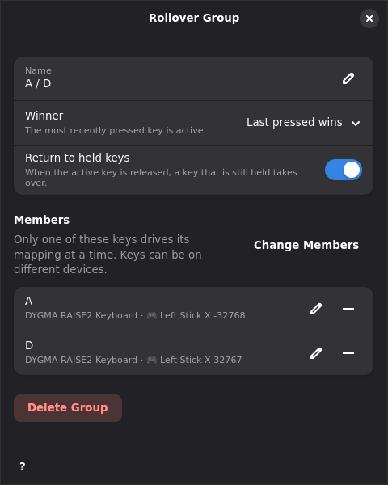

# Rollover groups

A rollover group is a set of keys or buttons where only one member drives its
mapping at a time. Members can be on different devices, for example a keyboard
key and a mouse side button. The group decides which held member is active.
When the active member changes, Keymasq releases the old member's output and
presses the new one.

The common case is two keys bound to one stick axis. Without a group, A sends
the stick left and D sends it right, but releasing either key returns the stick
to center, even while the other key is still held:

| Event | No group | Group, last pressed wins |
|---|---|---|
| A down | left | left |
| D down | right | right |
| A up (D still held) | **center** | right |
| D up | center | center |

The same group also works for keyboard, mouse button, and gamepad button
outputs. With two keyboard keys, pressing D releases A's output and presses
D's. Keyboard firmwares call this SOCD handling, or Snap Tap.

## Create a group

1. Open a device tab and select the profile the group belongs to.
2. Click **Rollover Group** below the controls.
3. Click the keys you want in the group. Selected cells are outlined. Keys
   that are already in another group are dimmed, and their tooltip names that
   group.
4. To add keys from another device, switch to its device tab and click them
   there. Selection mode stays on in every device tab, and the bar lists the
   selected keys by device.
5. Click **Create**. Press Esc or click **Cancel** to leave without a group.

Keymasq saves the group with **Last pressed wins** and **Return to held keys**
on, names it after its members, and opens the group editor.

When two mappings of one device send different values to the same axis in the
selected profile, its device tab also shows a bar that offers to create a
group for them.

## Edit a group

Member cells show `↹` before their action, in the tab of their own device.
Clicking a member opens the group editor instead of the key selector. The
editor has these settings:



- **Name**. Press Enter or the apply button to save a new name.
- **Winner**. Decides which held member is active. See [Winner](#winner).
- **Return to held keys**. See [Return to held keys](#return-to-held-keys).
- **Members**. Each row shows the key, its device, and its mapping in the
  selected profile. The edit button switches to the key's device tab and opens
  the normal key selector for that key. The remove button takes the key out of
  the group. With **Fixed priority**, arrow buttons change the member order.
- **Change Members** returns to selection mode with the current members
  selected, on every device. Click keys to add or remove them, then click
  **Save**.
- **Delete Group** removes the group. The keys go back to their own mappings.

A group needs at least two members. Removing the second-to-last member asks
whether to delete the group.

## Winner

| Winner | Active member while several are held |
|---|---|
| Last pressed wins | The most recently pressed member. |
| First pressed wins | The member pressed first. Later members wait. |
| Cancel out | None. The output is released until only one member is held. |
| Fixed priority | The held member that is highest in the member list. |

## Return to held keys

With **Return to held keys** on, a held member takes over again as soon as the
active member is released:

| Event | On | Off |
|---|---|---|
| A down | left | left |
| D down | right | right |
| D up (A still held) | left | center |
| A up | center | center |

With it off, a member that lost while held stays inactive until it is pressed
again. The same applies to **First pressed wins** and **Fixed priority**: a
member that was held back does not take over when the winner is released.

## Handover

When the active member changes, Keymasq compares the outputs of the old and
the new member:

- An output that only the old member writes is released. For an axis, that
  writes its rest value.
- An output that both members write is overwritten. Two members on one axis
  move it straight from one value to the next, without the rest value in
  between. This needs plain mappings on both members, see
  [Member mappings](#member-mappings).

Physical key autorepeat only reaches the output of the active member.

## Member mappings

A member can use any mapping. The group doesn't look inside it. Gaining the
active role presses the member's mapping, and losing it releases the mapping,
just as if the key went down or up. For example:

- A member with rapidfire stops firing when it loses and starts again when it
  takes over.
- An overload superkey runs its On Press actions every time it takes over and
  its On Release actions every time it loses. Its Main actions stay held while
  it is active.
- A member with tap mode, or a macro that runs once, starts again every time it
  takes over. That includes returning to it with **Return to held keys**.
- A pattern superkey reads a handover as a real press or release, so a quick
  handover can count as a tap or a double tap.

Only the seamless handover from [Handover](#handover) depends on the mapping.
It applies when both members send one plain key, button, or axis value without
tap or rapidfire. Every other handover releases the old member before it
presses the new one.

A member doesn't need a mapping. An unmapped member passes its source key
through, and the group still applies to it. Keymasq grabs the member's
interface for that, even on a device that no profile maps.

## Profiles

Groups belong to one profile. Active profiles layer their groups in the same
order as their mappings. A group from a higher-priority
profile replaces every lower group that shares a member with it, so a key is
never in two groups at once.

Mappings still resolve per key across profiles. A member without a mapping in
the group's profile uses the mapping from a lower profile, or passes through.

When a profile change removes a group while members are held, the active
member keeps the action it pressed with until its key is released. A held
member that wasn't active has nothing to repeat or release, so Keymasq ignores
its key until it is pressed again.

When a group changes while members are held, for example its winner, the
changed group keeps the held keys and picks the active member by its new
settings. A group that appears while one of its keys is already down, for
example when a profile switches on, takes that key over as well. Held keys
keep the order they went down in.

Combos see the physical keys. A combo that uses group members still matches
when the group would suppress one of them. When a combo recalls a member's
output, the member steps aside until the combo restores it or its key is
released, and another held member can take over. A restored member only
presses again if it wins.

## Devices that go away

When a device disconnects while one of its members is active, its keys count
as released. With **Return to held keys** on, a member still held on another
device takes over. A device that isn't connected has no held keys, so the rest
of its group works as usual.

## Storage

Groups are stored in the profile TOML, next to the device layers:

```toml
[[rollover_groups]]
name = "A / Side"
members = [
  { hardware_id = "1234:5678", button = "key_a" },
  { hardware_id = "046d:c52b", button = "btn_side" },
]
winner = "newest"
restore = true
```

- `members` lists hardware IDs and button IDs from the hardware configs, in
  priority order.
- `winner` is `newest`, `oldest`, `neutral`, or `priority`. The default is
  `newest`.
- `restore` defaults to `true`.

Keymasq drops groups with fewer than two distinct members when it loads a
profile. When two groups in one profile share a member, the later group wins.
Deleting a hardware control or a whole device also removes it from every
group.

## Anti-cheat

Some games treat automatic key handover as an unfair advantage. Valve kicks
Counter-Strike 2 players who use Snap Tap style behavior on keyboard output,
and some platforms ban it. Check the rules of the game before using a group
there.

## See also

- [Actions](actions.md) for gamepad axis mappings.
- [Profiles](profiles.md) for profile layering.
- [Superkeys](superkeys.md) for overload and pattern superkeys.
